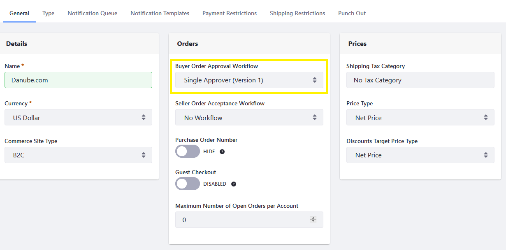

# Enabling or Disabling Order Workflows

[Order workflows](./introduction-to-order-workflows.md) are a channel-specific setting that, if enabled, require the buyer or seller to give internal prior [approval](./approving-or-rejecting-orders-in-order-workflows.md) for an order before it can be [processed](../orders/processing-an-order.md). To learn how to enabling Workflow, see [Activating Workflow](../../../../../dxp/7.x/en/process-automation/workflow/using-workflows/activating-workflow.md).

This article documents how to enable and disable Order Workflows.

## Enabling Workflow

To enable an approval workflow:

1. Go to the _Global Applications_ menu &rarr; _Commerce_ &rarr; _Channels_.
1. Select the desired channel (for example, _Sahara.com_). (If you had used an accelerator to create a site, there is an associated channel created by default.)
1. Click on the _General_ tab.
1. Select _Single Approver (Version 1)_ from the Buyer Order Approval Workflow dropdown menu.

    

1. If you want to enable the Seller Order Acceptance Workflow, select  _Single Approver (Version 1)_ from the dropdown menu.
1. Click _Save_.

The Workflow process has been activated for this this channel. Both workflows can work concurrently.

### Commerce 2.1 and Below

1. Navigate to the _Control Panel_ &rarr; _Commerce_ &rarr; _Channels_.

    

1. Click on the desired channel (for example, _Sahara.com_). (If you had used an accelerator to create a site, there is an associated channel created by default.)
1. Click on the _General_ tab.
1. Select _Single Approver (Version 1)_ from the Buyer Order Approval Workflow dropdown menu.

    

1. If you want to enable the Seller Order Acceptance Workflow, select  _Single Approver (Version 1)_ from the dropdown menu.
1. Click _Save_.

The Workflow process has been activated for this this channel. Both workflows can work concurrently.

### Commerce 2.0 and Below

To enable an approval workflow:

1. Navigate to the site where the store is located (for example, _Sahara.com_).
1. Expand the _Site Administration_ menu then click _Commerce_ → _Settings_.

    

1. Click on the _Order Workflows_ tab.
1. Click on _Approval Workflow_ field and select from the available options in the drop down.

   

1. To enable the _Transmission Workflow_, click on the _Transmission Workflow_ field and select from the available options in the drop down.

   

1. Click _Save_.

## Disabling an Order Workflow

To disable an order workflow, select the _No Workflow_ option, and click _Save_.

## Additional Information

Out-of-the-box, _Single Approver (Version 1)_ is the available order workflow. [Custom workflows](../../../../../dxp/7.x/en/process-automation/workflow/introduction-to-workflow.md) can be created and may then be selected in the _Order Workflows_ tab.

* [Introduction to Order Workflows](./introduction-to-order-workflows.md)
* [Approving or Rejecting Orders in Order Workflows](approving-or-rejecting-orders-in-order-workflows.md)
* [Processing an Order](../orders/processing-an-order.md)
* [Order Life Cycle](../orders/order-life-cycle.md)
* [Order Management Statuses Reference Guide](../orders/order-management-statuses-reference-guide.md)
