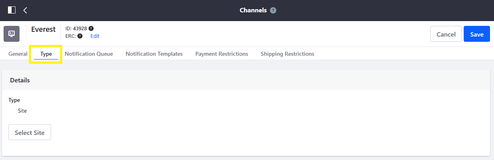
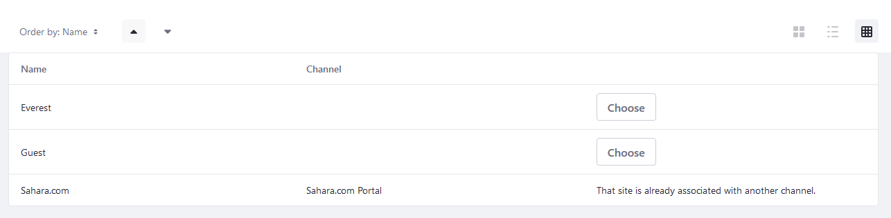

# Managing Channels

This article describes how to manage Channels in Liferay Commerce. To learn about the uses for Channels in Liferay Commerce, see: [Introduction to Channels](./introduction-to-channels.md) and the [Channels Reference Guide](./channels-reference-guide.md).

By default, a channel is automatically created if using an accelerator (for example, Minium) to jump-start a store site.

## Adding a New Channel

1. Click _Global Applications_ &rarr; _Commerce_ &rarr; _Channels_.

    

1. Click the () button.
1. Enter a name for the new channel.
1. Select a currency to associate with the channel.
1. In the _Type_ field, select _Site_.

    

1. Click _Add_.

The channel is now created. Products may now be configured to be filtered by this new channel. See [Configuring Product Visibility Using Channels](./configuring-product-visibility-using-channels.md) for more information.

## Associating a Channel with a DXP Site

A channel can be associated with a Liferay site or an external channel such as Amazon Marketplace. To associate a channel with a site on a DXP instance:

1. Click on the desired channel (for example, _Everest_ from the steps above).
1. Click the _Type_ tab.

    

1. Click _Select Site_.
1. Click _Choose_ next to the desired site.

    

1. Click _Save_ when finished.

The channel is now associated with that store site. Users can always select a different site later as long it is not already associated with another channel.

## Deleting a Channel

Channels can be deleted, including those created by an site accelerator. Note that when deleting a channel, this does not delete the DXP site. To delete a channel:

1. Navigate to the _Control Panel_ → _Commerce_ → _Channels_.
1. Click the () then _Delete_.

The channel is now deleted.

## Commerce 2.1 and Below

### Adding a New Channel

To add a new Channel, follow these steps:

1. Navigate to the _Control Panel_ → _Commerce_ → _Channels_.
1. Click the () button.
1. Enter a name for the new channel.
1. Select a currency to associate with the channel.
1. In the _Type_ field, select _Site_.

    

1. Click _Add_.

The channel is now created. Products may now be configured to be filtered by this new channel. See [Configuring Product Visibility Using Channels](./configuring-product-visibility-using-channels.md) for more information.

At this point, the channel is not yet been associated with any store site.

### Commerce 2.0 and Below

#### Adding a New Channel

To add a new Channel, follow these steps:

1. Navigate to the _Control Panel_ → _Commerce_ → _Channels_.
1. Click the () button.
1. Enter a name for the new channel.
1. In the _Type_ field, select _Site_.
1. Select a site to associate with the channel.
1. Select a currency to associate with the channel.
1. Click _Save_.

    

The channel is created and associated with the selected site. Products may now be configured to be filtered by this new channel.

## Additional Information

* [Introduction to Channels](./introduction-to-channels.md)
* [Configuring Product Visibility Using Channels](./configuring-product-visibility-using-channels.md)
* [Channels Reference Guide](./channels-reference-guide.md)
