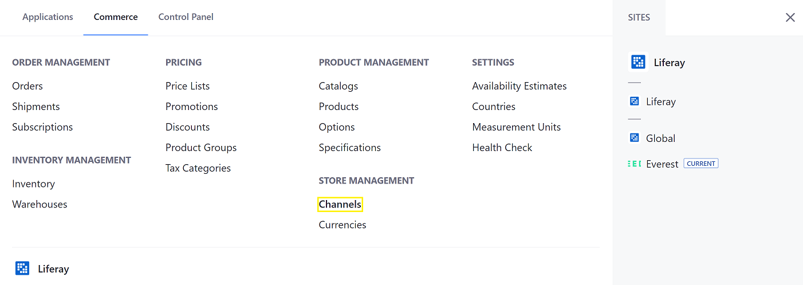
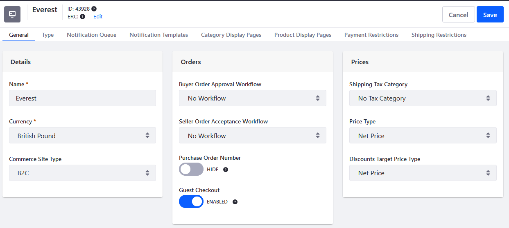
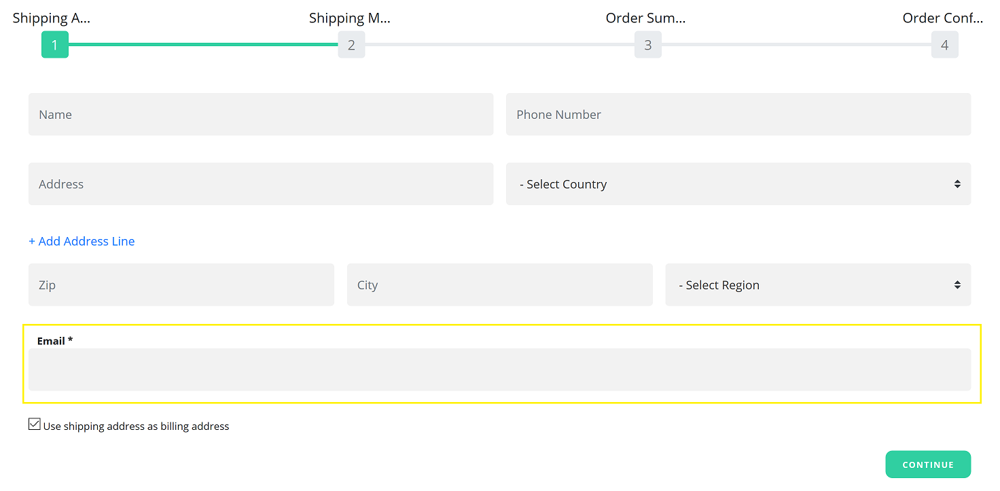
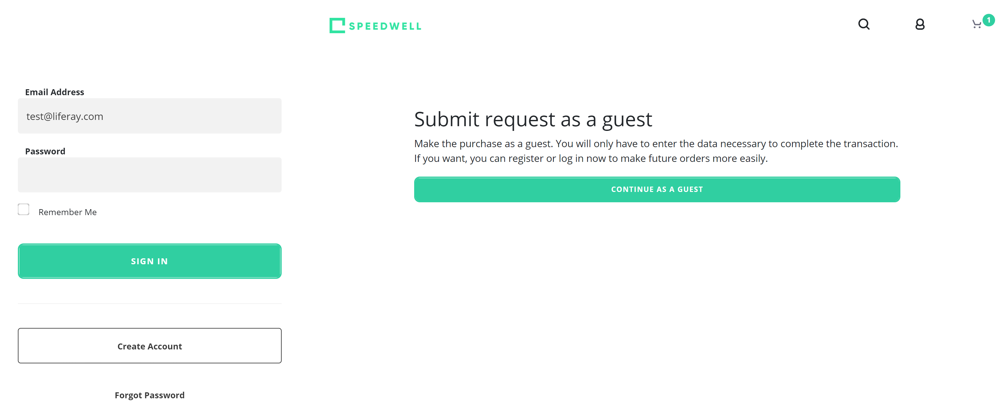
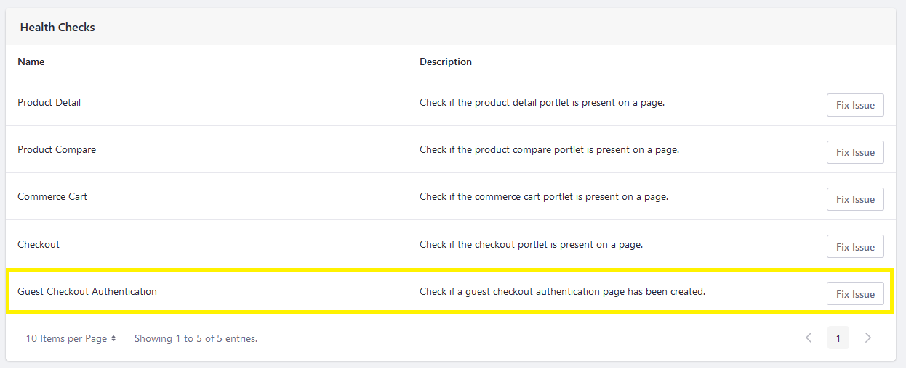

# Enabling Guest Checkout

Users can allow guests to submit orders without first having to sign in. The Guest Checkout function can be enabled or disabled for each [Channel](../managing-a-catalog/creating-and-managing-products/channels/introduction-to-channels.md) (if there are more than one channel on the Commerce instance).

To enable Guest Checkout:

1. Navigate to the _Global Menu_ &rarr; _Commerce_.
1. Click _Channels_ under _Store Management_.

    

1. Click on the desired channel (for example _Everest Portal_).
1. On the _General_ tab's _Orders_ section, slide the _Guest Checkout_ toggle to Enabled.
1. Click _Save_.

    

Guest Checkout has been enabled.

Guest customers can now add items to the cart and proceed to checkout without logging in. After clicking _Submit_, they will see the Email Address field during the checkout process.



## Adding the Continuing as Guest Option

To allow customers to continue their checkout process as a Guest user, you can create a separate authentication page where guest customers have several checkout options.

* They can sign in if they have an account. They can view all their account information, including past orders.
* They can create a new account if they are a new customer.
* They can continue as a Guest, entering only the data necessary to complete the transaction. They can register later or log in now to make future orders more easily.



```tip::
   The site page above was generated using the Speedwell accelerator. You can use other accelerators such as Minium to generate these pages and customize them later.
```

Follow the steps below to generate this authentication page:

1. Navigate to the _Global Menu_ &rarr; _Commerce_.
1. Click _Channels_ under _Store Management_.

    

1. Click on the desired channel (for example _Everest Portal_).
1. On the General tab's Health Checks section, click _Fix Issue_ next to Guest Checkout Authentication. This creates a new authentication page with an option to sign in as Guest.

    

1. Click Save again when finished.

```note::
   The new page inherits whatever default theme the site is using. For more information about how to configure pages themes and templates, see `Managing Master Page Templates <https://learn.liferay.com/dxp/7.x/en/site-building/creating-pages/defining-headers-and-footers/managing-master-pages.html>`_ and `Look and Feel <https://learn.liferay.com/dxp/7.x/en/site-building/creating-pages/building-and-managing-content-pages/content-pages-overview.html#look-and-feel>`_.
```

## Commerce 2.1 and Below

To enable Guest Checkout:

1. Navigate to the _Control Panel_ &rarr; _Commerce_ &rarr; _Channels_.
1. Click on the desired channel.
1. On the _General_ tab's _Orders_ section, slide the _Guest Checkout_ toggle to Enabled.
1. Click _Save_.

    

Guest Checkout has been enabled.

Guest customers can now add items to the cart and proceed to checkout without logging in. After clicking _Submit_, they will see the Email Address field during the checkout process.


They must enter their contact information including a valid email address before continuing.

## Additional Information

* [Guest Checkout](./guest-checkout.md)
* [Introduction to Channels](../managing-a-catalog/creating-and-managing-products/channels/introduction-to-channels.md)
* [Managing Channels](../managing-a-catalog/creating-and-managing-products/channels/managing-channels.md)
* [Channels Reference Guide](../managing-a-catalog/creating-and-managing-products/channels/channels-reference-guide.md)
