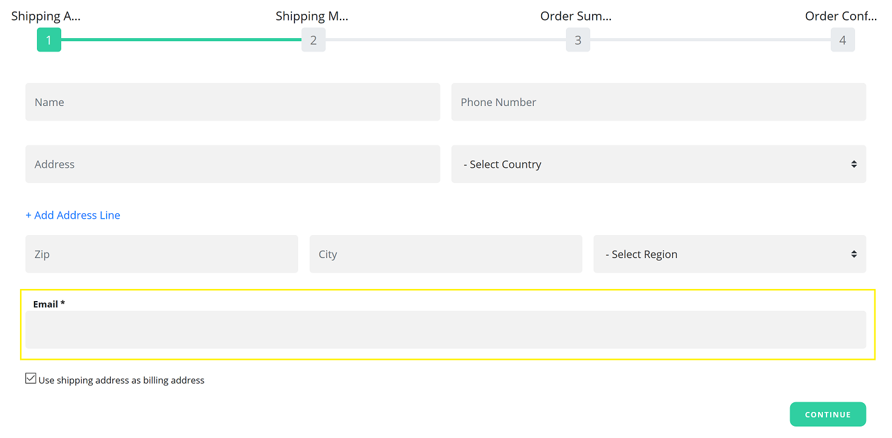
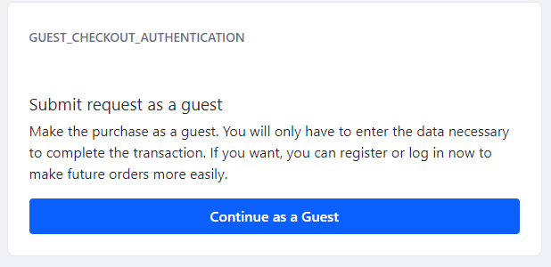

# Guest Checkout Overview

Users can allow guests to submit orders without first having to sign in. The Guest Checkout function can be enabled or disabled for each [Channel](../managing-a-catalog/creating-and-managing-products/channels/introduction-to-channels.md). See [Enabling Guest Checkout](./enabling-guest-checkout.md) to learn more. Otherwise, by default, all users must login to create orders.

Once Guest Checkout has been enabled, in order for their orders to be processed, guests must enter their email address during the checkout process. The email address field is now visible when entering the initial contact information.



Guests are then redirected to log in or create an account.


## Guest Checkout Process

If a guest user adds items to the cart then later signs in before completing the checkout process, the items are automatically carried over to his account.

## Processing a Guest Order

When a Guest submits an order, it is processed the same as any other order. See [Processing an Order](../orders-and-fulfillment/orders/processing-an-order.md) for more information.

```tip::
   Guests do not share order histories with other authenticated users, even if they have the same email addresses.
```

## Creating a Guest Checkout Authentication Page

Instead of using the Speedwell accelerator to generate your site pages, you can create a [site page](https://learn.liferay.com/dxp/7.x/en/site-building/creating_pages.html) with the _Guest Checkout Authentication_ widget. Use the Health Check on the [Channels setting](../managing-a-catalog/creating-and-managing-products/channels/channels-reference-guide.md) to generate this page and widget.

 Clicking the _Continue as a Guest_ allows customers to complete the purchase without logging in or having to create an account.



If this authentication page does not exist, then Guests will be redirected to the page with the _Checkout_ widget.

## Additional Information

* [Enabling Guest Checkout](./enabling-guest-checkout.md)
* [Introduction to Channels](../managing-a-catalog/creating-and-managing-products/channels/introduction-to-channels.md)
* [Managing Channels](../managing-a-catalog/creating-and-managing-products/channels/managing-channels.md)
* [Channels Reference Guide](../managing-a-catalog/creating-and-managing-products/channels/channels-reference-guide.md)
