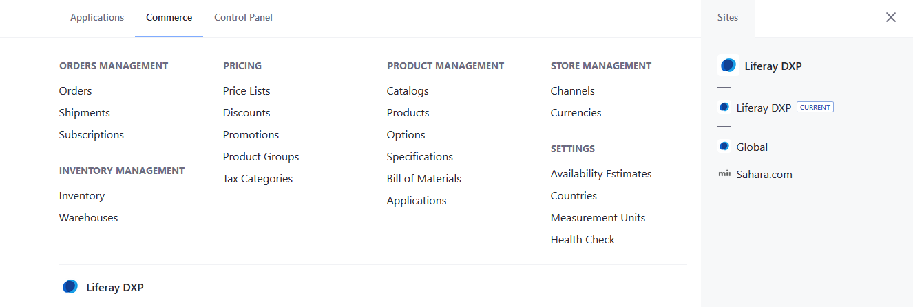

# Liferay Commerce Configuration Overview

Liferay Commerce 3.0's configurations are reached through the _Global Applications_ menu.

Navigate to the _Global Applications_ menu &rarr; _Commerce_. Administrators can configure:

* [Channels](../managing-a-catalog/creating-and-managing-products/channels/managing-channels.md)
* [Price Lists](../managing-a-catalog/managing-price/creating-a-price-list.md)
* [Discounts](../promoting-products/introduction-to-discounts.md)
* Promotions
* Product Groups
* [Catalogs](../managing-a-catalog/catalogs/creating-a-new-catalog.md)
* [Products](../managing-a-catalog/creating-and-managing-products/products/products-overview.md)
* [Options](../managing-a-catalog/creating-and-managing-products/products/customizing-your-product-with-product-options.md)
* [Orders](../orders-and-fulfillment/orders/orders-menu-reference-guide.md)
* [Shipments](../orders-and-fulfillment/shipments/introduction-to-shipments.md)
* [Bill of Materials](../managing-a-catalog/creating-and-managing-products/products/managing-boms.md)
* [Subscriptions](../orders-and-fulfillment/subscriptions/managing-subscriptions.md)
* [Currencies](../store-administration/currencies/adding-a-new-currency.md)
* [Inventory](../managing-a-catalog/managing-inventory/introduction-to-managing-inventory.md)
* [Warehouses](../managing-a-catalog/managing-inventory/warehouse-reference-guide.md)
* [Availability Estimates](../managing-a-catalog/managing-inventory/availability-estimates.md)

## Liferay Commerce 2.1 and Below

Liferay Commerce 2.1 configurations are divided into several locations in the Liferay _Product Menu_. The Commerce _Control Panel_ drop down contains configurations and settings that apply _globally_ to the Liferay Commerce installation. The Commerce _Site Menu_ drop down contains configurations and settings that are scoped to a specific store site.

### Commerce Control Panel

Navigate to the _Control Panel_ → _Commerce_. Making changes to any of the follow configurations will apply across the store sites.

* [Channels](../managing-a-catalog/creating-and-managing-products/channels/managing-channels.md)
* [Price Lists](../managing-a-catalog/managing-price/creating-a-price-list.md)
* [Orders](../orders-and-fulfillment/orders/orders-menu-reference-guide.md)

The Commerce Global Settings menu contains the following tabs:

* [Availability Estimates](../managing-a-catalog/managing-inventory/availability-estimates.md)
* [Adding a New Currency](../store-administration/currencies/adding-a-new-currency.md)
* [Measurement Units](../store-administration/configuring-shipping-methods/measurement-units.md)
* [Regions](../store-administration/adding-regions.md)
* [Warehouses](../managing-a-catalog/managing-inventory/warehouse-reference-guide.md)

### Commerce Site Settings

> Commerce 2.0 and below

The following configurations are scoped to the selected store site. Changes here are not applied to other stores hosted on the same Liferay Commerce instance.

Navigate to the _Control Panel_ → _Store Site_ → _Commerce_.

The following site settings are found here:

* [Notifications](./sending-emails/using-notification-templates.md)
* [Introduction to Order Workflows](../orders-and-fulfillment/order-workflows/introduction-to-order-workflows.md)
* [Payment Methods](../store-administration/configuring-payment-methods/payments.md)
* Product Display Pages
* [Shipping Methods](../store-administration/configuring-shipping-methods/shipping-method-reference.md)
* [Site Types](../starting-a-store/sites-and-site-types.md)
