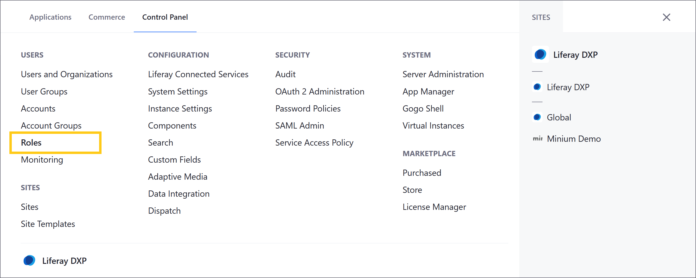
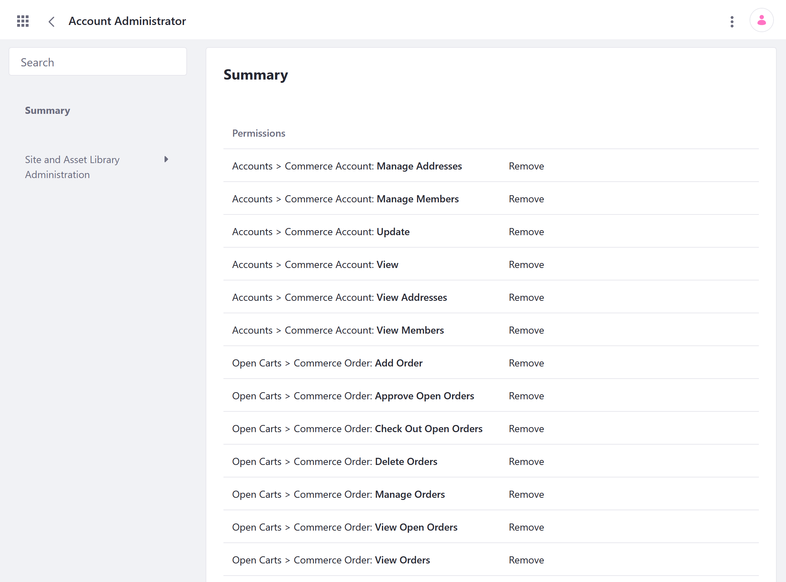
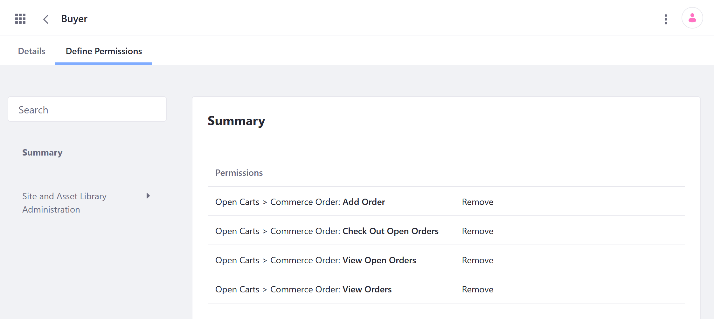

# Commerce Roles Reference Guide

Liferay Commerce provides four out-of-the-box Commerce:

* Account Administrator
* Buyer
* Order Manager
* Sales Agent

```note::
   Permission keys may change in future updates.
```

## Viewing Permissions

Follow these steps to view the permissions associated with each Commerce role:

1. Open the *Global Menu* (), click on the *Control Panel* tab, and go to *Users* &rarr; *Roles*.

   

1. Click on the desired role:

   * *Account Administrator* (Site Role)
   * *Buyer* (Site Role)
   * *Order Manager* (Site Role)
   * *Sales Agent* (Regular Role)

1. Click on the *Define Permissions* tab, which provides a summary of all permissions assigned to the role.

## Account Administrator

> Site Role

Account Administrators can modify their Account, invite or add users to it, and assign roles to other Account members. Note that Account Administrators cannot create or delete Accounts. This permission is reserved for the Store Administrator.



The following permissions pertain to the Account Administrator's ability to modify accounts in a B2B setting.

| Permissions | Description |
| --- | --- |
| Accounts > Commerce Account: Update | Ability to modify Accounts |
| Accounts > Commerce Account: View | Ability to view Accounts |
| Accounts > Commerce Account: View Members | Ability to view all members in an Account |
| Accounts > Commerce Account: Manage Address | Ability to add a new billing, a shipping, or a combined address |
| Accounts > Commerce Account: Manage Members | Ability to invite a new member or an organization and modify his or her credentials |
| Accounts > Commerce Account: View Addresses | Ability to view all the addresses associated with an Account |

The following permissions pertain to the Account Administrator Role's ability to modify orders regardless of the store type (B2B or B2C).

| Permissions | Description |
| --- | --- |
| Open Carts > Commerce Order: Add Order | Ability to add an order to the Buyer's specified account (can have more than one account) |
| Open Carts > Commerce Order: Approve Open Orders | Allow account administrator to approve orders if workflow has been enabled |
| Open Carts > Commerce Order: Check Out Open Orders | Ability to complete the checkout process for new, incomplete orders |
| Open Carts > Commerce Order: Delete Orders | Grants the ability to delete an order |
| Open Carts > Commerce Order: Manage Orders | Change Order details such as mailing and billing addresses; ability to add a note to the order |
| Open Carts > Commerce Order: View Open Orders | Ability to view all open orders |
| Open Carts > Commerce Order: View Orders | Ability to view all orders regardless of their statuses |

## Buyer

> Site Role

Users assigned this role can view, create, and check out orders.



There are four permissions set by default:

| Permissions | Description |
| --- | --- |
| Orders > Commerce Order: Add Order | Ability to add an order to the Buyer's specified account (can have more than one account) |
| Orders > Commerce Order: Checkout Open Orders | Ability to complete the checkout process for new, incomplete orders |
| Orders > Commerce Order: View Open Orders | Ability to view all open orders |
| Orders > Commerce Order: View Orders | Ability to view all orders regardless of their statuses |

## Order Manager

> Site Role

Order Managers have all the permissions of Buyers but can also manage, delete, and approve orders. The following permissions have been assigned to the Order Manager role.


| Permissions | Description |
| --- | --- |
| Orders > Commerce Order: Add Order | Allows order managers to add an order |
| Orders > Commerce Order: Approve Open Orders | Allow order managers to approve orders if workflow has been enabled |
| Orders > Commerce Order: Check Out Open Orders | Ability to complete the checkout process for new, incomplete orders |
| Orders > Commerce Order: Delete Orders | Allow order managers to delete orders |
| Orders > Commerce Order: Manage Orders | Change Order details such as mailing and billing addresses; ability to add a note to the order |
| Orders > Commerce Order: View Open Orders | Ability to view all open orders |
| Orders > Commerce Order: View Orders | Ability to view all orders regardless of their statuses |

## Sales Agent

> Regular Role

The Sales Agent is a regular role in Liferay Commerce and assignees are able to manage any account assigned to the role without granting administrative permissions. Because it is a regular role, it is found in the *Regular Roles* tab.


| Permissions | Description |
| --- | --- |
| Manage Organizations | Ability to add or remove organizations |
| Manage Available Accounts | Ability to manage Accounts that the sales agent is a member of |
