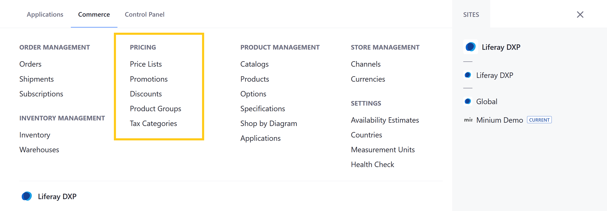

# Pricing Permissions Reference

Liferay Commerce provides out-of-the-box permissions to control access to Pricing applications and resources in the Global Menu ().



You can manage Pricing permissions for user roles under *Commerce* &rarr; *Pricing* in the Define Permissions tab. Assign permissions individually, or check *Action* to assign all permissions for an application or resource.


```note::
   The following article does not document permissions for related widgets.
```

## Standard Application Permissions

Application permissions define what actions can be performed in an application.

Pricing includes the following applications:

* **Price Lists**: This application is used to create and manage Price List entities that store Product price entries.

* **Discounts**: This application is used to create and manage Discount entities that modify prices.

* **Promotions**: This application is used to create and manage Promotions that store Product price entries that can be applied in place of Price List Entries. <!--Are these entities just a type of Price List?-->

* **Product Groups**: This application is used to create and manage Product Group entities.

* **Tax Categories**: This application is used to create and manage categories for applying tax rates to Channel Products and shipping costs. See [Creating Tax Categories](../../store-administration/configuring-taxes/creating-tax-categories.md) for more information.

All Pricing applications have the following permissions:

| Permission | Description |
| --- | --- |
| Access in Control Panel | Ability to access the application in the Global Menu |
| Configuration | Ability to view and set the application's configuration options |
| Permissions | Ability to view and modify the application's permissions |
| Preferences | Ability to view and set application preferences |
| View | Ability to view ... | <!--finish-->

## Related Resource Permissions

Resource permissions define what actions can be performed on resources displayed or managed within an application. Resources are any user-facing object, such as Catalogs, Price Lists, Orders, and Warehouses.

Pricing applications reference <!--w/c--> the following resources:

* **Commerce Price List** (listed under Price Lists and Product Groups): Price Lists are entities that store price entries for Product SKUs. This includes both Base Price Lists and custom Price Lists. <!--does this also include promotions?--> Each list is linked to a single Catalog and has the following configuration options: currency, priority, schedule, eligibility, and price modifiers. See [Creating a Price List](../../managing-a-catalog/managing-price/creating-a-price-list.md) for more information.

* **Commerce Discount** (listed under Discounts and Product Groups): Discounts are entities used to modify prices. They are configured to target the price of Products, Shipments, Subtotals, Totals, or Product Groups. When applied, it modifies the best applicable price for a customer, whether unit or promo. See [Introduction to Discounts](../../promoting-products/introduction-to-discounts.md) for more information.

* **Commerce Product Group** (listed under Product Groups): Product Groups are entities for grouping related Products in order to apply Price Lists and Discounts to them.<!--accurate?--> See [Introduction to Product Groups](../../promoting-products/introduction-to-product-groups.md) for more information.

All resources connected to Pricing applications have the following permissions:

| Permission | Description |
|---|---|
| Delete | Ability to delete a resource |
| Permissions | Ability to view and modify a resource's permissions  |
| Update | Ability to modify a resource |
| View | Grants ability to view a resource |

## Additional Information

* [Introduction to Pricing](../../managing-a-catalog/managing-price/introduction-to-pricing.md)
* [Creating a Price List](../../managing-a-catalog/managing-price/creating-a-price-list.md)
* [Introduction to Discounts](../../promoting-products/introduction-to-discounts.md)
