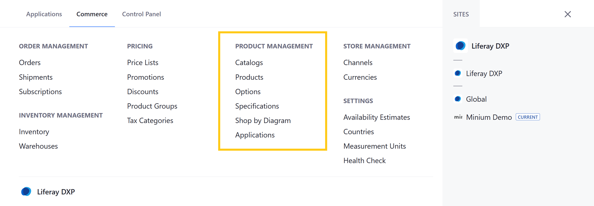
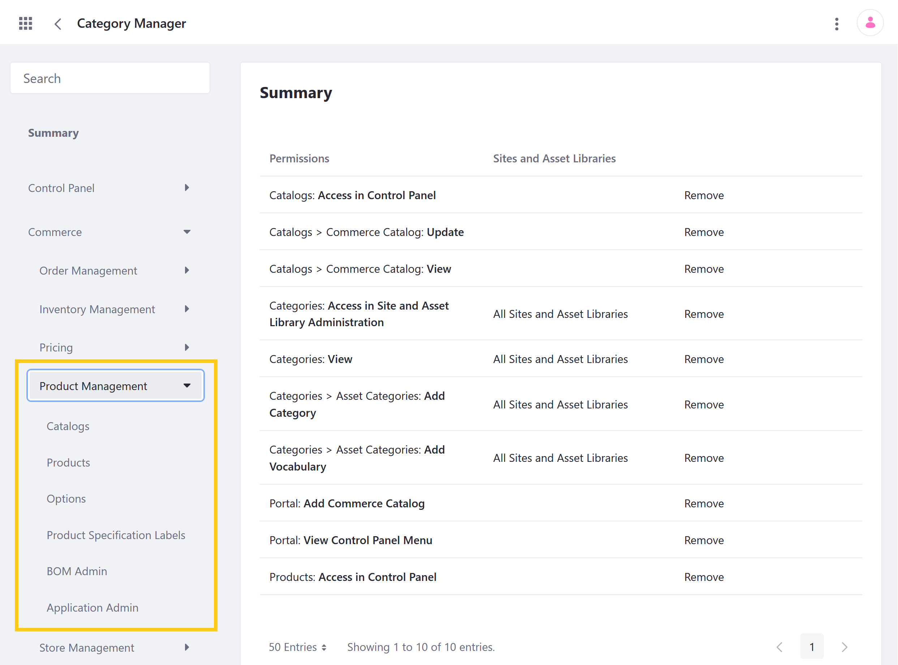

# Product Management Permissions Reference

Liferay Commerce provides out-of-the-box permissions to control access to Product Management applications and resources in the Global Menu ().



You can manage Product Management permissions for user roles under *Commerce* &rarr; *Pricing* in the Define Permissions tab. Assign permissions individually, or check *Action* to assign all permissions for an application or resource.



```note::
   The following article does not document permissions for related widgets.
```

## Standard Application Permissions

Application permissions define what actions can be performed in an application.

Product Management includes the following applications:

* **Catalogs**: This application is used to create and manage Catalog entities.

* **Products**: This application is used to create and manage Product entities within a Catalog.
  
* **Options**: This application is used to create and manage templates for Product Options.

* **Specifications**: This application is used to create labels and groups for categorizing Product Specifications. <!--in the permissions UI, this is called "Product Specification Labels," which is a misnomer, since it gives users access to both the "Specification Labels" and "Specification Groups" tabs-->

* **BOM Admin**: This application is used to create and annotate Bill of Materials diagrams. See [Managing BOMs](../../managing-a-catalog/creating-and-managing-products/products/managing-boms.md) for more information.

* **Application Admin**: This application is used to create and manage Model entries. <!--Should anything else be noted? There is no existing documentation-->

All Product Management applications have the following permissions:

| Permission | Description |
| --- | --- |
| Access in Control Panel | Ability to access the application in the Global Menu |
| Configuration | Ability to view and set the application's configuration options |
| Permissions | Ability to view and modify the application's permissions |
| Preferences | Ability to view and set application preferences |
| View | Ability to view ... | <!--finish-->

## Related Resource Permissions

Resource permissions define what actions can be performed on resources displayed or managed within an application. Resources are any user-facing object, such as Catalogs, Price Lists, Orders, and Warehouses.

Product Management applications are connected to the following resources:

* **Commerce Catalog** (listed under Catalogs): Catalogs entities for storing and managing related Products. Each Catalog has a default language, currency, image, Base Price List, and Base Promotion List. See [Creating a New Catalog](../../managing-a-catalog/catalogs/creating-a-new-catalog.md) for more information.

* **Commerce Products** (listed under Products, Options, and Product Specification Labels): Products are entities stored in a Catalog and sold in a Channel. Each Product can have multiple SKUs, associated media (images and attachments),  . They can also be linked to Specifications, Categories, Options, Inventory, price entries, and more. See [Products Overview](../../managing-a-catalog/creating-and-managing-products/products/products-overview.md) for more information.

* **Commerce Product Option Category** (listed under Catalogs): <!--What does this refer to? There is no existing documentation that refers to "Options Categories."-->

* **Commerce Product Option** (listed under Catalogs): Product Options are entities used to add custom fields to Products. Each Option has a field type that determines its behavior. Depending on its type, the Option can be used to receive customer input, generate SKUs for product variants, and more. See [Customizing Products with Product Options](../../managing-a-catalog/creating-and-managing-products/products/customizing-your-product-with-product-options.md) for more information.

* **Commerce Product Specification** (listed under Catalogs): Product Specifications are entities for storing information about Product attributes. See [Specifications](../../managing-a-catalog/creating-and-managing-products/products/specifications.md) for more information. <!--Is this referring to Labels and Groups in the Specification application, or the use of those labels and groups for a Product? I'm confused about why this is listed under Catalogs and not Specifications. -->

* **Commerce Warehouse** (listed under Products, [Shipments](./order-management-permissions-reference-guide.md)) and [Warehouses](./inventory-management-permissions-reference-guide.md)): Warehouses are entities for storing Product inventory. Each Warehouse is connected to Channels and represents a physical location, with an address and geolocation. See [Adding a New Warehouse](../../managing-a-catalog/managing-inventory/adding-a-new-warehouse.md) for more information.

* **Commerce BOM Folder** (listed under BOM Admin): BOM folders are entities for storing BOM Definitions. Each folder has its own associated image and can be linked to Models defined in the Application Admin.

* **Commerce BOM Definition** (listed under BOM Admin): BOM Definitions are diagrams annotated with Product SKUs. These diagrams represent how mapped Products relate to one another within a larger system.

* **Commerce Application Brand** (listed under Application Admin): Application Brands are used to store and organize Application Models.

* **Commerce Application Model** (listed under Application Admin): Application Models are Brand entries that can be linked with BOM folders to organize BOM diagrams by version. Each model has only a name and year.

The above resources (excluding Commerce Product) have the following permissions:

| Permission | Description |
|---|---|
| Delete | Ability to delete a resource |
| Permissions | Ability to view and modify a resource's permissions  |
| Update | Ability to modify a resource |
| View | Grants view access to a resource |

The Commerce Product resource has the following permissions:

| Permission | Description |
|---|---|
| Manage Attachments| Ability to manage Product attachments in the Media tab |
| Manage Images | Ability to manage Product images in the Media tab |
| Permissions | Ability to view and modify permissions for a Product entity |
| View Price | Grants view access to Product prices |
| View Rules | Grants view access to Product rules |

## Additional Information

* [Products Overview](../../managing-a-catalog/creating-and-managing-products/products/products-overview.md)
* [Creating a New Catalog](../../managing-a-catalog/catalogs/creating-a-new-catalog.md)
* [Customizing Products with Product Options](../../managing-a-catalog/creating-and-managing-products/products/customizing-your-product-with-product-options.md)
