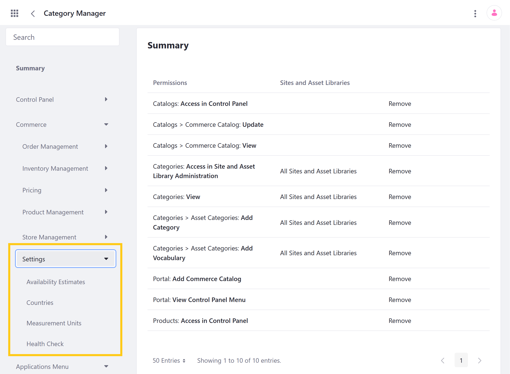

# Settings Permissions Reference

Liferay Commerce provides out-of-the-box permissions to control access to Settings applications in the Global Menu ().


You can manage Settings permissions for user roles under *Commerce* &rarr; *Order Management* in the Define Permissions tab. Assign permissions individually, or check *Action* to assign all permissions for an application or resource.



```note::
   The following article does not document permissions for related widgets.
```

## Standard Application Permissions

Application permissions define what actions can be performed in an application.

Settings includes the following applications:

* **Availability Estimates**: This application is used to create and manage availability estimates for when Products are available. See [Availability Estimates](../../managing-a-catalog/managing-inventory/availability-estimates.md) for more information.

* **Countries**: This application is used to create and manage country entries, which are then used in other applications (e.g., Channels). See [Adding Regions](../../store-administration/adding-regions.md) for more information. <!--TASK: replace when general article on Countries is written.-->

* **Measurement Units**: This application is used to create and manage standard measurement units that are used for Product Specifications. See [Measurement Units](../../store-administration/configuring-shipping-methods/measurement-units.md) for more information.

* **Health Check**: This application is used to check the health status of Commerce applications, as well as fix any existing issues. <!--TASK: Add link when general article on Health Check is written.-->

All Settings applications have the following permissions:

| Permission | Description |
| --- | --- |
| Access in Control Panel | Ability to access the application in the Global Menu |
| Configuration | Ability to view and set the application's configuration options |
| Permissions | Ability to view and modify the application's permissions |
| Preferences | Ability to view and set application preferences |
| View | Ability to view ... | <!--finish-->

## Additional Information

* [Availability Estimates](../../managing-a-catalog/managing-inventory/availability-estimates.md)
* [Measurement Units](../../store-administration/configuring-shipping-methods/measurement-units.md)
