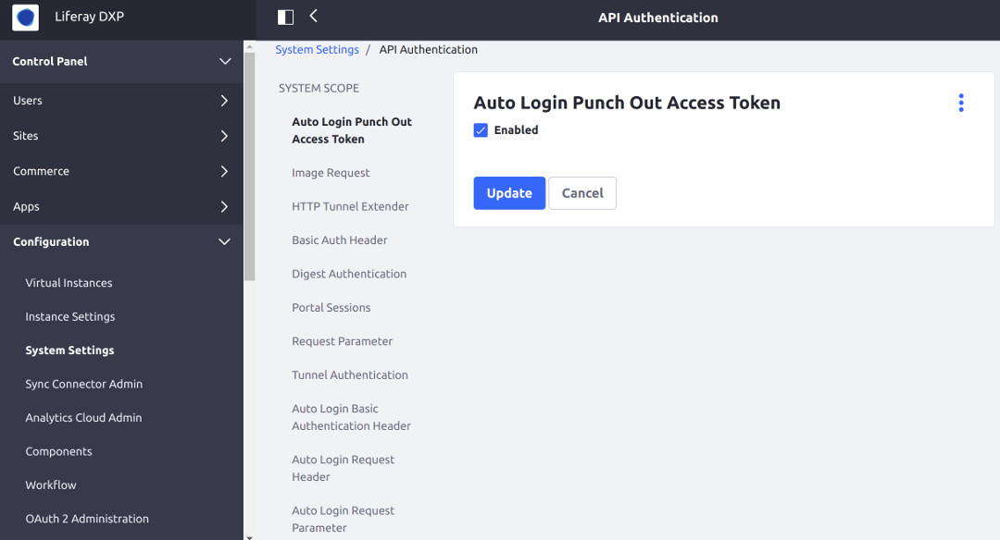
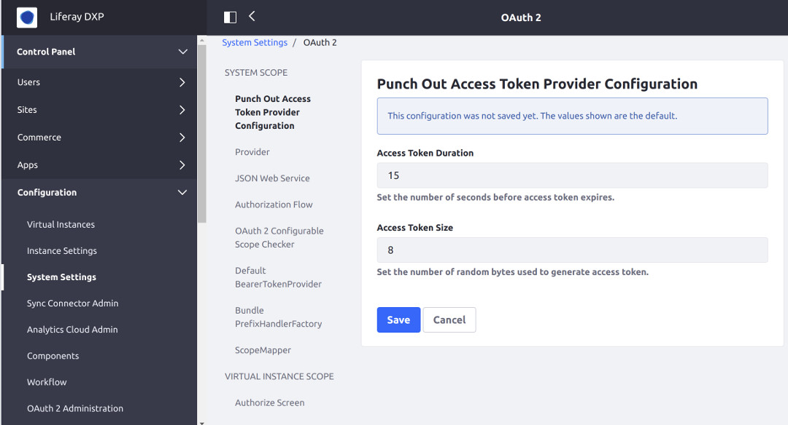
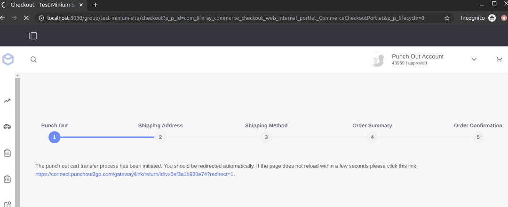

# Liferay Commerce Connector to PunchOut2Go

> Subscription Required

Liferay provides a PunchOut2Go connector that enables Commerce integration with a user's existing PunchOut2Go infrastructure. You can download this connector from the [Liferay Help Center](http://customer.liferay.com/downloads) as an LPKG file.

<!-- -->

```important::
   The PunchOut2Go connector requires Liferay Commerce 2.1.2 and Liferay DXP 7.1 FP18+ or 7.2 FP6+.
```

## Deploy the PunchOut2Go Connector

Before deploying the PunchOut2Go connector, ensure Commerce is already deployed to your Liferay server to avoid conflicts. Then, follow these steps to deploy the PunchOut2Go LPKG connector:

1. Download the *Commerce Connector to PunchOut2Go* from the [Liferay Help Center](http://customer.liferay.com/downloads).

1. Copy the *PunchOut2Go Connector* `LPKG` into the [`${liferay.home}/deploy`](https://learn.liferay.com/dxp/latest/en/installation-and-upgrades/reference/liferay-home.html) folder.

1. Verify that the following message displays in the application server console:

    ```
    2020-07-24 22:10:01.924 INFO  [fileinstall-/../../liferay-portal-7.1.10.1-sp1/osgi/marketplace][LPKGArtifactInstaller:209] The portal instance needs to be restarted to complete the installation of file:/../../liferay-portal-7.1.10.1-sp1/osgi/marketplace/Liferay%20Commerce%20Connector%20to%20PunchOut2Go%20-%20API.lpkg
    2020-07-24 22:10:01.926 INFO  [fileinstall-../../liferay-portal-7.1.10.1-sp1/osgi/marketplace][LPKGArtifactInstaller:209] The portal instance needs to be restarted to complete the installation of file:/../../liferay-portal-7.1.10.1-sp1/osgi/marketplace/Liferay%20Commerce%20Connector%20to%20PunchOut2Go%20-%20Impl.lpkg`
    ```

1. Restart the application server.

<!-- 1. Verify that the following message displays in the application server console:

    ```
     [Success message]
    ```
-->

Once the server finishes restarting, the connector is active and ready for configuration.

## Configure the Connector

The PunchOut2Go Connector is configured on a per-[channel](../starting-a-store/channels/introduction-to-channels.md) basis.

Users must have the URL of the store's catalog page; in this example: `http://localhost:8080/web/everest.com/catalog`.

1. Navigate to the _Control Panel_ &rarr; _Commerce_ &rarr; _Channels_.
1. Click on the desired channel.
1. Click the _Punch Out_ tab.
1. Switch the toggle to _Enabled_.
1. Enter the Punch Out Start URL.
1. Click _Save_ when finished.

### Enable Auto Login Punch Out Access Token

Users must enable the Punch Out Access Token for the buyer's procurement system to enable access to the Liferay Commerce instance. To enable the token:

1. Navigate to the _Control Panel_ &rarr; _Configuration_ &rarr; _System Settings_.
1. Click _API Authentication_ under _Security_.

    

1. Click _Auto Login Punch Out Access Token_ in the left menu.
1. Check the _Enabled_ checkbox.

    

1. Click the _Update_ button.

The Auto Login _Punch Out_ Token is enabled and the buyer's procurement system can now log in.

### Punch Out Access Token Provider Configuration

Once the Punch Out Access Token has been enabled, users can configure the Punch Out Access Token Provider. In particular, they can set how long the token lasts and the size of the token. Follow the steps below:

1. Navigate to the _Control Panel_ &rarr; _Configuration_ &rarr; _System Settings_.
1. Click _OAuth2_ under _Security_.
1. Enter the following:

    * **Access Token Duration**:
    * **Access Token Size**:

    

1. Click _Save_ when finished.

The Auto Login _Punch Out_ Token is configured.

## Create a Punch Out Buyer Role

As best practice, users should create a Role for vendors using Punch Out. To learn more about Commerce Roles, see [Commerce Roles](../users-and-accounts/roles-and-permissions/commerce-roles-reference.md). For more information about Roles and Permissions in DXP, see [Understanding Roles and Permissions](https://learn.liferay.com/dxp/latest/en/users-and-permissions/roles-and-permissions/understanding-roles-and-permissions.html)

1. Navigate to the _Control Panel_ → _Users_ → _Roles_.
1. Click the _Site Roles_ tab.
1. Click the _Add Site Role_ button.
1. Enter the following:
    * **Name**: Punch Out Vendor.
1. Click _Save_.
1. Click _Define Permissions_.
1. Expand the _Site Administration_ in the left menu.
1. Navigate to _Applications_ &rarr; _Open Carts_.
1. Check the following boxes (at the minimum):

    * **Check Out Open Orders**
    * **View Open Orders**

    

1. Click _Save_ when finished.

The Role has been created with the required minimum permissions. Assign this Role to the buyers who are using Punch Out.

## Verify Redirect to Buyer's Procurement System

The checkout process with the Connector to PunchOut2Go active occurs in the same way. When users click _Submit_ they are redirected to the appropriate procurement system.



## Additional Information

* [Deploying Liferay Commerce to an Existing Liferay Installation](../installation-and-upgrades/installing-commerce-2.1-and-below/deploying-liferay-commerce-to-an-existing-liferay-installation.md)
* [Activating Liferay Commerce Enterprise](../installation-and-upgrades/activating-liferay-commerce-enterprise.md)
* [Liferay Commerce Connector to PunchOut2Go Reference Guide](./liferay-commerce-connector-to-punchout2go-reference-guide.md)
