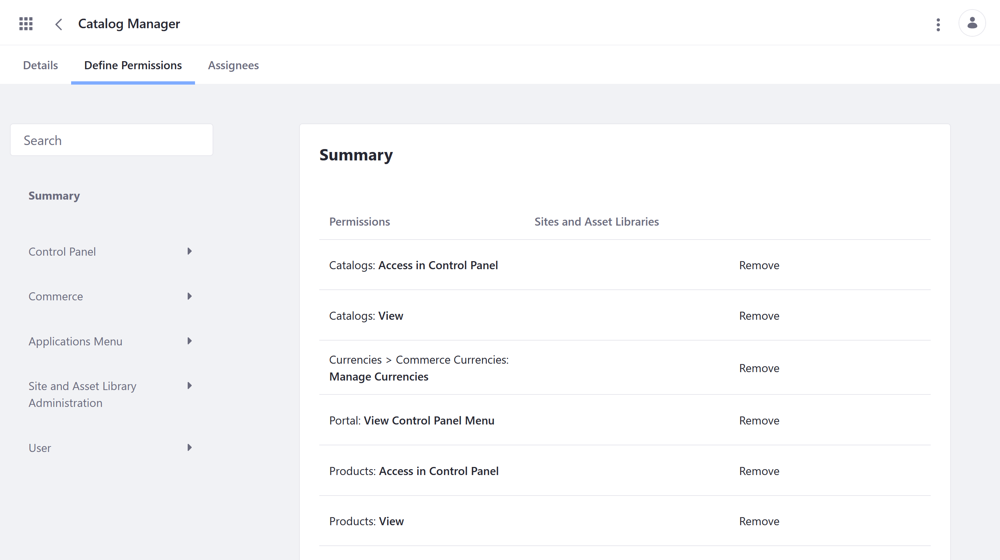

# Commerce Roles

User roles are used to group together the permissions necessary for accessing and using Liferay applications and resources. Each role can be scoped to an instance, Site, Organization, Asset Library, or Account. See [Understanding Roles and Permissions](https://learn.liferay.com/dxp/latest/en/users-and-permissions/roles-and-permissions/understanding-roles-and-permissions.html) for more details.

Commerce includes four out-of-the-box Commerce roles: Account Administrator, Account Member, Buyer, and Order Manager. While these roles may satisfy your business/Commerce needs, other common roles include: Catalog Manager, Inventory Manager, Shipments Manager, Instance Order Manager, and Discount Manager.

```note::
   For Liferay 7.3.x and earlier Commerce versions, Sales Agent is also included as an out-of-the-box role.
```

## Viewing Permissions

Follow these steps to view and manage permissions associated with a Commerce role:

1. Open the *Global Menu* (), click on the *Control Panel* tab, and go to *Users* &rarr; *Roles*.

   

1. Click on the desired role:

   * *Account Administrator* (Account Role)
   * *Account Member* (Account Role)
   * *Buyer* (Site Role)
   * *Order Manager* (Site Role)

   ```note::
      In Liferay 7.3 and earlier versions, the Account Administrator is a Site Role, and the Account Member role is not a default role. 
   ```

1. Click on the *Define Permissions* tab.

   From here, you can view a summary of all application and resource permissions assigned to the role.

   You can also remove or add permissions.

   

## Account Administrator (Account Role)

> Out-of-the-box

Account Administrators can modify their Account, invite or add users to it, and assign roles to other Account members. Note that Account Administrators cannot create or delete Accounts. This permission is reserved for instance administrators.

The following Accounts permissions pertain to the Account Administrator's ability to modify accounts in a B2B setting. Open Carts permissions pertain to the administrator's ability to modify Channel orders regardless of the store type.

| Permissions | Description |
| --- | --- |
| Accounts > Account: Add Account Entry | |
| Accounts > Account Entry: Manage Users | |
| Accounts > Account Entry: Update | |
| Accounts > Account Entry: View | |
| Accounts > Account Entry: View Users | |
| Accounts > Commerce Account: Manage Addresses | Ability to add a new billing, a shipping, or a combined address |
| Accounts > Commerce Account: Manage Members | Ability to invite a new member or an organization and modify his or her credentials |
| Accounts > Commerce Account: Update | Ability to modify Accounts |
| Accounts > Commerce Account: View | Ability to view Accounts |
| Accounts > Commerce Account: View Addresses | Ability to view all the addresses associated with an Account |
| Accounts > Commerce Account: View Members | Ability to view all members in an Account |
| Open Carts > Commerce Order: Add Order | Ability to add an order to the Buyer's specified account (can have more than one account) |
| Open Carts > Commerce Order: Approve Open Orders | Allow account administrator to approve orders if workflow has been enabled |
| Open Carts > Commerce Order: Check Out Open Orders | Ability to complete the checkout process for new, incomplete orders |
| Open Carts > Commerce Order: Delete Orders | Grants the ability to delete an order |
| Open Carts > Commerce Order: Manage Orders | Change Order details such as mailing and billing addresses; ability to add a note to the order |
| Open Carts > Commerce Order: View Open Orders | Ability to view all open orders |
| Open Carts > Commerce Order: View Orders | Ability to view all orders regardless of their statuses |

## Account Member (Account Role)

> Out-of-the-box for Liferay 7.4+

This role is automatically assigned to all users within an account and grants basic view permissions.

| Permission | Description |
| --- | --- |
| Accounts > Account Entry: View | Ability to view an Account |

## Buyer (Site Role)

> Out-of-the-box

Users assigned this role can view, create, and check out orders.

| Permissions | Description |
| --- | --- |
| Open Carts > Commerce Order: Add Order | Ability to add an order to the Buyer's specified account (can have more than one account) |
| Open Carts > Commerce Order: Checkout Open Orders | Ability to complete the checkout process for new, incomplete orders |
| Open Carts > Commerce Order: View Open Orders | Ability to view all open orders |
| Open Carts > Commerce Order: View Orders | Ability to view all orders regardless of their statuses |

## Catalog Manager

> Custom role

Catalog Managers can access, create, edit, and manage Products within a specific Catalog. This role is useful in multiple Catalog scenarios, where different vendors or company teams manage different Products in separate Catalogs. Note that Catalog Managers cannot manage inventory.

| Permissions | Description |
| --- | --- |
| Catalogs: Access in Control Panel | |
| Catalogs: View | |
| Currencies > Commerce Currencies: Manage Currencies | |
| Portal: View Control Panel Menu | |
| Products: Access in Control Panel | |
| Products: View | |

In addition to the above permissions, you must also assign *View* and *Update* permissions for the individual Catalog you want the role will manage.

To do this, open the *Global Menu* (), click on the *Commerce* tab, and go to *Product Management* &rarr; *Catalog*. Then, click on the *Actions* button () for the desired Catalog, and select *Permissions*. Use the check boxes to assign the role *View* and *Update* permissions.

```note::
   If you'd like your Catalog Manager to manage Products within a Catalog without the ability to modify the Catalog itself, remove the ``Catalogs: Access in Control Panel`` and ``Catalogs: View`` permissions.
```

## Discount Manager

> Custom role

The Discount Manager role allows users to create, update, and delete Discounts in Liferay Commerce. Since Commerce Discounts can target different parts of an order and use different eligibility rules, there are a lot of possible permission configurations for a Discount Manager. The following configuration grants access to all Discount options.

| Permissions | Description |
| --- | --- |
| Account Groups: View | |
| Catalogs: View | |
| Catalogs > Commerce Catalogs: View Commerce Catalogs | |
| Channels: View | |
| Channels > Commerce Channels: View Commerce Channels | |
| Discounts: Access in Control Panel | |
| Discounts: Permissions | |
| Discounts: View | |
| Discounts > Commerce Discount: Delete | |
| Discounts > Commerce Discount: Permissions | |
| Discounts > Commerce Discount: Update | |
| Discounts > Commerce Discount: View | |
| Discounts > Commerce Discounts: Add Discount | |
| Discounts > Commerce Discounts: View Discounts | |
| Account Groups > Commerce Accounts: Manage All Accounts | |<!--Accurate? or Shipments > Commerce Shipments: Manage All Accounts?-->
| Currencies > Commerce Currencies: Manage Currencies | |
| Account Groups > Commerce Accounts: View Commerce Account Groups | | <!--accurate?-->
| Portal: View Control Panel Menu | |
| Price Lists: Access in Control Panel | |
| Product Groups: View | |

## Inventory Manager

> Custom role

The Inventory Manager role allows users to view and manage inventory in all Warehouses. Users with the role can add incoming shipments, update inventory levels, transfer between Warehouses, and view the changelog.

| Permissions | Description |
| --- | --- |
| Inventory: Access in Control Panel | |
| Inventory: View | |
| Warehouses > Commerce Inventories: Manage Inventory | |
| Portal: View Control Panel Menu | |

## Order Manager (Site Role)

> Out-of-the-box

This Order Manager role grants users all the permissions of Buyers and allows them to also manage, delete, and approve orders in a specific Channel Site.

| Permissions | Description |
| --- | --- |
| Open Carts > Commerce Order: Add Order | Allows order managers to add an order |
| Open Carts > Commerce Order: Approve Open Orders | Allow order managers to approve orders if workflow has been enabled |
| Open Carts > Commerce Order: Check Out Open Orders | Ability to complete the checkout process for new, incomplete orders |
| Open Carts > Commerce Order: Delete Orders | Allow order managers to delete orders |
| Open Carts > Commerce Order: Manage Orders | Change Order details such as mailing and billing addresses; ability to add a note to the order |
| Open Carts > Commerce Order: View Open Orders | Ability to view all open orders |
| Open Carts > Commerce Order: View Orders | Ability to view all orders regardless of their statuses |

## Order Manager (Regular Role)

> Custom role

This Order Manager role grants additional permissions that allow users to manage orders for one or more Channels.

| Permissions | Description |
| --- | --- |
| Open Carts > Commerce Order: Add Order | Allows order managers to add an order |
| Open Carts > Commerce Order: Approve Open Orders | Allow order managers to approve orders if workflow has been enabled |
| Open Carts > Commerce Order: Check Out Open Orders | Ability to complete the checkout process for new, incomplete orders |
| Open Carts > Commerce Order: Delete Orders | Allow order managers to delete orders |
| Open Carts > Commerce Order: Manage Order Notes | |
| Open Carts > Commerce Order: Manage Order Restricted Notes | |
| Open Carts > Commerce Order: Manage Orders | Change Order details such as mailing and billing addresses; ability to add a note to the order |
| Open Carts > Commerce Order: View Open Orders | Ability to view all open orders |
| Open Carts > Commerce Order: View Orders | Ability to view all orders regardless of their statuses |
| Orders: Access in Control Panel | |
| Orders: Permissions | |
| Orders: View | |
| Account Groups > Commerce Accounts: Manage All Accounts | | <!--accurate? OR: Shipments > Commerce Shipments: Manage All Accounts?-->
| Portal: View Control Panel Menu | |

## Shipments Manager

> Custom role

The Shipment Manager role allows a user to process shipments. This includes the ability to add shipping details, shipping dates, add items to the shipment and update shipment status. In Commerce 3.0+ and Liferay 7.3+, users create shipments via the Orders application. If you only want the Shipment Manager to fill and process the shipment, then the following permissions are sufficient. Otherwise, you may want to add additional [Order Manager](#order-manager-regular-role) permissions.

| Permissions | Description |
| --- | --- |
| Open Carts > Commerce Order: View Orders | |
| Account Groups > Commerce Accounts: Manage All Accounts | | <!--accurate? OR Shipments > Commerce Shipments: Manage All Accounts?-->
| Warehouses > Commerce Inventories: Manage Inventory | |
| Shipments > Commerce Shipments: Manage Shipments | |
| Portal: View Control Panel Menu | |
| Shipments: Access in Control Panel | |
| Shipments: View | |
| Shipments > Commerce Warehouse: View | |

## Liferay 7.3 and Earlier

### Sales Agent (Regular Role)

> Out-of-the-box

The Sales Agent is a regular role in Liferay Commerce and assignees are able to manage any account assigned to the role without granting administrative permissions. Because it is a regular role, it is found in the *Regular Roles* tab.


| Permissions | Description |
| --- | --- |
| Manage Organizations | Ability to add or remove organizations |
| Manage Available Accounts | Ability to manage Accounts that the sales agent is a member of |

## Additional Information

* [Understanding Roles and Permissions](https://learn.liferay.com/dxp/latest/en/users-and-permissions/roles-and-permissions/understanding-roles-and-permissions.html)
* [Order Management Permissions Reference]()
* [Inventory Management Permissions Reference]()
* [Pricing Permissions Reference]()
* [Product Management Permissions Reference]()
* [Store Management Permissions Reference]()
* [Settings Permissions Reference]()