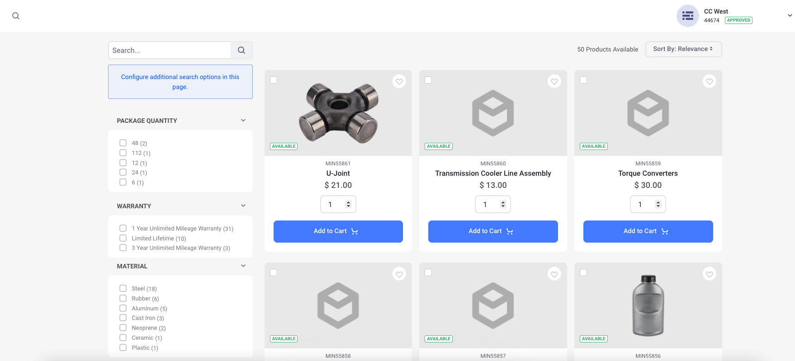

# Search

The Search page may be used to search for content that may be available on a Liferay Commerce site, including but not limited to: web content, knowledge base articles, documents, images, and products. The Search page contains a search bar and several facet widgets that allow users to refine their searches.

If using the [Minium Accelerator](../../starting-a-store/using-the-minium-accelerator-to-jump-start-your-b2b-store.md), the Search page contains the _Search Bar_, _Search Options_, _Search Results_, _Type Facet_, _Tag_, _Category_, _Site_, _Folder_, _User_, and the _Modified Facet_ widgets.



```note::
   The Search Bar widget is scoped to include *Everything*. This is necessary for displaying Products, since Products are created in Catalogs at the global level and are not Site-scoped. 
   
   Also, the Search Options widget is set to *Allow Empty Searches*. This allows customers to browse and filter all content visible to the Channel.
```

## Additional Information

* [Widget Reference Guide](../liferay-commerce-widgets/widget-reference.md)
* [Creating Pages](https://help.liferay.com/hc/en-us/articles/360018171291-Creating-Pages)
