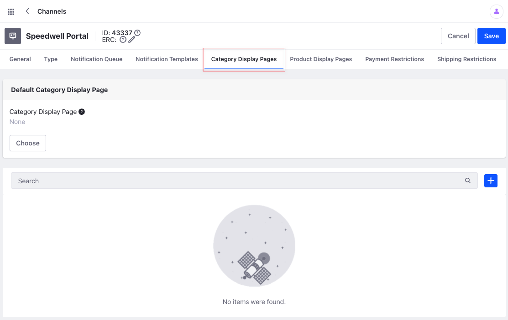
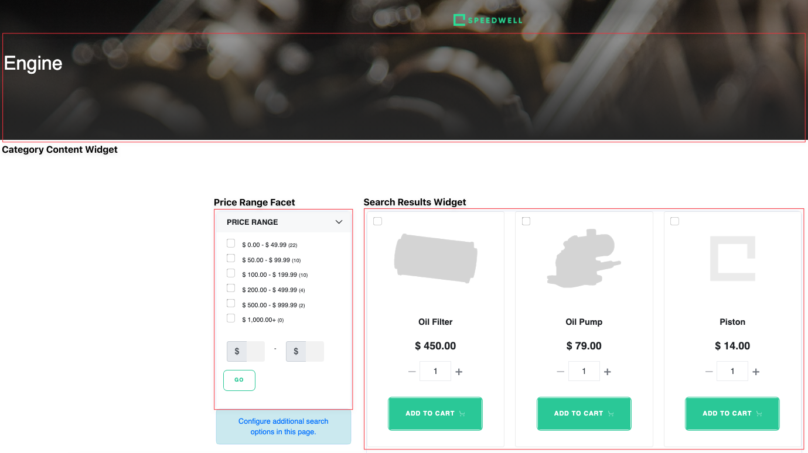
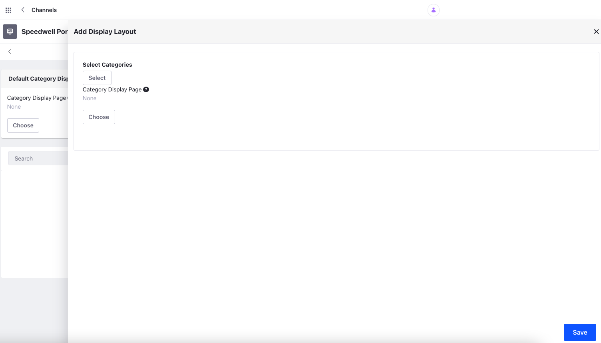
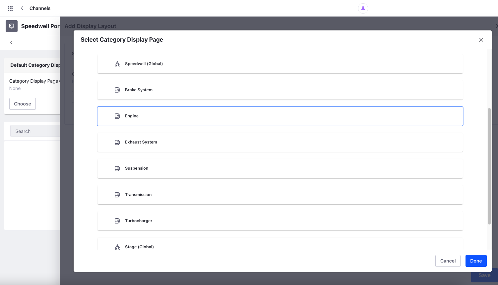

# Creating Category Display Pages

You can link Categories to Widget Pages to create and manage pages at scale in Liferay Commerce. Rather than managing one page for every category, you can define a single template to be used across all categories with Category Display pages. Once the pages are created, users can make use of built-in or custom widgets and fragments to display details pertaining to a specific category. This is useful when you have many categories in your store and want to manage them efficiently.

## Creating a Default Category Display Page



To create a default category page for your store, follow these steps:

1. Create a new _Widget Page_ in your store, and add the _Category Content_ widget to it, along with any other desired page elements.

1. Click the _Global Menu_ (), &rarr; the Commerce tab &rarr; _Store Management_ &rarr; _Channels_.

1. Select the desired _Channel_ and click on the _Category Display Pages_ tab. Under the Default Category Display Page section, click _Choose_ and select the page you created.

This page is used as the default page for all Categories in your store.



```{note}
For Liferay DXP 7.3 and earlier, the Default Category Display Page selection under Channel Settings is not available. To set a Category Display page, users must create a Widget page and add the Category Content widget to it, along with any other desired Page elements. This is then recognized as the default Category Display page.
```

## Creating a Category Display Page for a Specific Category

In some cases, you may want to display a specific category of products on a page. This can be useful to display products with promotions or offers. To map a specific Category to a Page, follow these steps:

1. Create a new [_Widget Page_](https://learn.liferay.com/dxp/latest/en/site-building/creating-pages/understanding-pages/understanding-pages.html#widget-pages) in your store and add the _Category Content_ widget to it along with any other desired Page elements.

1. Open the _Global Menu_ () &rarr; Commerce tab &rarr; _Store Management_ &rarr; _Channels_.

1. Select the desired _Channel_, click on the _Category Display Pages tab_, and click the _Add_ button ().

   

1. Click _Select_ under _Select Categories_ and choose the category you want to link to your new Site page.

   

1. Click _Choose_ under _Category Display Page_, select your new Site page, and click _Save_.

1. Click _Save_ when finished.

```{note}
The default Category Display page must contain the Category Content widget to display each category differently. If there are multiple pages with the Category Content widget, Liferay defaults to the first one in the layout list. 
```

This establishes a relationship between the category and the selected Page. Each time a user clicks on the specific category, they are redirected to the new category display page. To view and manage your category display pages, use the Category Display Pages tab under Channel Settings.

## Additional Information

- [Displaying Categories Using Display Pages](https://learn.liferay.com/dxp/latest/en/site-building/displaying-content/using-display-page-templates/displaying-categories-using-display-pages.html)
