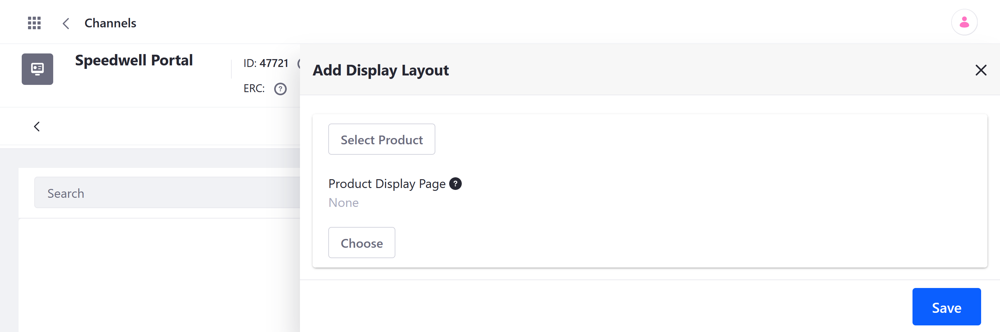
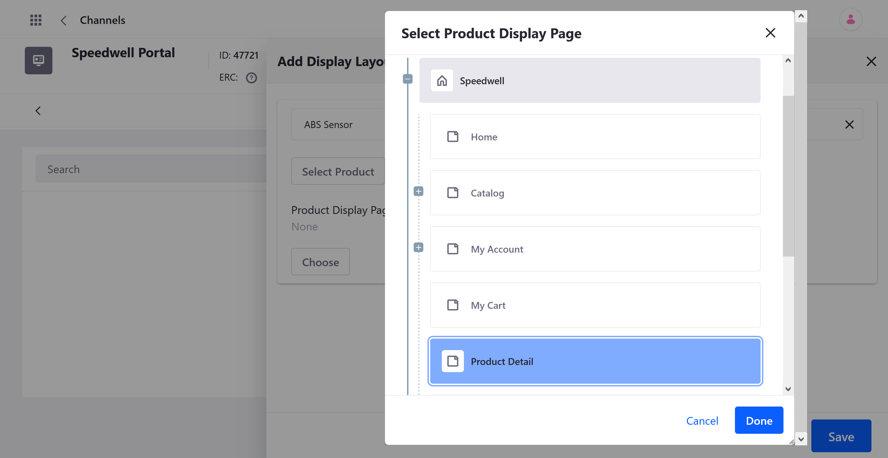
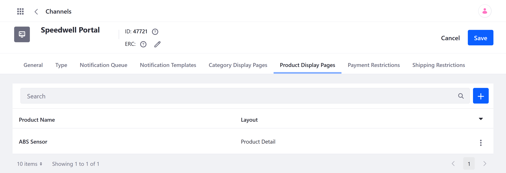

# Creating Product Display Pages

With Liferay Commerce, you can link individual store products with Site pages to create dedicated display pages for each product. Quickly design layouts using out-of-the-box or custom widgets and fragments to display product details.

Follow these steps to set up a display page for your products:

1. Create a new Site page in your Store, and add the *Product Details* widget to it, along with any other desired Page elements. See [Building Content Pages](https://learn.liferay.com/dxp/latest/en/site-building/creating-pages/building_and_managing_content_pages.html) for more information. This page determines the layout used for displaying any linked products.

1. Open the *Global Menu* (), click on the *Commerce* tab, and go to *Store Management* &rarr; *Channels*.

1. Select the desired *Channel*, click on the *Product Display Pages* tab, and click the *Add* button ().

   

1. Click on *Select Product*, and *choose* the product you want to link to your new Site page.

1. Click on *Choose* under *Product Display Page*, select your new Site page, and click on *Done*.

   

1. Click on *Save* when finished.

This immediately establishes a relationship between the product and the selected Page. Now, when users click on the product in your store, they'll be redirected to the product's display page.

You can view and manage all saved configurations via the Product Display Pages tab.



```note::
   When there are two layouts with the product details or category content widget on them, Liferay defaults to the first one listed in the layout list.
```

## Additional Information

* [Creating Your Storefront](./creating-your-storefront.md)
* [Creating a Catalog Page](./creating-a-catalog-page.md)
