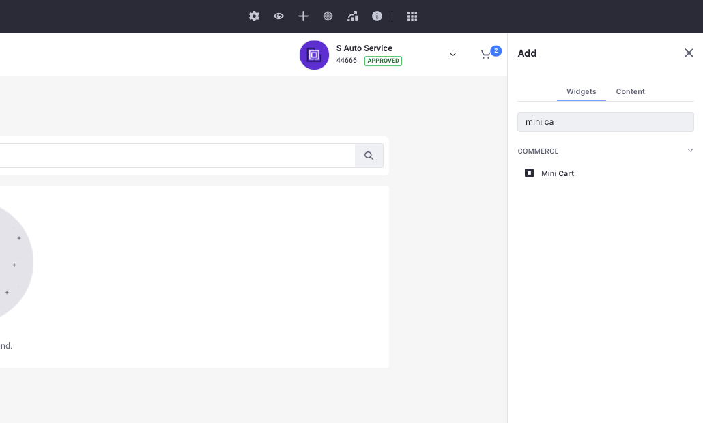
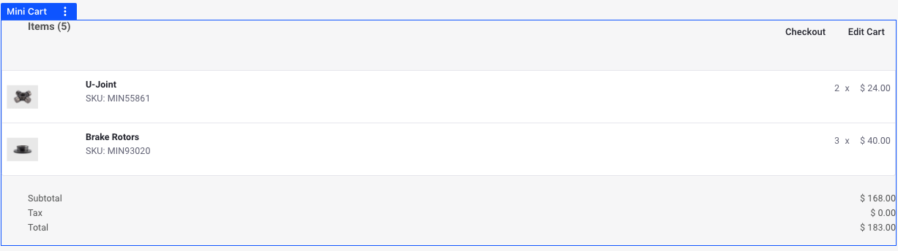

# Using the Mini Cart Widget

Liferay Commerce comes with a *Mini Cart* widget that provides a quick overview of the current cart status.

```{important}
The Mini Cart widget is not the same as the custom mini cart component present in accelerators like Minium and Speedwell.
```

## Adding the Mini Cart Widget to a Page

1. Click the *Add* () button from the top menu.

1. In the Widgets section, search for the *Mini Cart* widget.

   

1. Drag and drop the widget to the desired area in your storefront.

   

```{important}
If you are using a Content Page, the add button is present on the right side. Clicking this opens the *Fragments and Widgets* menu. The rest of the steps remain the same.
```

The widget immediately reflects the status of your cart if there are items present in it. It has two options at the top-right. The first option initiates the checkout process, and you can continue to place your order. The second option edits the cart and takes you to the order details page. Here, you can delete the items from your cart, add a shipping and billing address, or continue to check out.

```{note}
The Mini Cart widget supports Application Display Templates to change the look and feel of the widget without having to deploy any code.
```

## Additional Information

* [Liferay Commerce Widget Reference List](./widget-reference.md)
