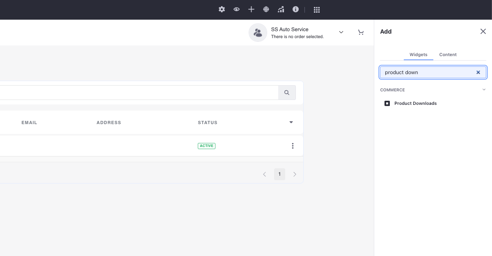
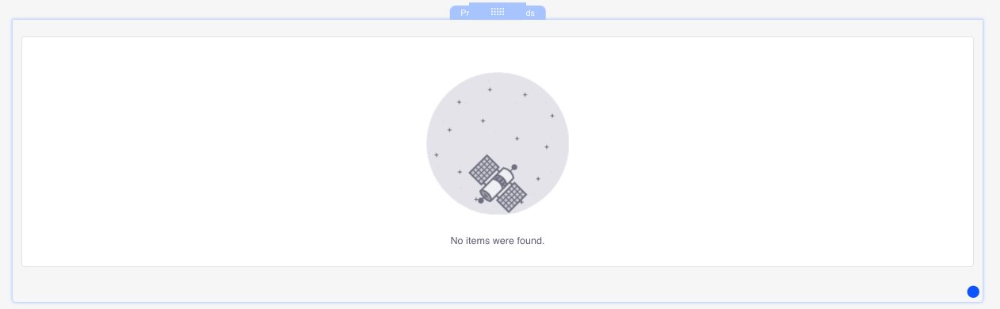
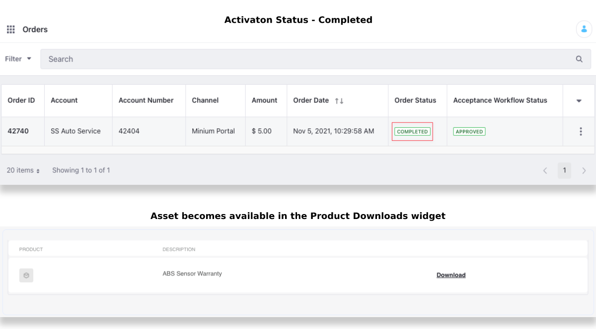

# Using the Product Downloads Widget

Liferay Commerce includes the *Product Downloads* widget to access and download digital assets purchased as [Virtual Products](../../managing-a-catalog/creating-and-managing-products/product-types/creating-a-virtual-product.md).

Follow the steps below to use the Product Downloads widget.

1. Click the *Add* button() from the top menu.

1. In the Widgets section, search for the Product Downloads widget.

   

1. Drag and drop the widget to the desired area in your storefront.

   

This automatically activates the widget. Once a Virtual Product is purchased, the asset appears here, based on its *Activation Status*:

| Configuration | Effect on Visibility |
| --- | --- |
| Activation Status | Determines the order stage at which the asset becomes available to download (i.e., Completed, Pending, or Processing). |
| Duration | The number of days for which the asset is available to download. |
| Max Number of Downloads | The number of times the asset can be downloaded for a single purchase. |

The table above details the configuration options available to a Virtual Product. These options control the visibility of the product on the Product Downloads widget.

