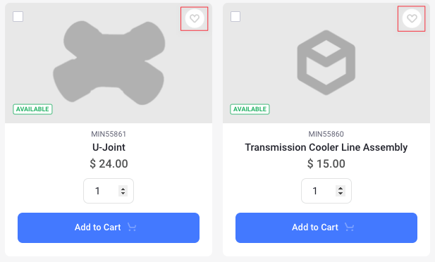
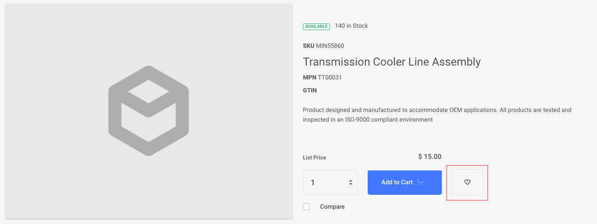
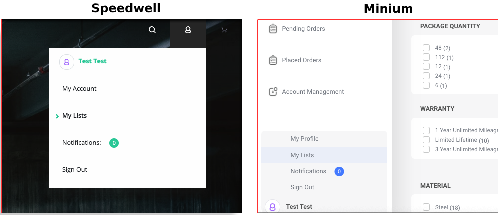
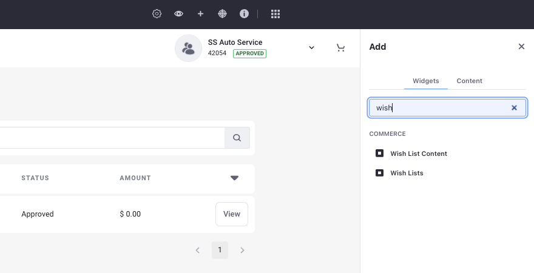
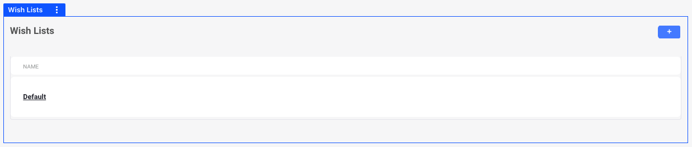
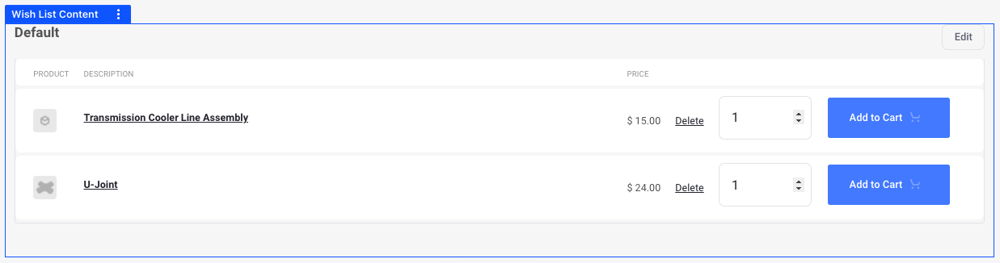
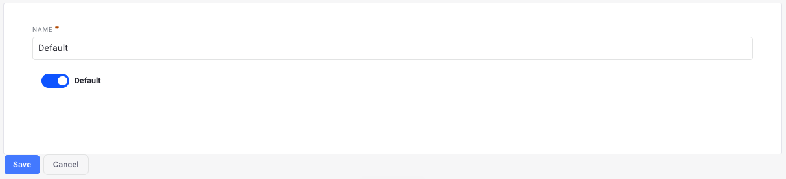

# Using Wish Lists

Liferay Commerce comes with wish lists out-of-the-box. You can save products in a wish list to purchase them later or can use them to avoid going through an entire catalog of products if you have redundant purchases.

## Adding Products to a Wish List

Every user has a default wish list automatically created for them.



To add products to the default wish list, go to your storefront and click on the heart button at the top right of the product.



You can also click on the product to view the *Product Details* page and click on the heart button to do the same.  

## Widgets: Wish List and Wish List Content

There are two widgets associated with wish lists. The first one is the *Wish Lists* widget that displays a list of all the wish lists available. The second one is the *Wish List Content* widget that displays the contents of the active wish list.



If you are using the Minium or Speedwell accelerator, you have access to the *My Lists* entry in the user menu. This page already has both these widgets in place.

### Adding a Wish List Widget to your Page

Follow these steps to add the Wish Lists widget to a Widget Page.



1. Click the *Add* () button from the top menu.

1. In the Widgets section, search for the *Wish Lists* widget.

1. Drag and drop the widget to the desired area in your storefront.

```{important}
If you are using a *Content Page*, there are two different ways to add a widget.

1. Click on the *Edit* () button from the top menu and click the *Add* () button on the right side. The rest of the steps remain the same as above.

1. Open the *Product Menu* (), select *Site Builder* &rarr; *Pages*. Navigate to the desired page and click on the *Actions* () button and select Edit. The rest of the steps remain the same as above.
```



To create a new wish list, click the *Add* button at the top right. When you have multiple wish lists, click on one to make it the active wish list.

```{important}
To add products to a new wish list, you need to set it as the default wish list.
```

```{note}
The same steps can be followed for the Wish List Content widget as well. Search for it in the Widgets section, and drag and drop it to the desired area in your storefront.
```



### Working with the Wish List Content Widget

Inside the Wish List Content widget, you can view the products present in your wish list, delete them, change their quantities and add them to your cart.



You can edit the name of your wish list on the Wish List Content widget. To do that, click on the *Edit* button at the top right, enter a name of your choice and click *Save*. You can use the toggle to set any wish list as the default one.

```{note}
If you set the default wish list to be non-default using the toggle, it can be deleted. After deleting, if you try adding products to a wish list, a new default wish list is created.
```
