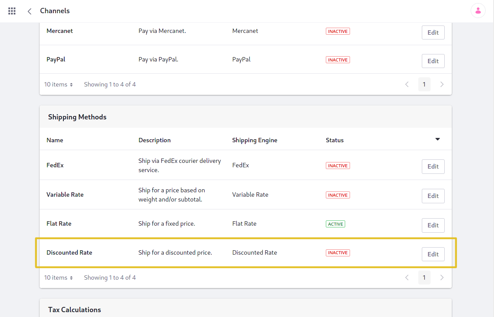

# Implementing a New Shipping Engine

This tutorial will show you how to add a custom shipping engine by implementing the [CommerceShippingEngine](https://github.com/liferay/liferay-portal/blob/[$LIFERAY_LEARN_PORTAL_GIT_TAG$]/modules/apps/commerce/commerce-api/src/main/java/com/liferay/commerce/model/CommerceShippingEngine.java) interface.

Shipping engines process shipping options to determine which of the available options will be shown to the user, for what price, and so on. Liferay Commerce provides three shipping engines out-of-the-box: a [flat rate engine](https://github.com/liferay/liferay-portal/blob/[$LIFERAY_LEARN_PORTAL_GIT_TAG$]/modules/apps/commerce/commerce-shipping-engine-fixed-web/src/main/java/com/liferay/commerce/shipping/engine/fixed/web/internal/FixedCommerceShippingEngine.java), a [variable rate engine](https://github.com/liferay/liferay-portal/blob/[$LIFERAY_LEARN_PORTAL_GIT_TAG$]/modules/apps/commerce/commerce-shipping-engine-fixed-web/src/main/java/com/liferay/commerce/shipping/engine/fixed/web/internal/ByWeightCommerceShippingEngine.java), and the [FedEx engine](https://github.com/liferay/liferay-portal/blob/[$LIFERAY_LEARN_PORTAL_GIT_TAG$]/modules/apps/commerce/commerce-shipping-engine-fedex/src/main/java/com/liferay/commerce/shipping/engine/fedex/internal/FedExCommerceShippingEngine.java).

>The FedEx shipping engine is only available for Commerce Enterprise Subscribers.


## Overview

1. [**Deploy an Example**](#deploy-an-example)
1. [**Walk Through the Example**](#walk-through-the-example)
1. [**Additional Information**](#additional-information)

## Deploy an Example

In this section, we will get an example shipping engine up and running on your instance of Liferay Commerce. Follow these steps:

1. Start Liferay Commerce.

    ```bash
    docker run -it -p 8080:8080 [$LIFERAY_LEARN_PORTAL_DOCKER_IMAGE$]
    ```

1. Download and unzip the [Acme Commerce Shipping Engine](./liferay-j6x8.zip)

    ```bash
    curl https://learn.liferay.com/commerce/latest/en/developer-guide/liferay-j6x8.zip -O
    ```

    ```bash
    unzip liferay-j6x8.zip
    ```

1. Build and deploy the example.

    ```bash
    ./gradlew deploy -Ddeploy.docker.container.id=$(docker ps -lq)
    ```

    ```note::
       This command is the same as copying the deployed jars to ``/opt/liferay/osgi/modules`` on the Docker container.
    ```

1. Confirm the deployment in the Docker container console.

    ```bash
    STARTED com.acme.j6x8.impl_1.0.0
    ```

1. Verify that the example shipping engine was added. Open your browser to `https://localhost:8080`. Then click the Applications Menu () and navigate to _Commerce_ → _Channels_. In the Shipping Methods section, the new shipping method ("Discounted Rate") representing our shipping engine will be present.

```note::
   In Commerce 2.1 and earlier, find the shipping methods by navigating to *Site Administration* → *Commerce* → *Settings* → *Shipping Methods*.
```



Congratulations, you've successfully built and deployed a new shipping engine that implements `CommerceShippingEngine`.

Next, let's dive deeper to learn more.

## Walk Through the Example

In this section, we will review the example we deployed. First, we will annotate the class for OSGi registration. Second, we will review the `CommerceShippingEngine` interface. And third, we will complete our implementation of `CommerceShippingEngine`.

### Annotate the Class for OSGi Registration

```java
@Component(
    property = "commerce.shipping.engine.key=j6x8",
    service = CommerceShippingEngine.class
)
public class J6X8CommerceShippingEngine implements CommerceShippingEngine {
```

> It is important to provide a distinct key for the shipping engine so that Liferay Commerce can distinguish the new engine from others in the [shipping engine registry](https://github.com/liferay/liferay-portal/blob/[$LIFERAY_LEARN_PORTAL_GIT_TAG$]/modules/apps/commerce/commerce-service/src/main/java/com/liferay/commerce/internal/util/CommerceShippingEngineRegistryImpl.java). Reusing a key that is already in use will override the existing associated engine.

### Review the `CommerceShippingEngine` Interface

Implement the following methods:

```java
public String getCommerceShippingOptionLabel(String name, Locale locale);
```

> This method returns a text label used for shipping options. See the implementation in [J6X8CommerceShippingEngine.java](https://github.com/liferay/liferay-learn/blob/master/docs/commerce/latest/en/developer-guide/implementing-a-new-shipping-engine/resources/liferay-j6x8.zip/j6x8-impl/src/main/java/com/acme/j6x8/internal/commerce/model/J6X8CommerceShippingEngine.java) for a reference in retrieving the description with a language key.
>
> See [Localizing Your Application](https://help.liferay.com/hc/en-us/articles/360018168251-Localizing-Your-Application) for more information.

```java
public List<CommerceShippingOption> getCommerceShippingOptions(
        CommerceContext commerceContext, CommerceOrder commerceOrder,
        Locale locale)
    throws CommerceShippingEngineException;
```

> This will be where we add the business logic for our custom shipping engine. It must fetch a list of available options, then perform the processing necessary to present them to the customer.

```java
public String getDescription(Locale locale);
```

> This returns a brief description of our shipping engine. It works similarly to the `getCommerceShippingOptionLabel` method.

```java
public String getName(Locale locale);
```

> This returns the name of our shipping engine to display in the UI. It also works similarly to the `getCommerceShippingOptionLabel` and `getDescription` methods.

### Complete the Shipping Engine

The shipping engine method `getCommerceShippingOptions` returns the list of shipping options to show to the customer.

```java
@Override
public List<CommerceShippingOption> getCommerceShippingOptions(
        CommerceContext commerceContext, CommerceOrder commerceOrder,
        Locale locale)
    throws CommerceShippingEngineException {

    try {
        CommerceShippingMethod commerceShippingMethod =
            _commerceShippingMethodLocalService.fetchCommerceShippingMethod(
                commerceOrder.getScopeGroupId(), "j6x8");

        if (commerceShippingMethod == null) {
            return Collections.emptyList();
        }

        List<CommerceShippingOption> commerceShippingOptions =
            new ArrayList<>();

        List<CommerceShippingFixedOption> commerceShippingFixedOptions =
            _commerceShippingFixedOptionLocalService.
                getCommerceShippingFixedOptions(
                    commerceShippingMethod.getCommerceShippingMethodId(),
                    QueryUtil.ALL_POS, QueryUtil.ALL_POS);

        for (CommerceShippingFixedOption commerceShippingFixedOption :
                commerceShippingFixedOptions) {

            CommerceAddress commerceAddress =
                commerceOrder.getShippingAddress();

            if (_commerceAddressRestrictionLocalService.
                    isCommerceShippingMethodRestricted(
                        commerceShippingFixedOption.
                            getCommerceShippingMethodId(),
                        commerceAddress.getCommerceCountryId())) {

                continue;
            }

            String name = commerceShippingFixedOption.getName(locale);

            if (_commerceShippingHelper.isFreeShipping(commerceOrder)) {
                commerceShippingOptions.add(
                    new CommerceShippingOption(
                        name, name, BigDecimal.ZERO));
            }

            BigDecimal amount = commerceShippingFixedOption.getAmount();

            amount = amount.multiply(BigDecimal.valueOf(0.75));

            commerceShippingOptions.add(
                new CommerceShippingOption(name, name, amount));
        }

        return commerceShippingOptions;
    }
    catch (Exception exception) {
        throw new CommerceShippingEngineException(exception);
    }
}
```

The method starts by getting the available shipping options and looping over them to process each one.

```java
CommerceShippingMethod commerceShippingMethod =
    _commerceShippingMethodLocalService.fetchCommerceShippingMethod(
        commerceOrder.getScopeGroupId(), "j6x8");

if (commerceShippingMethod == null) {
    return Collections.emptyList();
}

List<CommerceShippingOption> commerceShippingOptions =
    new ArrayList<>();

List<CommerceShippingFixedOption> commerceShippingFixedOptions =
    _commerceShippingFixedOptionLocalService.
        getCommerceShippingFixedOptions(
            commerceShippingMethod.getCommerceShippingMethodId(),
            QueryUtil.ALL_POS, QueryUtil.ALL_POS);

for (CommerceShippingFixedOption commerceShippingFixedOption :
        commerceShippingFixedOptions) {
    
    //The shipping option processing logic goes here.
```

> First, use [CommerceShippingMethodLocalService](https://github.com/liferay/liferay-portal/blob/[$LIFERAY_LEARN_PORTAL_GIT_TAG$]/modules/apps/commerce/commerce-service/src/main/java/com/liferay/commerce/service/impl/CommerceShippingMethodLocalServiceImpl.java) to get the "shipping method" (representing our shipping engine), and then use [CommerceShippingFixedOptionLocalService](https://github.com/liferay/liferay-portal/blob/[$LIFERAY_LEARN_PORTAL_GIT_TAG$]/modules/apps/commerce/commerce-shipping-engine-fixed-service/src/main/java/com/liferay/commerce/shipping/engine/fixed/service/impl/CommerceShippingFixedOptionLocalServiceImpl.java) to get the available options.

> Then loop over the shipping options to process them.

Here are the shipping option processing steps:

* [Implement address restriction checking.](#implement-address-restriction-checking)
* [Check for free shipping.](#check-for-free-shipping)
* [Add custom shipping option logic.](#add-custom-shipping-option-logic)
* [Add the processed shipping option.](#add-the-processed-shipping-option)

Liferay Commerce's [fixed rate shipping engine](https://github.com/liferay/liferay-portal/blob/[$LIFERAY_LEARN_PORTAL_GIT_TAG$]/modules/apps/commerce/commerce-shipping-engine-fixed-web/src/main/java/com/liferay/commerce/shipping/engine/fixed/web/internal/FixedCommerceShippingEngine.java) is a good reference to see what processing steps are a good baseline to start with. Our example method uses similar steps.

#### Implement Address Restriction Checking

```java
private boolean _shippingOptionIsAddressRestricted(
        CommerceOrder commerceOrder,
        CommerceShippingFixedOption commerceShippingFixedOption)
    throws PortalException {

    CommerceAddress commerceAddress = commerceOrder.getShippingAddress();

    return _commerceAddressRestrictionLocalService.
        isCommerceShippingMethodRestricted(
            commerceShippingFixedOption.getCommerceShippingMethodId(),
            commerceAddress.getCommerceCountryId());
}
```

> The next step determines whether a particular shipping option is restricted for the order's shipping address. A restricted option will not presented as an option to choose from.
>
> Use [CommerceAddressRestrictionLocalService](https://github.com/liferay/liferay-portal/blob/[$LIFERAY_LEARN_PORTAL_GIT_TAG$]/modules/apps/commerce/commerce-service/src/main/java/com/liferay/commerce/service/impl/CommerceAddressRestrictionLocalServiceImpl.java) to determine if the option is restricted for the order's address. Use `CommerceOrder` to get the address information; the `CommerceOrder` object represents all kinds of information about the order being shipped. See [CommerceOrder.java](https://github.com/liferay/liferay-portal/blob/[$LIFERAY_LEARN_PORTAL_GIT_TAG$]/modules/apps/commerce/commerce-api/src/main/java/com/liferay/commerce/model/CommerceOrder.java) and [CommerceOrderModel.java](https://github.com/liferay/liferay-portal/blob/[$LIFERAY_LEARN_PORTAL_GIT_TAG$]/modules/apps/commerce/commerce-api/src/main/java/com/liferay/commerce/model/CommerceOrderModel.java) to find more methods you can use with a `CommerceOrder`.

#### Check for Free Shipping

```java
String name = commerceShippingFixedOption.getName(locale);

if (_commerceShippingHelper.isFreeShipping(commerceOrder)) {
    commerceShippingOptions.add(
        new CommerceShippingOption(
            name, name, BigDecimal.ZERO));
}
```

> Use the [CommerceShippingHelper](https://github.com/liferay/liferay-portal/blob/[$LIFERAY_LEARN_PORTAL_GIT_TAG$]/modules/apps/commerce/commerce-service/src/main/java/com/liferay/commerce/internal/util/CommerceShippingHelperImpl.java) to more easily determine if the order should be free.

#### Add Custom Shipping Option Logic

```java
BigDecimal amount = commerceShippingFixedOption.getAmount();

amount = amount.multiply(BigDecimal.valueOf(0.75));
```

> Here is where you can add more shipping option logic. The example shipping option reduces the standard fixed shipping option amount by 25%.

#### Add the Processed Shipping Option

```java
commerceShippingOptions.add(
    new CommerceShippingOption(name, name, amount));
} // end of shipping option processing loop

return commerceShippingOptions;
```

> Apply the amount to the shipping option and add the shipping option to the list. Then close the for loop and return the shipping options list.

### Add the Language Keys to `Language.properties`

Add the language keys and their values to a [Language.properties](https://github.com/liferay/liferay-learn/blob/master/docs/commerce/latest/en/developer-guide/implementing-a-new-shipping-engine/resources/liferay-j6x8.zip/j6x8-impl/src/main/resources/content/Language.properties) file within our module:

```properties
discounted-rate=Discounted Rate
ship-for-a-discounted-price=Ship for a discounted price.
```

> See [Localizing Your Application](https://help.liferay.com/hc/en-us/articles/360018168251-Localizing-Your-Application) for more information.

## Conclusion

Congratulations! You now know the basics for implementing the `CommerceShippingEngine` interface, and have added a new shipping engine to Liferay Commerce.

## Additional Information

* [Applying Shipping Method Restrictions](../../store-administration/configuring-shipping-methods/applying-shipping-method-restrictions.md)
* [Localizing Your Application](https://help.liferay.com/hc/en-us/articles/360018168251-Localizing-Your-Application)
