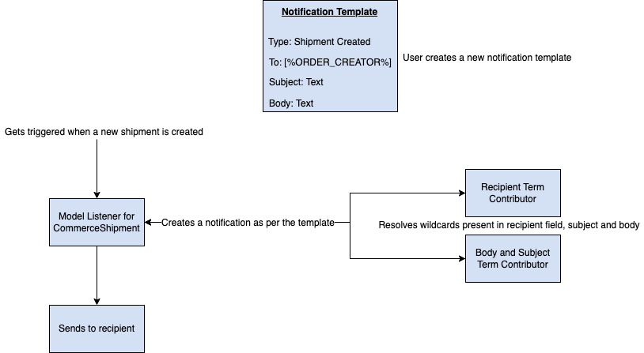

# Implementing a Custom Notification Type

You can configure Liferay Commerce to send email notifications for a variety of event triggers in your store. When there's no out-of-the-box notification trigger that fits your needs, you can implement your own. 

To add a new notification type, you must implement the `CommerceNotificationType` interface. See [Store Emails](../../store-management/sending-emails/store-emails.md) to learn how to set up a Notification Template and view the OOTB types available.

## Overview of a Notification Type

Notifications are scoped to a Channel. You can create a new Notification Template under Channel settings, and it gets triggered based on the notification type.



The diagram above shows a Notification Template of type *G2F3 Shipment Created*. This gets triggered for the creation of new shipments. During the creation of a shipment, a notification is sent to the recipient/recipients as mentioned in the Notification Template. You can use wildcards in the To, Subject, and Body fields of the template, and these get resolved before sending.

## Deploying the Notification Type and Adding Language Keys

1. Start Liferay DXP. If you don't already have a docker container, use

    ```bash
    docker run -it -m 8g -p 8080:8080 [$LIFERAY_LEARN_DXP_DOCKER_IMAGE$]
    ```

    If you're running a different Liferay DXP/Portal version, adjust the above command accordingly.

1. Download and unzip the Acme Commerce Notification Type.

    ```bash
    curl https://learn.liferay.com/commerce/latest/en/developer-guide/order-management/liferay-g2f3.zip
    
    unzip liferay-g2f3.zip
    ```

1. Build and deploy the example.

    ```bash
    ./gradlew deploy -Ddeploy.docker.container.id=$(docker ps -lq)
    ```

    ```{note}
    This command is the same as copying the deployed jars to `/opt/liferay/osgi/modules` on the Docker container.
    ```

1. Confirm the deployment in the Docker container console.

    ```bash
    STARTED com.acme.g2f3.impl_1.0.0
    ```

2. Log in as an administrator, open the *Global Menu* (), and click on *Control Panel* &rarr; *Language Override*. Click the *Add* button () and add the following keys.

    |  Language Key | Value  |
    |:---|:---|
    | g2f3-shipment-created  | G2F3 Shipment Created  |
    | g2f3-shipment-creator-name-definition-term  | Name of the account that created the order  |
    | g2f3-order-shipping-address-definition-term  | Shipping Address  |
    | g2f3-shipment-id-definition-term  | Shipment ID  |
    | g2f3-shipment-creator-email-definition-term  | Email of the user that created the shipment  |

    ```{important}
    You can add language keys in the Language Override tool for Liferay DXP 7.4 U4+ or Liferay Portal 7.4 GA8+. For previous versions, you must add a `Language.properties` file under `/src/main/resources/content/` with the keys before building and deploying.
    ````

3. Open the *Global Menu* (), click on *Commerce* &rarr; *Channels*, and select *Notification Templates*.

4. Create a new template using the *Add* button (): 

    **Name:** Testing G2F3 Shipment Created

    **Type:** G2F3 Shipment Created

    **To:** [%SHIPMENT_CREATOR_EMAIL%]

    **From Address:** test@liferay.com

    **From Name:** Administrator

    **Subject:** New Shipment Created - Shipment ID: [%SHIPMENT_ID%]

    **Body:**

    *Hi,*

    *A new shipment has been created by [%SHIPMENT_CREATOR_NAME%]*

    *Shipping Address:*
    *[%ORDER_SHIPPING_ADDRESS%]*

    *Thanks,*

    *Admin*

5. Click *Save*.

6. Open the *Global Menu* (), click on *Control Panel* &rarr; *Sites*, and add a new Minium Demo site.

7. Log in as a buyer and place a new order in the store.

8. Log out and log back in as an administrator, open the *Global Menu*, and click on *Commerce* &rarr; *Orders*. 

9. Select the Order and click on *Accept Order*. Then click on *Create Shipment*.

10. Check your inbox for the received notification.

```{important}
You can use a fake SMTP server like MockMock (https://github.com/tweakers/MockMock) to test these notifications in your local development environment. Add the following line in your `portal-ext.properties` file: `mail.send.blacklist=noreply@liferay.com, noreply@domain.invalid, test@domain.invalid`. Run the jar using `java -jar MockMock.jar` and check `localhost:8282` for the received emails.
```

## How the Custom Notification Type Works

This example consists of 7 main steps. First, you must annotate the class for OSGi registration. Next, review the [CommerceNotificationType](https://github.com/liferay/liferay-portal/blob/[$LIFERAY_LEARN_PORTAL_GIT_TAG$]/modules/apps/commerce/commerce-notification-api/src/main/java/com/liferay/commerce/notification/type/CommerceNotificationType.java) interface. Then, finish the implementation of the custom `CommerceNotificationType`.

After that, create a `ModelListener` for the `CommerceShipment` class. Next, review the `CommerceDefinitionTermContributor` interface. Finally, implement term contributors to resolve the wildcards for the new notification.

* [Annotate the class for OSGi Registration](#annotate-the-class-for-osgi-registration)
* [Review the CommerceNotificationType interface](#review-the-commercenotificationtype-interface)
* [Complete the Notification Type](#complete-the-notification-type)
* [Create a ModelListener for CommerceShipment](#create-a-modellistener-for-commerceshipment)
* [Review the CommerceDefinitionTermContributor interface](#review-the-commercedefinitiontermcontributor-interface)
* [omplete the Term Contributors](#complete-the-term-contributors)

### Annotate the class for OSGi Registration

You must provide a distinct key for the notification type so that Liferay Commerce can distinguish it from others in the notification status registry. Specifying a key that is already in use overrides the existing associated type. The order determines its sort order in the drop down. In this case, the *Order Awaiting Shipment* notification type has the order as 50, and the *Order Partially Shipped* notification type has the order as 60. To place the status between the two, the order must be between those two numbers, in this case, 51.

### Review the CommerceNotificationType interface

Implement the following methods:

```java
public String getClassName(Object object);
```

This method returns the name of the class for which the notification type is implemented.

```java
public long getClassPK(Object object);
```

This method returns the primary key of the object.

```java
public String getKey();
```

This method returns the unique key of the notification type. Using an existing key overrides that notification type.

```java
public String getLabel(Locale locale);
```

This method returns the name of the notification type as it appears in the UI. This name may be a language key or a string.

### Complete the Notification Type

```{literalinclude} ./implementing-a-custom-notification-type/resources/liferay-g2f3.zip/g2f3-impl/src/main/java/com/acme/g2f3/internal/commerce/notification/type/G2F3ShipmentCreatedNotificationTypeImpl.java
    :dedent: 1
    :language: java
    :lines: 21-49
```

To complete the Notification type implementation, you must implement the above methods. In the first method, you check if the object is of type `CommerceShipment` and return its class name if it's true. In the second method, you check this again and return the shipment's primary key if it's true. The third method returns the unique key and the last method returns the label that appears on the UI.

### Create a ModelListener for CommerceShipment

```{literalinclude} ./implementing-a-custom-notification-type/resources/liferay-g2f3.zip/g2f3-impl/src/main/java/com/acme/g2f3/internal/commerce/notification/model/listener/G2F3CommerceShipmentModelListener.java
    :language: java
    :lines: 15-41
```

For triggering the notification every time a shipment is created, you must extend the [`BaseModelListener`](https://github.com/liferay/liferay-portal/blob/[$LIFERAY_LEARN_PORTAL_GIT_TAG$]/portal-kernel/src/com/liferay/portal/kernel/model/BaseModelListener.java) class that implements the [`ModelListener`](https://github.com/liferay/liferay-portal/blob/[$LIFERAY_LEARN_PORTAL_GIT_TAG$]/portal-kernel/src/com/liferay/portal/kernel/model/ModelListener.java) interface. This interface has methods for the entity that are triggered for events like create, update, delete, etc. You can use the `onAfterCreate(T model)` method to trigger the notification upon creation of a shipment.

### Review the CommerceDefinitionTermContributor interface

Implement the following methods:

```java
public String getFilledTerm(String term, Object object, Locale locale) throws PortalException;
```

This method replaces the wildcard with its appropriate value and returns it as a String.

```java
public String getLabel(String term, Locale locale);
```

This method returns the name of the term contributor as it appears in the UI. This name may be a language key or a string.

```java
public List<String> getTerms();
```

This method returns all the term contributors available for the Notification type.

### Complete the Term Contributors

Term contributors resolve the wildcards present in the To, Subject, and Body fields. There are two term contributors implemented in this example: one for the Subject and Body fields and the other for the To field.

#### Implement the getFilledTerm method for the Body and Subject

```{literalinclude} ./implementing-a-custom-notification-type/resources/liferay-g2f3.zip/g2f3-impl/src/main/java/com/acme/g2f3/internal/commerce/order/term/contributor/G2F3CommerceShipmentCommerceDefinitionTermContributor.java
    :dedent: 1
    :language: java
    :lines: 33-76
```

Before resolving the wildcard, there are checks to verify whether the object is null or of type `CommerceShipment`. Then, if the term contains the wildcard, the wildcard gets replaced with the shipment creator's name, shipping address, or the shipment ID. For the shipment creator's name, the name of the account from the shipment is returned. The shipping address is returned as a concatenated string of the street address, city, and zip. The shipment ID is returned from the shipment object directly.

#### Implement the getFilledTerm method for the Recipient

```{literalinclude} ./implementing-a-custom-notification-type/resources/liferay-g2f3.zip/g2f3-impl/src/main/java/com/acme/g2f3/internal/commerce/order/term/contributor/G2F3CommerceShipmentRecipientCommerceDefinitionTermContributor.java
    :dedent: 1
    :language: java
    :lines: 32-63
```

Before resolving the wildcard, there are checks to verify whether the object is null or of type `CommerceShipment`. Then, if the term contains the wildcard, the wildcard gets replaced with the user ID of the account. When a notification is sent, it uses this ID to find the user's email.

#### Implement the getLabel and getTerms methods

The `getLabel` method returns the name of the terms as it appears in the UI. You can use language keys to do this or directly return a string.

```{literalinclude} ./implementing-a-custom-notification-type/resources/liferay-g2f3.zip/g2f3-impl/src/main/java/com/acme/g2f3/internal/commerce/order/term/contributor/G2F3CommerceShipmentCommerceDefinitionTermContributor.java
    :dedent: 1
    :language: java
    :lines: 78-82
```

This method returns all the term contributors available for the Notification type. You can use language keys to do this or directly return a hard coded string that displays the term in the UI.

```{literalinclude} ./implementing-a-custom-notification-type/resources/liferay-g2f3.zip/g2f3-impl/src/main/java/com/acme/g2f3/internal/commerce/order/term/contributor/G2F3CommerceShipmentCommerceDefinitionTermContributor.java
    :dedent: 1
    :language: java
    :lines: 84-87
```

## Conclusion

Congratulations! You now know the basics for implementing the `CommerceNotificationType` interface. You also know the basics of how notifications work and the use of a `MessageListener` to send your own notification type.
