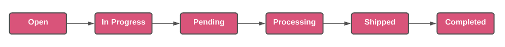
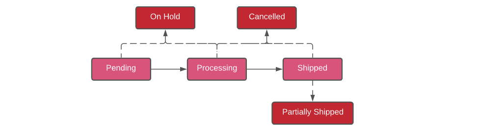
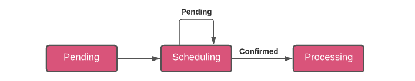
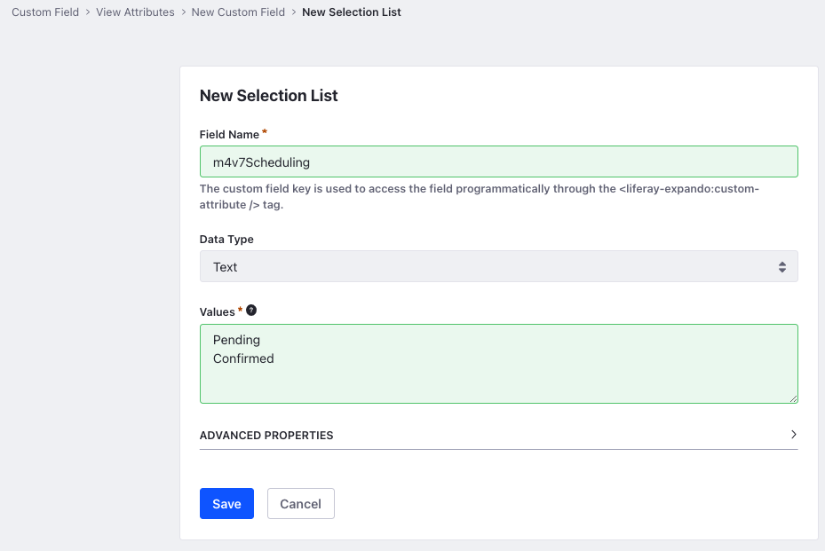

# Implementing a Custom Order Status

This tutorial shows you how to add a custom order status by implementing the `CommerceOrderStatus` interface. The Commerce Order Engine provides a standard order flow out-of-the-box but you can customize it to fit your needs.

A custom order status is a new stage added to the existing order flow. The need for a custom order status can arise when you want a custom order fulfillment process that cannot be realized with the standard order flow. To get started, we will take a look at an overview of the order statuses available in Liferay Commerce and then deploy and walk through an example implementation.

## Overview of Order Statuses

The Liferay Order Engine comes with a standard order flow off the shelf. A pictorial representation of the order flow and corresponding statuses are shown below.



The order engine performs checks against each order status to ensure correct order processing and to determine the new status to be applied to the order. In addition to the ones mentioned above, there are also other statuses that the order can transition to.



1. _On Hold_ - An order can be put on hold when it is in any of the non-final order statuses (Pending, Processing, Shipped).

1. _Cancelled_ - An order can be cancelled when it is in any of the non-final order statuses (Pending, Processing, Shipped).

1. _Partially Shipped_ - When there are multiple items in the order and not every item has been shipped, it transitions to the _Partially Shipped_ status.



A custom order status can be used to alter the out-of-the-box order flow. This is useful when your use cases have stages in their lifecycle that don’t conform to the existing statuses.  The new status we are going to implement in this tutorial is called Scheduling and it is placed between the existing Pending and Processing statuses. This custom stage represents orders which are waiting to be scheduled before they can be accepted. The scheduling status is kept track of using a _Custom Field_ on the Order. You can read [Commerce Order Engine Overview](./commerce-order-engine-overview.md) for more detailed information about each order status and their transitions.

## Deploy an example

In this section, we are going to set up an example order status on your instance of Liferay Commerce. Follow these steps:

1. Start Liferay Commerce.

    ```bash
    docker run -it -p 8080:8080 liferay/portal:7.4.1-ga2
    ```

1. Download and unzip the Acme Commerce Order Status Method.

    ```bash
    curl https://learn.liferay.com/commerce/latest/en/developer-guide/order-management/liferay-m4v7.zip

    unzip liferay-m4v7.zip
    ```

1. Build and deploy the example.

    ```bash
    ./gradlew deploy -Ddeploy.docker.container.id=$(docker ps -lq)
    ```

    ```{note}
    This command is the same as copying the deployed jars to `/opt/liferay/osgi/modules` on the Docker container.
    ```

1. Confirm the deployment in the Docker container console.

    ```bash
    STARTED com.acme.m4v7.impl_1.0.0
    ```

1. We must create a custom field to keep track of scheduling the order. To create this, click the _Applications Menu_ (), navigate to _Control Panel_ → _Custom Fields_.

1. Select Commerce Order from the list of items and click the _Add_ () button to add a new field. Select the _Dropdown_ option from the available fields and enter the following information. Click _Save_ when done.

    

    __Field Name__: m4v7Scheduling

    __Data Type__: Text

    __Values__: Pending, Confirmed (in two separate lines)  

1. Now, verify that the example order status was added. Open your browser to `https://localhost:8080`. Then click the Applications Menu (), navigate to your site and place an order.

1. Click the Applications Menu again, navigate to _Commerce_ → _Orders_, and select the order that you placed. You should see a new status _Scheduling_ in the order lifecycle and a button called Scheduling that sets the new order flow in motion. The new custom field is present under the _Custom Fields_ section of the order.

    

## Walk through the example

In this section, we are going to review the example we deployed. First, we annotate the class for OSGi registration. Second, we review the [`CommerceOrderStatus`](https://github.com/liferay/liferay-portal/blob/master/modules/apps/commerce/commerce-api/src/main/java/com/liferay/commerce/order/status/CommerceOrderStatus.java) interface. Lastly, we complete our implementation of the custom CommerceOrderStatus.

* [Annotate the class for OSGi Registration](#annotate-the-class-for-osgi-registration)
* [Review the `CommerceOrderStatus` interface](#review-the-commerceorderstatus-interface)
* [Complete the Order Status](#complete-the-order-status)

```{important}
Depending on the stage at which we place the new status in the order lifecycle, we must tweak the next stage for correct order processing. Since we are placing the new status in between the Pending and Processing statuses, we must override the existing Processing status so that it checks for the new status in its logic. 
```

### Annotate the class for OSGi Registration

```{literalinclude} ./implementing-a-custom-order-status/resources/liferay-m4v7.zip/m4v7-impl/src/main/java/com/acme/m4v7/internal/commerce/order/status/M4V7SchedulingCommerceOrderStatus.java
    :language: java
    :lines: 17-23
```

> It is important to provide a distinct key for the order status so that Liferay Commerce can distinguish the new status from others in the order status registry. Reusing a key that is already in use overrides the existing associated status. The priority of the order status determines its order in the order lifecycle. In this case, the Pending status has a priority of 30 and the processing status has a priority of 50. To place the status in between the two, we choose 40 as the priority.

```{note}
For this example implementation, we have used a random integer as the key and 40 as the priority, but they can be stored in variables for ease of use within the code. See example [here](https://gist.github.com/aswinrajeevofficial/5d09d76ae11a1dc78c7d1fc388ae0306#file-m4v7schedulingcommerceorderstatus-java).
```

### Review the CommerceOrderStatus interface

Implement the following methods:

```java
public String getLabel(Locale locale);
```

> This method returns the name of our order status. This name may be a language key that corresponds to the name that appears in the UI. In our case, we return the string _Scheduling_.

```java
public int getKey();
```

> This method returns the unique key of the order status. Using an existing key overrides that status.

```java
public int getPriority();
```

> This method returns the priority of the order status. This is used to determine the stage at which this status is placed.

```java
public boolean isTransitionCriteriaMet(CommerceOrder commerceOrder) throws PortalException;
```

> This method checks if the order has correctly met all the transition criteria specified for the current order status.

```java
public CommerceOrder doTransition(CommerceOrder commerceOrder, long userId) throws PortalException;
```

> Once the transition criteria for this status is met, the `doTransition` method performs all the actions necessary for the order to transition to this status.

```java
public boolean isComplete(CommerceOrder commerceOrder);
```

> This method is used to check if the order status has completed its action and is ready for transition to the next status. In this example, for the Scheduling status, it checks if the custom field value is equal to Pending or if it's Confirmed and ready to transition to the Processing stage.

There are two more methods in the interface. The first one `public boolean isValidForOrder(CommerceOrder commerceOrder) throws PortalException` is used to check whether the status is applicable for the order and the second one, `public boolean isWorkflowEnabled(CommerceOrder commerceOrder) throws PortalException`  checks if there is a workflow associated with the status. We do not need to implement these two methods for this example.

### Complete the Order Status

The order status implementation consists of implementing the methods for the Scheduling status and also tweaking the existing business logic present in the Processing status. 

* [Implement the `isTransitionCriteriaMet` method](#implement-the-istransitioncriteriamet-method)
* [Implement the `doTransition` method](#implement-the-dotransition-method)
* [Implement the `isComplete` method](#implement-the-iscomplete-method)
* [Override the existing _Processing_ status](#override-the-existing-processing-status)
* [Tweak the Processing status business logic](#tweak-the-processing-status-business-logic)

#### Implement the isTransitionCriteriaMet method

```{literalinclude} ./implementing-a-custom-order-status/resources/liferay-m4v7.zip/m4v7-impl/src/main/java/com/acme/m4v7/internal/commerce/order/status/M4V7SchedulingCommerceOrderStatus.java
    :dedent: 1
    :language: java
    :lines: 64-75
```

> For the order to transition into the Scheduling order status, it must be in the Pending status. This is checked using the getOrderStatus() method on the commerceOrder object. The method returns `true` if the order is pending, and `false` otherwise.

#### Implement the doTransition method

```{literalinclude} ./implementing-a-custom-order-status/resources/liferay-m4v7.zip/m4v7-impl/src/main/java/com/acme/m4v7/internal/commerce/order/status/M4V7SchedulingCommerceOrderStatus.java
    :dedent: 1
    :language: java
    :lines: 26-33
```

> Once the transition criteria for the order is met, it sets the order status as Scheduling based on the key we assigned to it earlier. Then, it calls the updateCommerceOrder() method from the _commerceOrderService, passing in the commerceOrder object to update the new status.

#### Implement the isComplete method

```{literalinclude} ./implementing-a-custom-order-status/resources/liferay-m4v7.zip/m4v7-impl/src/main/java/com/acme/m4v7/internal/commerce/order/status/M4V7SchedulingCommerceOrderStatus.java
    :dedent: 1
    :language: java
    :lines: 50-62
```

> In order to complete the Scheduling stage, we must set the Custom Field to Confirmed. This custom attribute is retrieved through an `ExpandoBridge` using the key we named it with. As we used a dropdown, the return value is placed in a String array and we must cast it to one. If the value is _Confirmed_, we return `true`, otherwise we return `false`.

#### Override the existing Processing status

```{literalinclude} ./implementing-a-custom-order-status/resources/liferay-m4v7.zip/m4v7-impl/src/main/java/com/acme/m4v7/internal/commerce/order/status/M4V7ProcessingCommerceOrderStatus.java
    :language: java
    :lines: 15-22
```

> The existing Processing status has to be overridden to tweak the logic present inside it. This is done by annotating the class for OSGi registration and using the same key and priority as the existing status. We also set a service.ranking for the overridden status to 100 so that it takes priority over the existing one.

#### Tweak the Processing status business logic

```{literalinclude} ./implementing-a-custom-order-status/resources/liferay-m4v7.zip/m4v7-impl/src/main/java/com/acme/m4v7/internal/commerce/order/status/M4V7ProcessingCommerceOrderStatus.java
    :dedent: 1
    :language: java
    :lines: 53-73
```

> Since the original Processing status checks for the Pending status in its methods, we must tweak them slightly to check for the newly added status. This is again done using the unique key we assigned to the new status.

## Conclusion

Congratulations! You now know the basics for implementing the `CommerceOrderStatus` interface, and have added a new order status to Liferay Commerce.

## Additional Information

* [Commerce Order Engine Overview](./commerce-order-engine-overview.md)
