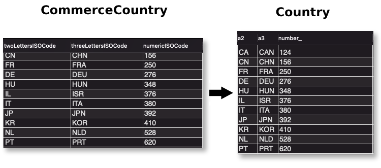

# Upgrading Liferay Commerce

To enhance the quality of your experience with Liferay Commerce, Liferay provides periodic product upgrades with bug fixes and new features. Users should consider regularly updating to the latest release.

## Upgrading to Commerce 3.0 from 2.1 and Below

Starting with Liferay Commerce 3.0, Commerce is now bundled with Liferay DXP 7.3. In order to upgrade to Commerce 3.0, you must first upgrade your base Liferay DXP installation to DXP 7.3 and then execute a search reindex.

To learn more about the DXP upgrade process, see [Upgrade Overview](https://learn.liferay.com/dxp/latest/en/installation-and-upgrades/upgrading-liferay/upgrade-basics/upgrade-overview.html). Once DXP is upgraded to 7.3, execute a reindex.

```warning::
   After upgrading to 7.3, do **not** deploy the Commerce ``LPKG`` again. The Commerce 3.0 modules are bundled with 7.3. Deploying the ``LPKG`` causes conflicts.
```

### Executing a Post-Upgrade Reindex

After upgrading to DXP 7.3, execute a full search reindex.

1. Open the _Global Menu_, and go to _Control Panel_ &rarr; _Search_.

    

1. Under the _Index Actions_ tab, click on _Execute_ for _Reindex all search indexes_.

Once the the reindex has finished, verify it was successful by going to _Commerce_ &rarr; _Products_ in the Global Menu and confirming that all products are displayed.

## Upgrading to Commerce 2.1.x

Liferay Commerce provides a seamless upgrade process to Commerce 2.1.x, whether from version 1.1.x or 2.0.x.

```note::
   Upgrading from 1.1.x to 2.1.x does **not** require an incremental upgrade to 2.0.x.
```

Before upgrading to Commerce 2.1.x, you must first be running the latest fix pack of Liferay DXP 7.2. For example, if upgrading to Liferay Commerce Enterprise 2.0.6 - upgrading Liferay DXP to Fix Pack 14 is required. To learn about upgrading to DXP 7.2, see [Upgrade Overview](https://learn.liferay.com/dxp/latest/en/installation-and-upgrades/upgrading-liferay/upgrade-basics/upgrade-overview.html).

### Apply the Latest Fix Pack

> Subscription Required

Liferay provides the latest fix pack releases for download at the [Help Center](https://customer.liferay.com/downloads). Once downloaded, you can apply the fix pack using the [Liferay Patching Tool](https://help.liferay.com/hc/articles/360018176551-Using-the-Patching-Tool). See [Installing Patches](https://help.liferay.com/hc/en-us/articles/360028810512-Installing-Patches) for more information.

If Liferay DXP was [installed manually](https://help.liferay.com/hc/articles/360017896672-Installing-Liferay-DXP-Manually-) (for example, on WebLogic), see [Installing Patches on the Liferay DXP 7.1 WAR](https://help.liferay.com/hc/articles/360018176651-Installing-patches-on-the-Liferay-DXP-7-1-WAR).

Then, follow these step to verify the fix pack was successfully installed:

1. Navigate to the `${liferay.home}/patching-tool` folder.

1. Verify that the fix pack has been applied by executing the following:
    * Linux/Unix: `./patching-tool.sh info`
    * Windows: `patching-tool info`

    ```
    Detailed patch list:
       [ -] dxp-12-7110 :: Currently not installed; Won't be installed: dxp-14 contains the fixes included in this one :: Built for LIFERAY
       [*I] dxp-14-7110 :: Installed; Will be installed. :: Built for LIFERAY
    ```

Fix Packs are cumulative in nature and include all previously release fix packs. After patching, remove Liferay DXP's cache of deployed code by deleting the contents of the `${liferay.home}/work` folder. See the next section on how to remove other stale data.

### Download and Deploy

Once you're running the latest fix pack of DXP 7.2, follow these steps to upgrade to Commerce 2.1.x upgrade Commerce.

1. Download the latest Liferay Commerce.

    * Commerce Enterprise is available from [Help Center](https://customer.liferay.com/downloads?p_p_id=com_liferay_osb_customer_downloads_display_web_DownloadsDisplayPortlet&_com_liferay_osb_customer_downloads_display_web_DownloadsDisplayPortlet_productAssetCategoryId=118190997&_com_liferay_osb_customer_downloads_display_web_DownloadsDisplayPortlet_fileTypeAssetCategoryId=118191001).
    * Commerce Community is available from the [Liferay Commerce Community Download Page](https://www.liferay.com/downloads-community)

1. Deploy the `LPKG` to the `${liferay.home}/deploy` folder.To learn more about deploying applications to Liferay DXP, see [Installing Apps](https://learn.liferay.com/dxp/latest/en/system-administration/installing-and-managing-apps/installing-apps.html).

1. Verify that the messages similar to those shown below appear in the application server console:

    ```
    Processing Liferay Commerce Enterprise x.x.x.lpkg
    ```

    ```
    The portal instance needs to be restarted to complete the installation of file:/../../liferay-commerce-enterprise-1.1.6/osgi/marketplace/Liferay%20Commerce%20-%20API.lpkg
    ```

    ```
    The portal instance needs to be restarted to complete the installation of file:/../../liferay-commerce-enterprise-1.1.6/osgi/marketplace/Liferay%20Commerce%20-%20Impl.lpkg
    ```

1. Shut down the application server.

### Clear Stale Data and Verify the Upgrade Process

1. Delete the `${liferay.home}/osgi/state` folder. To learn more about OSGi folders, see [Installing Apps](https://learn.liferay.com/dxp/latest/en/system-administration/installing-and-managing-apps/installing-apps.html).
1. Start the application server.
1. Verify that the the upgrade process has begun by looking for messages similar to this in your application server console logs:

    ```
    Upgrading com.liferay.commerce.account.internal.upgrade.v1_2_0.CommerceAccountGroupCommerceAccountRelUpgradeProcess
    Completed upgrade process com.liferay.commerce.account.internal.upgrade.v1_2_0.CommerceAccountGroupCommerceAccountRelUpgradeProcess in 24 ms
    Upgrading com.liferay.commerce.account.internal.upgrade.v1_2_0.CommerceAccountGroupRelUpgradeProcess
    Completed upgrade process com.liferay.commerce.account.internal.upgrade.v1_2_0.CommerceAccountGroupRelUpgradeProcess in 8 ms
    Upgrading com.liferay.commerce.account.internal.upgrade.v1_2_0.CommerceAccountGroupUpgradeProcess
    Completed upgrade process com.liferay.commerce.account.internal.upgrade.v1_2_0.CommerceAccountGroupUpgradeProcess in 12 ms
    Upgrading com.liferay.commerce.account.internal.upgrade.v1_3_0.CommerceAccountNameUpgradeProcess
    Starting com.liferay.portal.kernel.upgrade.UpgradeProcess#alter
    Completed com.liferay.portal.kernel.upgrade.UpgradeProcess#alter in 40 ms
    Completed upgrade process com.liferay.commerce.account.internal.upgrade.v1_3_0.CommerceAccountNameUpgradeProcess in 60 ms
    Starting com.liferay.portal.upgrade.internal.index.updater.IndexUpdaterUtil#updateIndexes#Updating database indexes for com.liferay.commerce.account.service
    Dropping stale indexes
    Adding indexes
    ```

    ```
    Verifying com.liferay.commerce.product.internal.verify.CommerceCatalogServiceVerifyProcess
    Starting com.liferay.commerce.product.internal.verify.CommerceCatalogServiceVerifyProcess#verifyMasterCommerceCatalog
    Completed com.liferay.commerce.product.internal.verify.CommerceCatalogServiceVerifyProcess#verifyMasterCommerceCatalog in 2 ms
    Completed verification process com.liferay.commerce.product.internal.verify.CommerceCatalogServiceVerifyProcess in 7 ms
    1 theme for admin-theme is available for use
    1 theme for classic-theme is available for use
    1 theme for minium-theme is available for use
    ```

The Liferay Commerce instance has been upgraded.

### Execute Post-Upgrade Reindex

> Liferay Commerce 2.1 and Below

After upgrading from to the latest version, execute a full search reindex.

To execute a search reindex:

1. Navigate to the _Control Panel_ → _Configuration_ → _Search_.
1. Click _Execute_ next to _Reindex all search indexes_.
1. Wait for the reindex to finish.
1. Navigate to the _Control Panel_ → _Commerce_ → _Products_.
1. Verify all the products are displayed again.

Once reindexing is complete, the upgraded Liferay Commerce instance is ready for use.

## Additional Information

* [Installing Apps](https://learn.liferay.com/dxp/latest/en/system-administration/installing-and-managing-apps/installing-apps.html)
* [Liferay Commerce Fix Delivery Method](../get-help/commerce-enterprise-support/liferay-commerce-fix-delivery-method.md)
