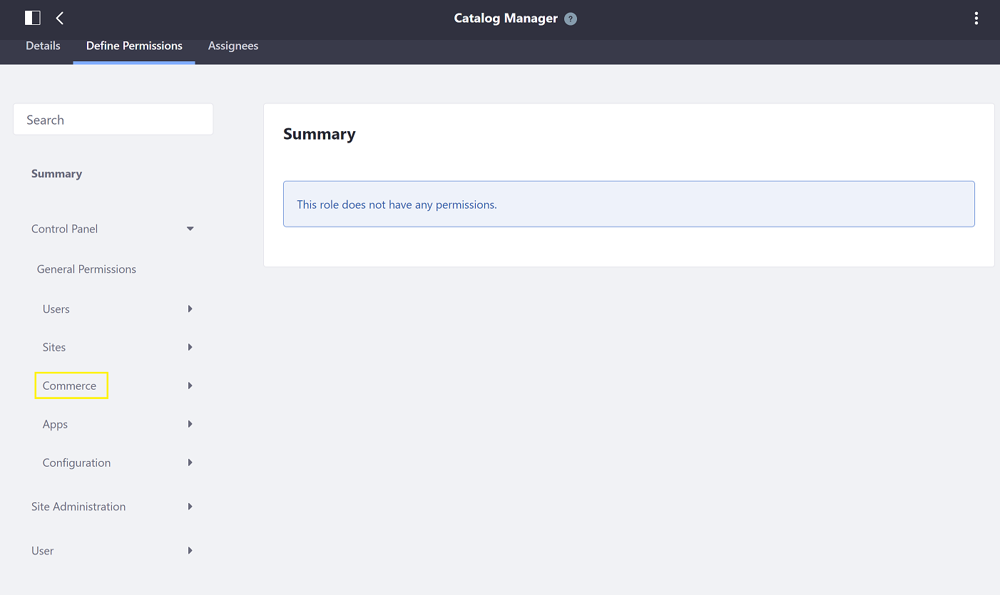
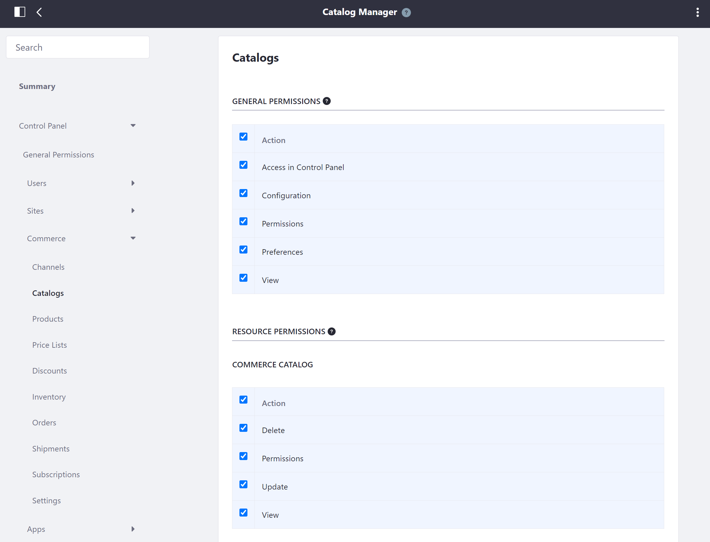
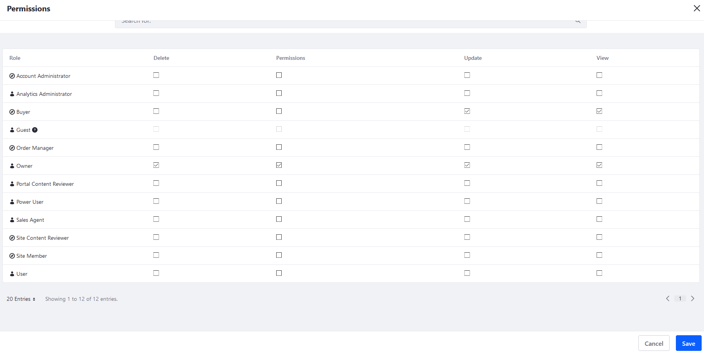

# Configuring Catalog Permissions

Catalog permissions determine which users can see and modify catalogs and their related products. Admin users have these permissions by default and these permissions can be added to new roles that have been added to the system.

```note::
   Individual product view permissions are managed by modifying the channels that they are available in. See `Configuring Product Visibility Using Channels <../../starting-a-store/channels/configuring-product-visibility-using-channels.md>`_ to learn more.
```

## Adding Catalog Management Permissions to an Existing Role

Get started by creating a new custom role or by modifying an existing role to manage Catalogs and Products. This Role will can be configured to have minimum access to system wide functions. To learn more about defining a user permissions, see [Defining Role Permissions](https://learn.liferay.com/dxp/latest/en/users-and-permissions/roles-and-permissions/defining-role-permissions.html).

To define catalog management permissions for an existing role:

1. Navigate to the _Control Panel_ &rarr; _Users_ &rarr; _Roles_.
1. Click the () to add a new Regular Role.
1. Enter the following:

     * **Title**: Catalog Manager.
     * **Description** This role manages catalogs.
     * **Key**: (generated based on the title)

1. Click _Save_.
1. Click _Define Permissions_.
1. Click the _Control Panel_ &rarr; _Commerce_ to expand the dropdown menu.

    

1. Click _Catalogs_.
1. Select the desired Permissions; at the very least, all _General Permissions_ and _Resource Permissions_.

    

1. Click _Save_.
1. Click the _Products_ dropdown menu.
1. Select the desired Permissions; at the very least, all _General Permissions_ and _Resource Permissions_.
1. Click _Save_ when finished.

The new Catalog Manager role receives the minimum permissions to view the Catalog and Products menu. Users with this role are now able to access the _Control Panel_ &rarr; _Commerce_ &rarr; _Catalogs_ and _Products_ menus.

## Configuring a Catalog's Permissions

Follow the steps below to configure catalog permissions:

1. Navigate to the _Control Panel_ &rarr; _Commerce_ &rarr; _Catalogs_.
1. Click the () then _Permissions_.

    

1. Check the boxes next the desired permissions for the applicable roles.

    

1. Click _Save_ when finished.

The catalog's permissions are now configured.

## Additional Information

* [Understanding Roles and Permissions](https://learn.liferay.com/dxp/latest/en/users-and-permissions/roles-and-permissions/understanding-roles-and-permissions.html)
* [Configuring Product Visibility Using Channels](../../starting-a-store/channels/configuring-product-visibility-using-channels.md)
