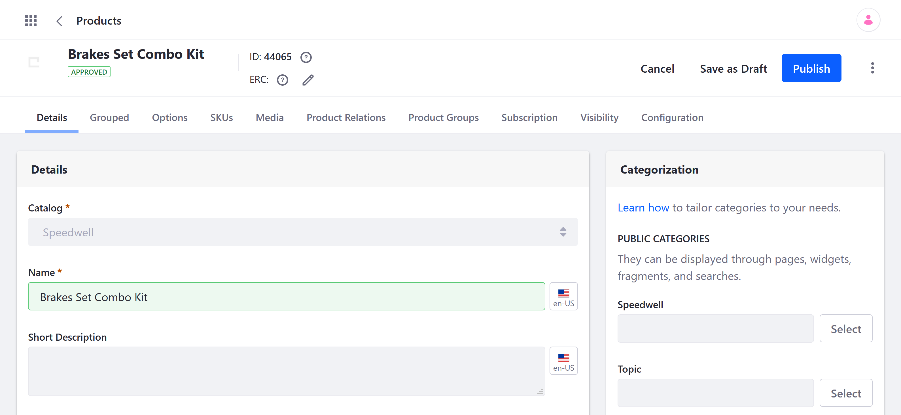
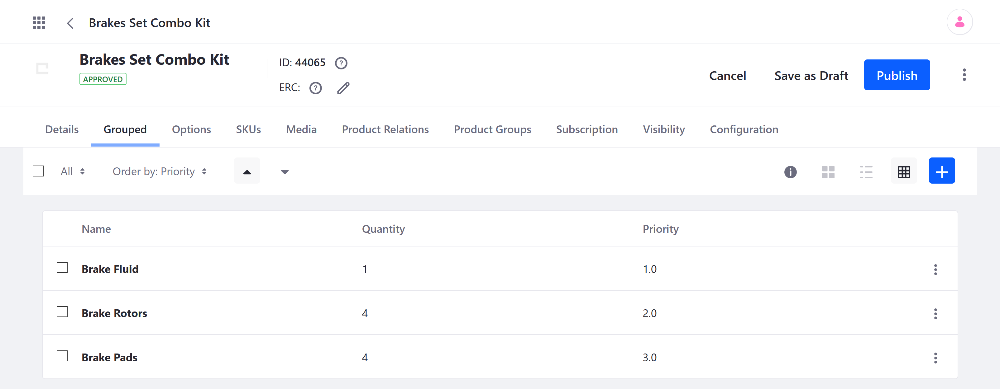
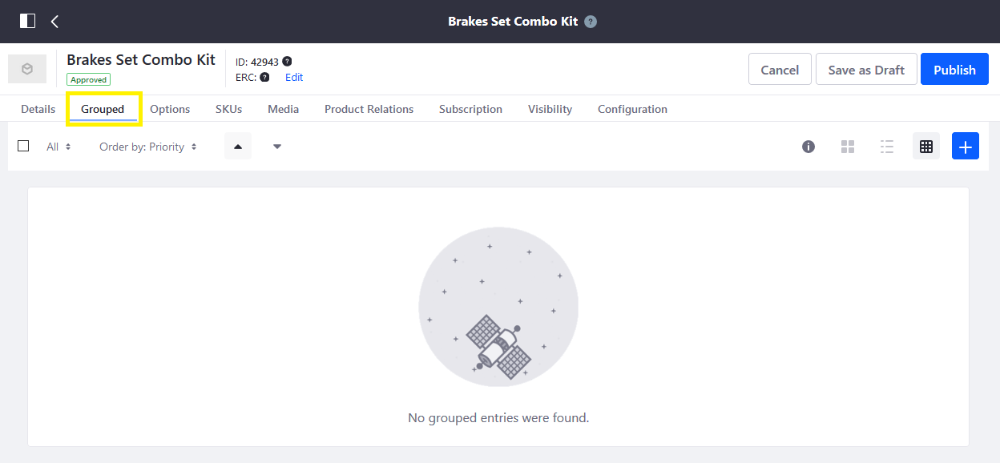
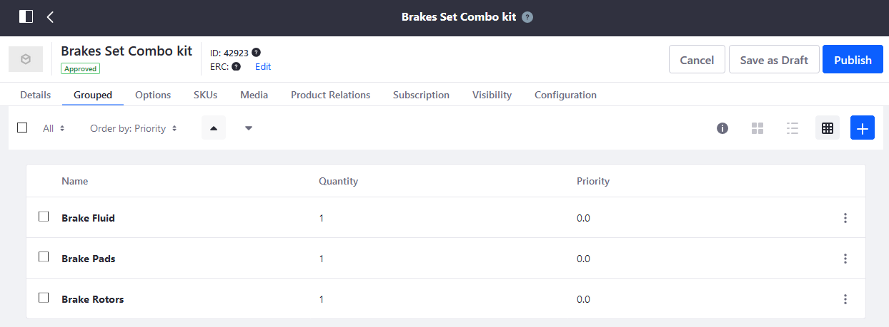
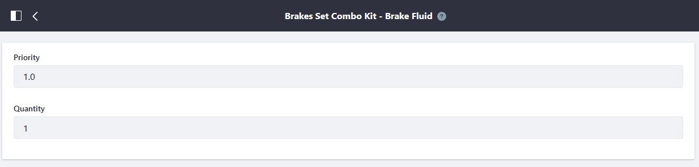
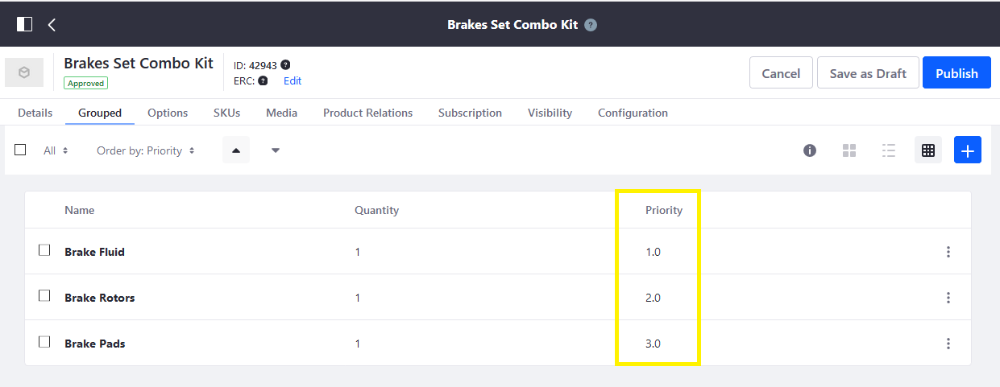

# Creating a Grouped Product

In Liferay Commerce, a Grouped Product consists of two or more Products from a Catalog that are sold together as a pre-defined set, either for customer convenience or to offer a special price. Grouped Products are tracked in inventory and can include any type of Products (i.e., Simple, Grouped, Virtual). For example, consider a wholesale furniture distributor. While furniture items can be purchased separately, the distributor can group related products together into a furniture set, either for customer convenience, or to offer special deals.

To get started, [create](#create-a-grouped-product) a Grouped Product and [add](#adding-product-entries) new Product entries to it. Then, configure the Grouped Product and SKU.

```{note}
In addition to Grouped Products, Liferay Commerce supports the creation of Product bundles using [Product Options](../products/using-product-options.md). With Options, you can define values that link the current Product to other SKUs to be purchased together. The final price is calculated based on the Option's configuration. See [Creating Product Bundles](../products/creating-product-bundles.md) and [Product Options](../products/using-product-options.md) for more information.
```

## Prerequisites

Before creating a Grouped Product, ensure you've already generated all of the SKUs you want to group together. At minimum, each SKU should have a set base price and sufficient inventory.

## Create a Grouped Product

Follow these steps to create a Grouped Product:

1. Open the *Global Menu*, click on the *Commerce* tab, and go to *Product Management* &rarr; *Products*.

1. Click the *Add* button (), and select *Grouped*.

1. Enter a *name*, and select the desired *Catalog*.

1. Click *Submit*.

This creates a new Grouped Product entity in the selected Catalog with a single SKU, *default*. Grouped Products can be configured in the same way as other Product types (e.g., SEO, Options, Inventory Rules). See [Product Configuration Reference](../products/product-configuration-reference.md) for more information about general Product settings.



## Adding Product Entries

Follow these steps to add entries to the Grouped Product:

1. Click on the *Grouped* tab.

1. Click the Add button (), and select the desired Product entries.

1. When finished, click *Add*.

The selected Product entries are immediately associated with the Grouped Product and are listed in the *Grouped* tab. You can edit each entry to determine its *quantity* and *priority*.



Once you've created the Grouped Product and associated other Products with it, set a base price for the default [SKU](./../products/creating-skus-for-product-variants.md) to make it available for purchase. This price is used in place of each Product's individual price.

## Commerce 2.1 and Below

1. Navigate to _Control Panel_ → _Commerce_ → _Products_.
1. Click the Add () button then _Grouped_.
1. Enter the following:
    * **Catalog**: Sahara.com
    * **Name**: Brakes Set Combo Kit
    * **Short Description**: Brakes Set Combo Kit
    * **Friendly URL**: (auto-generated)
    * **Meta Title**: Brakes Set Combo Kit
1. Click _Publish_.

Once the Grouped Product entity has been initially created, store administrators must associate the individual Products to the Grouped Product entry.

### Associate Products in Group

1. Click the _Grouped_ sub-tab.

   

1. Click the () button to add a Grouped Entry.
1. Select the following products: _Brake Fluid_, _Brake Pads_, and _Brake Rotors_.
1. Click _Add_.

    

Next, specify the priority (the order in which they are displayed), and the quantity sold in each package. Click the _3-dot_ icon then _Edit_ next to any of the products.



In the image above, the Product has been given priority 1.0 which means it's listed first. Assign incremental values to the other Products.



Once the Products have been grouped, follow the sections above to add Product Options, Generate SKUs, and set the prices. In addition, see the above sections on how to add Product Options, Specifications or upload Product Images.

### Setting Prices and Quantities on Liferay Commerce 2.0 and Below

To set prices and quantities for a Grouped Product,

1. Click the _SKU_ tab.
1. Click the _3-dot_ icon then _Edit_ next to _default_. (At this point, you can rename the SKU to something more descriptive like _Brakes Set Combo Kit_ on the _Details_ menu.)
1. Click _Pricing_ on the left menu.
1. Enter the following:
    * **Price**: 89.99
    * **Promo Price**: 0.00
    * **Cost**: 0.00

        

1. Click _Save_. (If Promo Price and Cost fields are left as 0.00, no discounts or promotions are applied at this point.)
1. Click _Price List_ to apply this product to any existing [Price Lists](../../managing-prices/adding-products-to-a-price-list.md).

## Additional Information

* [Introduction to Product Types](./introduction-to-product-types.md)
* [Creating a Simple Product](./creating-a-simple-product.md)
* [Creating a Virtual Product](./creating-a-virtual-product.md)
