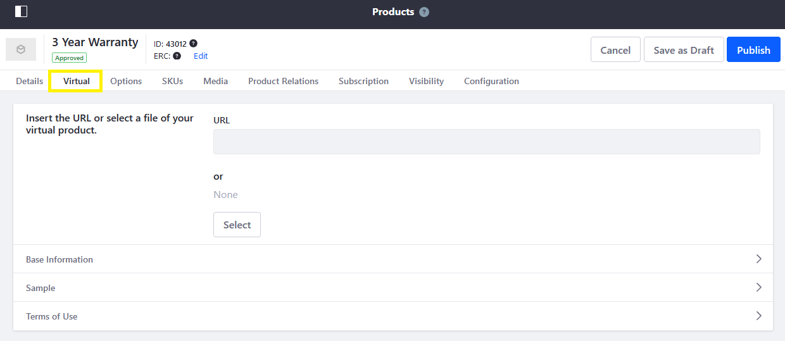
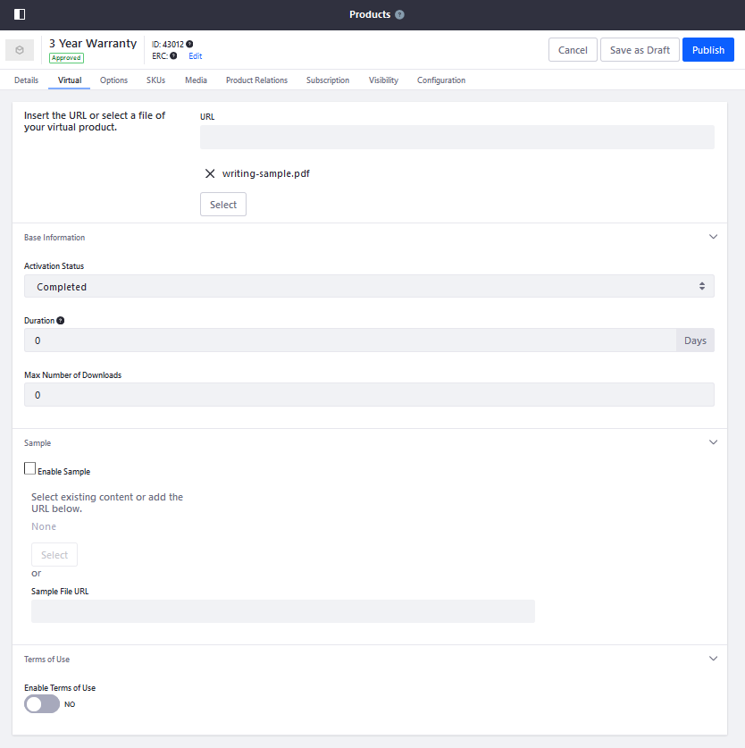

# Creating a Virtual Product

In Liferay Commerce, a Virtual Product is any non-tangible product that can be downloaded by customers. Examples include videos, electronic publications, warranties, and service contracts. Like other Product types, they are assigned inventory and can be sold individually, or as part of a [Product bundle](../products/creating-product-bundles.md) or [Grouped Product](./creating-a-grouped-product.md). For Virtual Products, you can also determine the download's terms of use, duration of availability, maximum number of customer downloads, and whether there's a download sample.

```{note}
Virtual Products are downloadable digital assets and cannot be shipped. The product becomes available to the customer in the Product Downloads widget based on the configured Activation Status. See [Using the Product Downloads Widget](../../../creating-store-content/liferay-commerce-widgets/using-the-product-downloads-widget.md) for more information.
```

## Creating Virtual Products

Follow these steps to create a Virtual Product:

1. Open the *Global Menu* (), click on the *Commerce* tab, and go to *Product Management* &rarr; *Products*.

1. Click the *Add* button(), and select *Virtual*.

1. Enter a *name* and select the desired *Catalog*.

1. Click *Submit* when finished.

Once a Virtual Product is created, you'll need to associate it with the desired digital assets, set its SKU's [base price](./../../managing-prices/setting-a-products-base-price.md), and [assign it inventory](../../managing-inventory/setting-inventory-by-warehouse.md) before it can be purchased by customers.

## Configuring Virtual Products

Besides standard Product details (e.g., [Specifications](../products/specifications.md), [Options](../products/using-product-options.md), [SKUs](../products/creating-skus-for-product-variants.md)), Virtual Products include unique settings. Follow these steps to configure unique Virtual Product settings:

1. Open the *Global Menu* (), click on the *Commerce* tab, and go to *Product Management* &rarr; *Products*.

1. Click on an existing *Virtual Product*.

1. Click on the *Virtual* sub-tab.

   

1. Under *Details*, enter a URL or select a file to determine which digital asset is used for the Product's download.

1. Under *Basic Information*, configure the following settings:

   * **Activation Status**: Set the Activation Status for the download. This determines the order stage at which the asset becomes available to download (i.e., Completed, Pending, or Processing).

   * **Duration**: Set the number of days customers keep access to the file; leaving this field `0` grants users unlimited access.

   * **Max Number of Downloads**: Set the maximum number of times that customers can download the digital asset.

1. Under *Sample*, determine whether the Product has an associated sample download. If enabled, enter a URL or select the file used for sample downloads.

1. Under *Terms of Use*, determine whether the Product has a Terms of Use. If enabled, select from available Web Content, or enter your own text using the provided text editor.

   

1. Click *Save* when finished.

For more information about each field, see the [Virtual Product Reference](./virtual-product-reference.md) article. Also, see general [Products](../products.html) documentation for additional configuration settings.

## Commerce 2.1 and Below

1. Navigate to _Control Panel_ → _Commerce_ → _Products_.
1. Click the Add button(), then select _Virtual_.
1. Enter the following:
    * **Catalog**: Sahara.com
    * **Name**: 3 Year Warranty
    * **Short Description**: 3 Year Warranty
    * **Full Description**: 3 Year Warranty for all products purchased on Sahara.com
    * **Friendly URL**: (auto-generated)
    * **Meta Title**: 3 Year Warranty
    * **Meta Description**: 3 Year Warranty for all products
    * **Meta Keywords**: warranty, goods, year
1. Click _Publish_.

Once this Virtual Product has been created, store administrators need to associate the digital assets and terms of use with the product.

### Set Virtual Product Details

1. Click the _Virtual_ sub-tab to continue.

   

1. Enter the following:
    * **Insert the URL or select a file of your virtual product.**: Upload warranty.pdf
    * **Activation Status**: Completed
    * **Duration**: 0
    * **Max Number of Downloads**: 0
    * **Enable Sample**: unchecked
    * **Enable Terms of Use**: No

   

1. Click _Save_.

For more information about each field, see the [Virtual Product Reference](./virtual-product-reference.md) article.

### Set Prices and Quantities

To set product prices and quantities:

1. Click the _SKU_ tab.
1. Click the _3-dot_ icon &rarr; _Edit_, for the _default_ SKU.
1. Click _Pricing_ on the left menu.
1. Enter the following:
    * **Price**: 12.00
    * **Promo Price**: 0.00
    * **Cost**: 0.00
1. Click _Save_. (If Promo Price and Cost fields are left as 0.00, no discounts or promotions are applied at this point.)
1. Click _Price List_ to apply this product to any existing [Price Lists](../../managing-prices/adding-products-to-a-price-list.md).
1. To set inventory, click the _Inventory_ sub-tab and set the appropriate quantities in each warehouse. Click the _Save_ button for every warehouse that is updated.

To learn more about pricing see: [Introduction to Pricing](../../managing-prices/introduction-to-pricing.md)

To learn how to configure inventory for your product, see: [Setting Inventory by Warehouse](../../managing-inventory/setting-inventory-by-warehouse.md).

Once you have set the product's price and SKUs, see the sections above on how to add Product Options, Specifications or upload Product Images.

## Additional Information

* [Introduction to Product Types](./introduction-to-product-types.md)
* [Creating a Grouped Product](./creating-a-grouped-product.md)
* [Creating a Simple Product](./creating-a-simple-product.md)
* [Virtual Product Reference](./virtual-product-reference.md)
