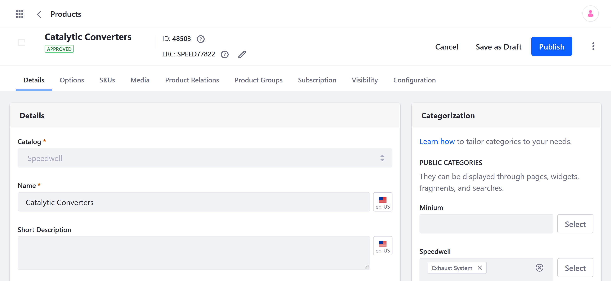
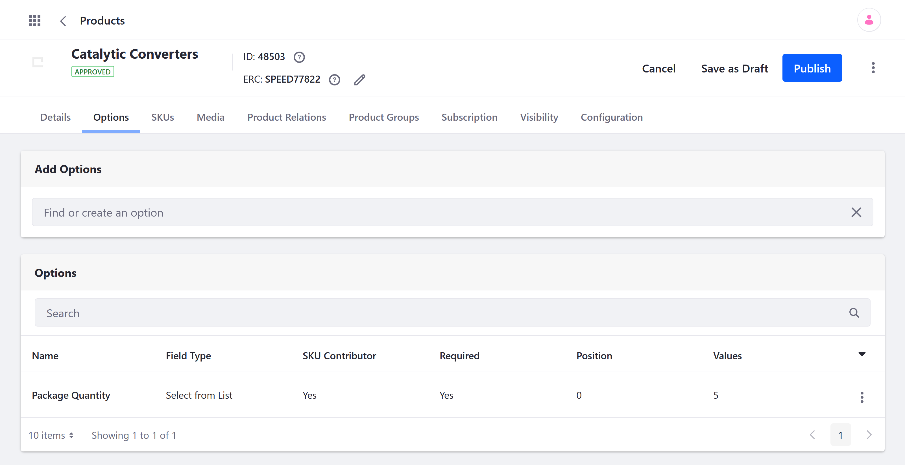
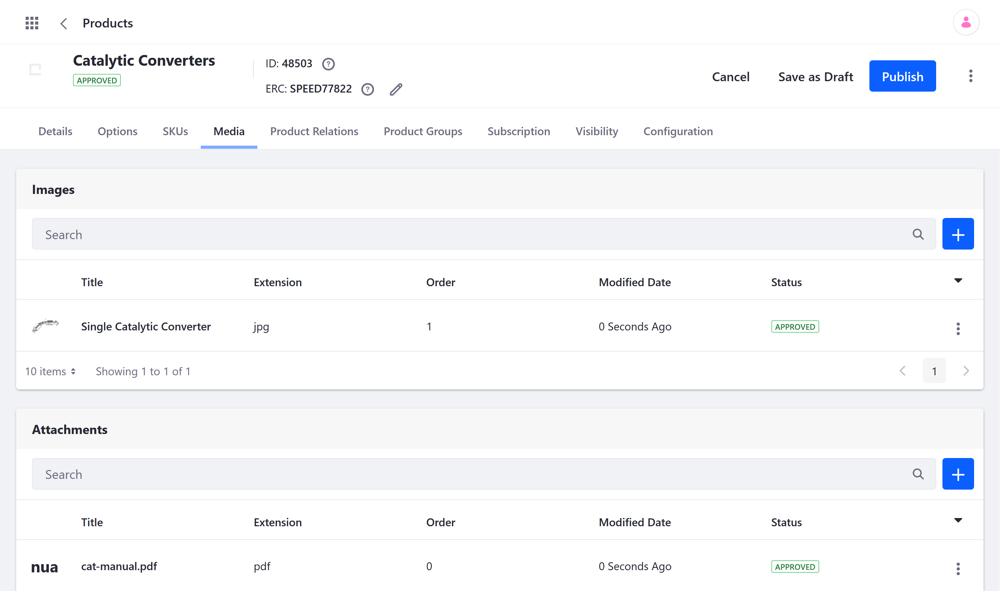
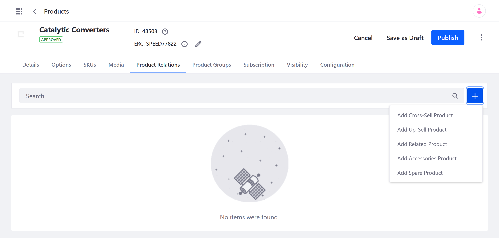
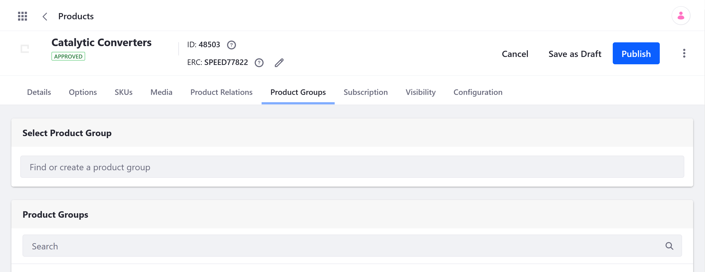
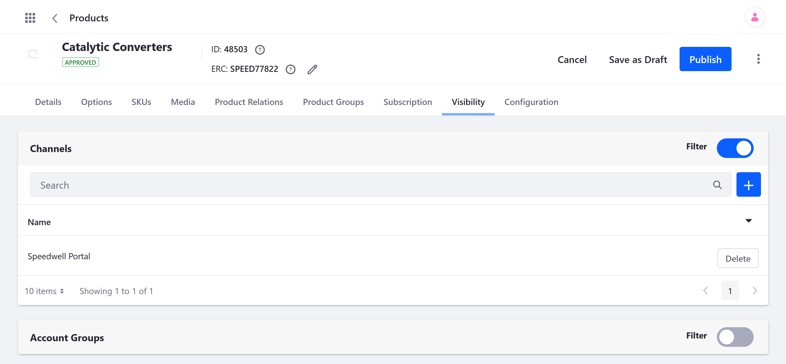

# Product Configuration Reference

<!--TASK: Add Intro-->

## Product Details

In the Product Detail's tab, you can configure the Product's SEO settings, applied Categories, specifications, and more.

### General Product Details

| Field | Description |
| --- | --- |
| Catalog | Catalog associated with the Product; this association is permanent |
| Name | Product Name |
| Short Description | Short summary of the Product |
| Full Description | Longer description of the product |

### SEO

| Field | Description |
| --- | --- |
| Friendly URL | The URL for the Product page |
| Meta Title |  Product title to help search engines locate your products |
| Meta Description | Product description used by search engines |
| Meta Keyword | Keywords used by search engines |

### Specifications

| Field | Description |
| --- | --- |
| Label | The specification's name |
| Value | The specification's value |
| Group | Links the specification to another Specification Group |
| Position | Determines display order, beginning with the lowest number |

<!--TASK: ### Categorization

| Field | Description |
| --- | --- |
| [Catalog Name] | Determines which Catalog categories are applied to the Product |
| Topic |  |
| Tags |  | -->

### Schedule

| Field | Description |
| --- | --- |
| Published | Enables the Product's visibility and availability for sale in the Catalog |
| Display Date | Date the Product is first made available for sale in the Catalog |
| Expiration Date | Determines when the Product will no longer be available, if *Never Expire* is unchecked |
| Never Expire | Determines if a Product can be scheduled for expiration |

## Options

Product Options provide a convenient way to add custom fields to your Products. They can be used to create Product variants based on attributes (e.g., size, quantity, color, material), bundles, and more. See [Using Product Options](./using-product-options.md) to learn more.

| Field | Description |
| --- | --- |
| Add Options | Field for Creating or applying existing Options to the Product|
| Options | List of Options added to the Product; click on an Option to edit its settings and values |

## SKUs

SKUs represent variants of a Product. See [Creating SKUs for Product Variants](./creating-skus-for-product-variants.md) to learn more.

By default, a Product's SKUs inherit the specifications and configurations of their parent Product. However, you can override some of these configurations on an individual basis. See [Overriding Product Level Information](./overriding-product-level-information.md) to learn more.

## Media

Users can upload product images and attachments. See [Product Images](./product-images.md) and [Product Attachments](./product-attachments.md) to learn more.

## Product Relations

Use Product relations to connect related products. Once connected, these relations can be displayed on the product's display page using the Product Publisher widget. See [Related Products, Up-Sells, and Cross-Sells](./related-products-up-sells-and-cross-sells.md) to learn more.

<!--TASK: ## Product Groups

 -->

## Subscription

Create and manage subscription options for Products. Examples include magazines, service contracts with renewal options, and regularly consumed items. See [Enabling Subscriptions for a Product](./enabling-subscriptions-for-a-product.md) to learn more.

## Visibility

By default, Products are visible across all Channels and Catalogs, you can limit visibility to specific Channels and Account Groups. See [Configuring Product Visibility Using Channels](../../../starting-a-store/channels/configuring-product-visibility-using-channels.md) and [Configuring Product Visibility Using Account Groups](./configuring-product-visibility-using-account-groups.md) for more information.

<!--TASK: ## Configuration

 -->

<!--TASK: ## Grouped

> For Grouped Products Only -->

<!--TASK: ## Virtual

> For Virtual Products Only 

See [Virtual Product Reference](./../product-types/virtual-product-reference.md) -->

## Additional Information

* [Creating a Simple Product](../product-types/creating-a-simple-product.md)
* [Creating a Grouped Product](../product-types/creating-a-grouped-product.md)
* [Creating a Virtual Product](../product-types/creating-a-virtual-product.md)
* [Virtual Product Reference](../product-types/virtual-product-reference.md)
