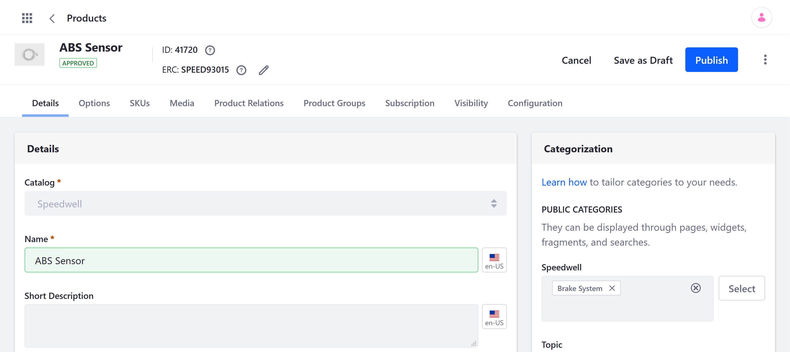
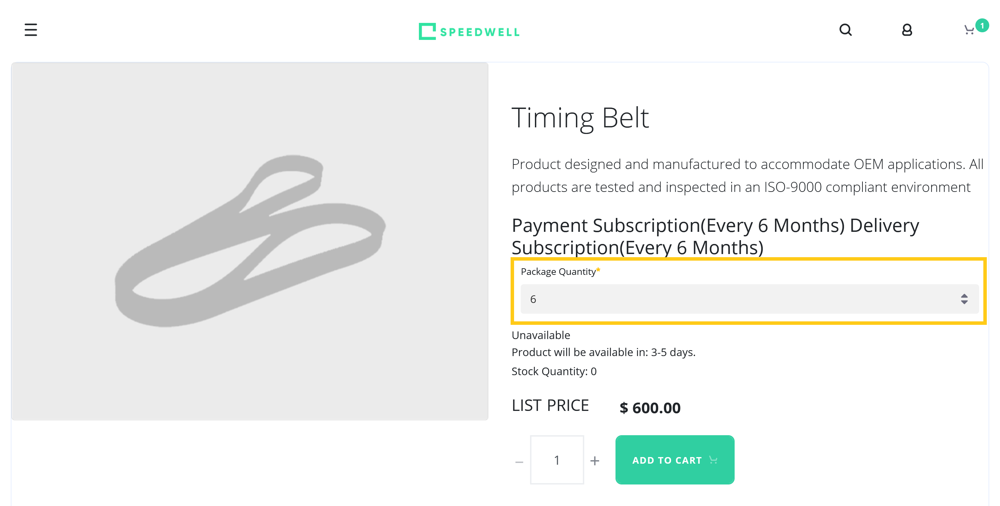
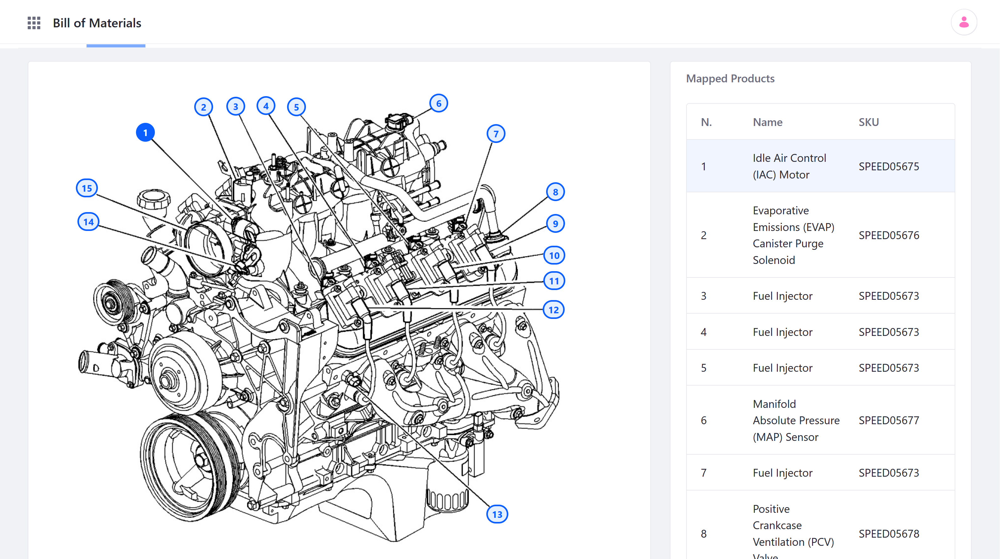

# Products Overview

Liferay Commerce provides three out-of-the-box Product types: [Simple](../product-types/creating-a-simple-product.md), [Grouped](../product-types/creating-a-simple-product.md), and [Virtual](../product-types/creating-a-simple-product.md). Each Product type is stored in a [Catalog](../../catalogs/creating-a-new-catalog.md) and assigned a default SKU at creation. By default, all Products are visible in a Catalog and across all Channels. However, you can control Product visibility by determining which Channels or Accounts are eligible to view it. After creation, each Product can also be assigned multiple [SKUs](./creating-skus-for-product-variants.md) to represent Product variants.
<!--TASK: improve article flow and fill our Product features-->
## General Product Details

Add [specifications](./specifications.md) to your Products, such as dimensions, weight, material, and warranty information.

Use [Product Categories](./organizing-your-catalog-with-product-categories.md) to group related products and quickly display them together on your Site using widgets and fragments.

Create friendly URLs for Products and add meta data for search engine optimization (SEO).

## Options

Use Product [Options](./using-product-options.md) to quickly add custom fields to your Products. These fields can be used to gather customer input (e.g., date, custom message) and provide customers with a choice between Product variants (e.g., Product bundles, color options).

## Media

Upload [images](./product-images.md) and [attachments](./product-attachments.md) directly to a Product to use for display images and product resources. Subscription users can also map Products to a Bill of Materials (BOM) diagram to provide product context to customers. See [Managing BOMs](./managing-boms.md) for more information.

## Subscription

Enable [subscriptions](./enabling-subscriptions-for-a-product.md) for Simple, Grouped, and Virtual Products. Examples of subscriptions include magazines, renewable service contracts, and automatic ordering for regularly consumed items.

## Inventory Rules

You can also configure custom Product [inventory rules](../../managing-inventory/introduction-to-managing-inventory.md) to set the maximum and minimum quantity customers can buy, determine whether your Channel takes back orders, or govern how a Product is sold when its inventory falls below a set threshold.

## Additional Information

* [Creating a Simple Product](../product-types/creating-a-simple-product.md)
* [Creating a Grouped Product](../product-types/creating-a-grouped-product.md)
* [Creating a Virtual Product](../product-types/creating-a-virtual-product.md)
