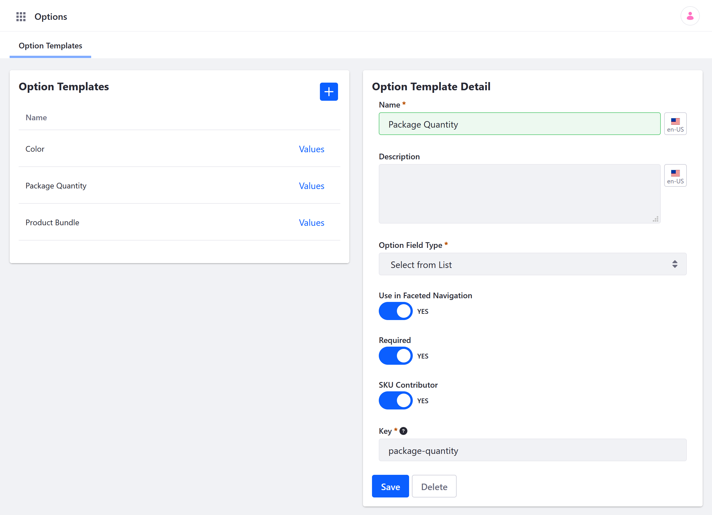
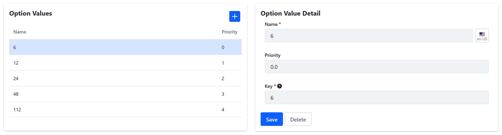
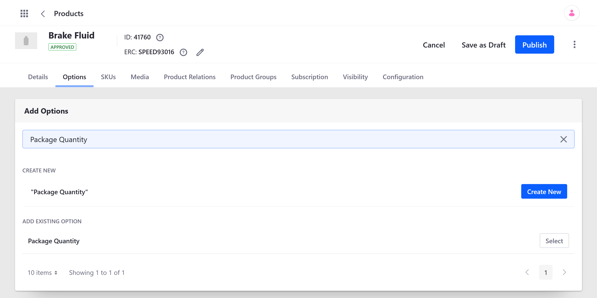

# Using Product Options

Product *Options* provide a convenient and flexible way to customize Products. With Options, you can add fields to Products sold in your Channel, allowing customers to choose from Product variants, bundles, and more.

To get started using Options, first [create and configure](#creating-an-option-template) an Options template. Then, depending on your template's configuration, [add values](#adding-values-to-option-templates) to it. Once created, you can [apply the template](#applying-an-option-template-to-a-product) to a Product and [configure its settings and values](#configuring-options-and-values-applied-to-products) at a product level, without affecting the global template.

## Creating an Option Template

Follow these steps to create an Option Template:

1. Open the *Global Menu* (), click on the *Commerce* tab, and go to *Product Management* &rarr; *Options*.

1. Click the *Add* button ().

   

1. Enter a template *Name* and *Description* (optional). A *Key* is automatically generated to match the Name field, but you can manually change the key if desired.

1. Select the template's *Field Type*. This determines the type of field used for the Product.

   * **Text**: adds a blank field for customers to enter text
   * **Select from List**: adds a drop-down list for the Option's values
   * **Single Selection**: adds a radio button list for the Option's values
   * **Multiple Selection**: adds a check-box list for the Option's values, allowing customers to select multiple values
   * **Date**: adds a field for customers to enter a date
   * **Numeric**: adds a blank field for customers to enter an integer
   * **Boolean Question**: adds a Boolean checkbox for the Option

1. Determine whether the Option can be *used in Faceted Navigation*. When enabled, you can use the Option as a search filter for Products.

1. Determine whether the Option is *Required*. When enabled, customers must use the field before adding the product to the cart.

1. Determine whether the Option is an *SKU Contributor*.

   When enabled, the Option's values are used to create [SKUs](./creating-skus-for-product-variants.md) for Product variants. Customers are required to select from available option values.

   ```note::
      SKU Contributor can only be enabled with the *Single Selection* and *Select from List* field types.
   ```

1. Click on *Save* when finished.

   

Once created, you can add [generic values](#adding-values-to-option-templates) to the Options template or skip this step and [apply the Option](#applying-an-option-template-to-a-product) to individual products.

```note::
   Alternatively, you can create basic Option templates via the *Products* page. Go to *Global Menu* → *Commerce tab* → *Product Management* → *Products*. Then select your desired *Product*, and click on the *Options* tab. Enter a name for your new Option into the *Add Option* field, and click *Create New*. An Option template is immediately created and applied to the Product. 
```

## Adding Values to Option Templates

If an Option uses the *Select from List*, *Single Selection*, or *Multiple Selection* field types, you'll need to add values to it.

Follow these steps to add generic values to an Option Template:

1. Open the *Global Menu* (), click on the *Commerce* tab, and go to *Product Management* &rarr; *Options*.

1. Click on *Values* for the desired template.

1. Click the *Add* button ().

1. Enter a *Name* for the value. A *Key* is automatically generated to match the entered name, though you can set them independently if desired.

1. Set the value's *Priority* to determine the order in which it's listed.

1. Click on *Save* to add the value to the Option Template.

   

You can repeat this process to add as many generic values to the option as desired. When the template is applied to a product, all values are included, though you can add, remove, or edit values for each product without affecting template values.

## Applying an Option to a Product

Follow these steps to apply an Option to a Product:

1. Open the *Global Menu* (), click on the *Commerce* tab, and go to *Product Management* &rarr; *Products*.

1. Click on the *Options* tab.

1. Enter the Option template's name into the *Add Options* field, and click *Select*.

   

The Option is immediately applied to the Product, and customers can access the Option field via the Product Details widget.

If desired, you can add multiple Options to the same Product. See [Creating SKUs for Product Variants](./creating-skus-for-product-variants.md) for more information.

```important::
   If SKU Contributor is enabled, you'll need to manually generate SKUs for the Option's values after they're created. To do this, go to the Product's *SKUs* tab, click on the *Add* button, and select *Generate All SKU Combinations*. Unique SKUs are immediately generated for each value. If the SKUs are not generated, the Option's field will not display its values.
```


## Configuring Options and Values Applied to Products

Once an Option is applied to a Product, you can access additional configuration settings for the Option and its values.

```note::
   Changes made to a Product's Option do not affect the Option template, and vice versa.
```

### Additional Option Settings

* **Position**: Set the Option's priority to determine the order in which it is displayed, beginning with `0.0`.

* **Price Type**: Set the price type used for the Option's values, Dynamic or Static.

  * *Dynamic* pricing requires linking values to SKUs and uses the linked Product's price for the value's own price.

  * *Static* pricing uses a fixed price for the Option's values. If the value is linked to a Product, the Static price overrides the Product's instance price without affecting its list price.

```note::
   The price type attribute is only compatible with the *Single Selection* and *Select from List* field types.
```

### Additional Value Settings

* **Default**: Set a default value for the Option.

* **Delta Price** (For Static Only): Set a specific price for the value.

* **Product**: Link an existing SKU to the value and specify its quantity.

```note::
   Products can only be linked to Options with the price type attribute.
```

## Commerce 2.1 and Below

### Creating an Option Template

To create an option template:

1. Navigate to the _Control Panel_ → _Commerce_ → _Product_.
1. Click on the _Options_ tab. This displays a list of existing templates on the left of the page and the _Option Template Detail_ form on the right.
1. Click the (+) to add an Option Template.
1. Enter the following:
    * **Title**: Color
    * **Description**: Choice of colors
    * **Field Type**: Select from List
    * **Use in Faceted Navigation**: Yes
    * **Required**: Yes
    * **SKU Contributor:** No
    * **Key**: (automatically generated)

        

1. Click _Save_.

The Option Template has been added and can be applied to all products.

When _Use in Faceted Navigation_ is switched to _Active_, users have the ability to filter search results based on the specified option.

A SKU contributor can be assigned a unique price and other attributes for each variant via [SKUs](./creating-skus-for-product-variants.md). If enabled, the option must have a SKU in order to be sold.

```warning::
   You cannot use a Boolean option as a SKU contributor. Attempting to use a Boolean option as a SKU contributor shows the following warning message: ``SKU Contributor cannot be set as true for the selected Field Type.``
```

### Adding Option Values

Depending on the Field Type used in the template, you may need to create values for that option. In this example, _Select from List_ requires Option Values, such as the different product colors.

To add multiple Option Values:

1. Click the _Values_ link next to _Color_.
1. Click the () to add an Option Template.
1. Enter the following:
    * **Name:** Black
    * **Priority:** 1.0
    * **Key:** (autogenerated from the _Name_ field)

        

1. Click _Save_.

_Black_ is now added to the Color options. To add more colors, repeat the steps and increment the priority. For example, you can add _White_ and priority set as 2.0 followed by _Blue_ with priority 3.0, and so forth. Remember the priority field determines the order in which the options are displayed with the lowest values being displayed first.

### Applying an Option Template to a Product

Once you apply a template to a product, you can make any changes to the product's option. These changes will not affect the option template or any other product.

To apply an option template to a product:

1. Go to the _Global Applications_ → _Commerce_ → _Products_.
1. Click on any product listed there. For example, if the Minium accelerator was used to create the site, one sample product is the _Torque Converters_.

    

1. Click _Torque Converters_.
1. Click the _Options_ tab.

    

1. Search for an Option (for example _Quantity_).
1. Click _Select_ next to _Package Quantity_.

The Option Template is now applied; when the product is displayed on the catalog page, buyers may now select different quantities for Torque Converters.


## Additional Information

Note that you can apply more than one option template per product and each option has its own unique display priority. In addition to _Package Quantity_ (created by default in the Minium accelerator), there is the _Color_ Option created in the Options Template section above. You may also change the Option Values on this screen without having to change the template itself.

1. Click the _Values_ link next to _Package Quantity_.
2. Click the () button to add a new value.
3. Enter the following:
    * **Name:** 60
    * **Priority:** 5.0
    * **Key:** (autogenerated)
4. Click _Save_.

    

The new option has been added to the possible quantities a buyer can choose from.
