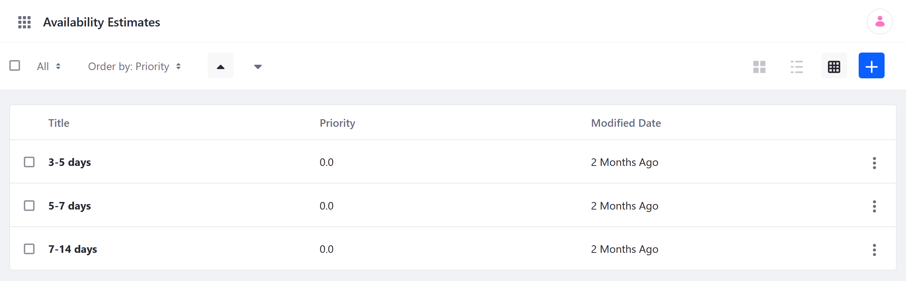
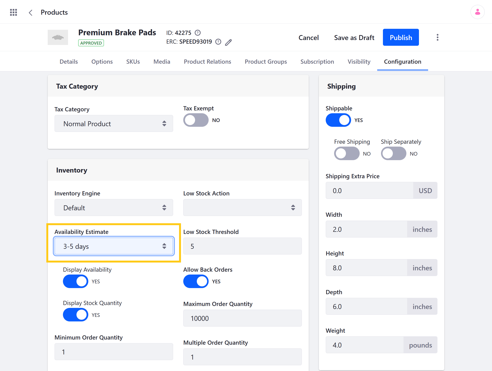
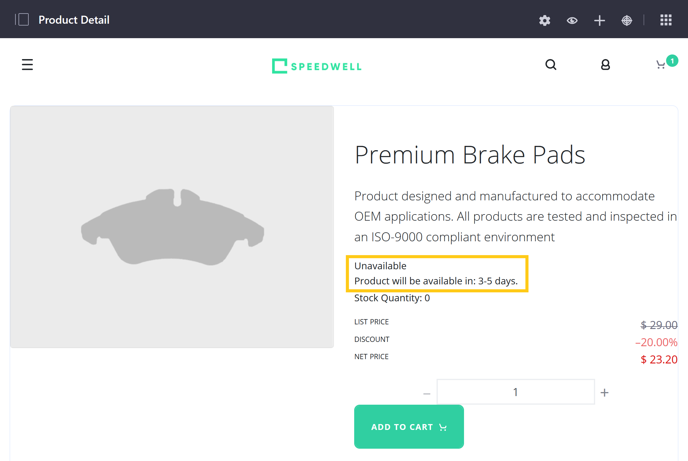

# Availability Estimates

If a Product becomes unavailable, store owners can provide customers with an estimate for when it will be restocked.

When using an [accelerator](../../starting-a-store/accelerators.md) to create a Commerce Site, three sample estimates are created.

Follow these steps to create your own availability estimates:

1. Open the *Global Menu* (), click on the *Commerce* tab, and go to *Availability Estimates*.

1. Click the *Add* button ().

    

1. Enter a *Title*. This value should be the estimated period of time before the Product is restocked (e.g., 3-5 days, 3-4 weeks, 2-3 months).

   It is displayed in the Product Details widget as follows: "Product will be available in: [Title Value]."

1. Enter a *Priority* to determine the order in which the estimate is listed.

1. Click *Save*.

Once created, you can add it to Products with *Display Availability* enabled. Simply navigate to a Product's *Configuration* tab, select the desired *Availability Estimate*, and click *Publish* when finished.

The selected estimate is displayed to customers whenever the Product's inventory reaches 0.

## Commerce 2.1 and Below

A set of Availability Estimates are created when using an [Accelerator](../../starting-a-store/accelerators.md) to create a storefront.

To create an Availability Estimate:

1. Navigate to the _Control Panel_ → _Commerce_ → _Settings_.
1. Click the _Availability Estimates_ tab.
1. Click the (+) button to add a new estimate.
1. Enter the following:
    * Title: 15-21 days
    * Priority: 4.0
1. Click _Save_.

The new Availability Estimate has been added. Note that because the priority is set to _4.0_, this means this time period is displayed last in the menu.

When configuring the low stock threshold, this Availability Estimate option is displayed in the _Product Configuration_ → _Inventory_ menu.

## Additional Information

* [Introduction to Managing Inventory](./introduction-to-managing-inventory.md)
* [Product Inventory Configuration Reference](./product-inventory-configuration-reference.md)
