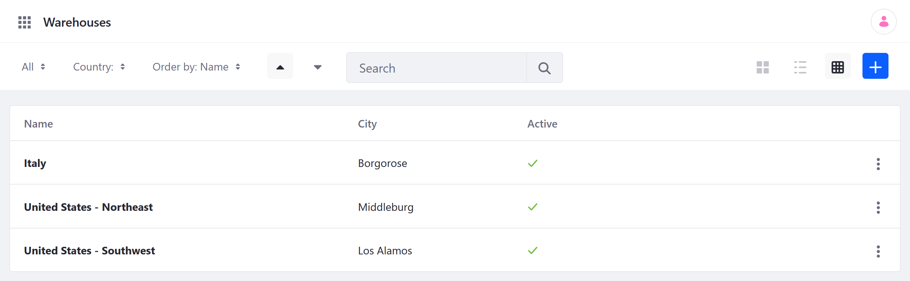
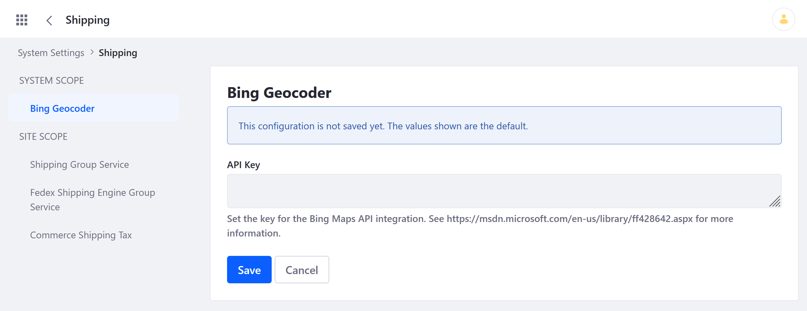
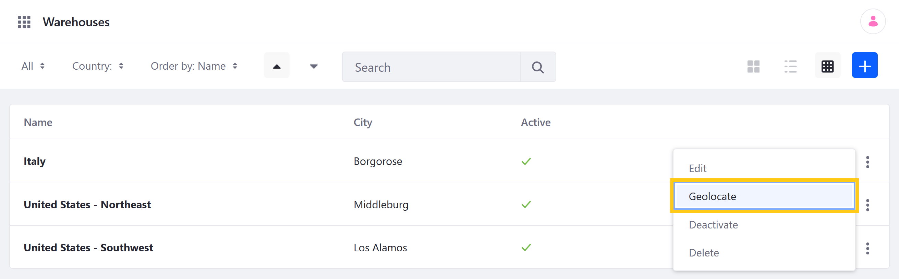

# Setting Up Commerce Warehouses

Commerce Warehouses represent physical locations where Product inventory is stored. Each Warehouse can be linked to multiple Channels and must have a set geolocation to be activated. These geolocations are used by the Fedex shipping method when calculating shipping costs for customers.

When using an [accelerator](../../starting-a-store/accelerators.md) to create a Commerce Site, three sample Warehouses are created.

```note::
   When setting up commerce warehouses, users may need to first enable the applicable country and region location of the Warehouse (state or province). See `Adding Regions <../../store-administration/adding-regions.md>`_ for more information.
```

## Adding a Warehouse

Follow these steps to add a new Warehouse:

1. Open the *Global Menu* (), click on the *Commerce* tab, and go to *Warehouses*.

1. Click the *Add* button ().

   

1. Enter a *Name* and *Description* (optional) for the new Warehouse.

1. Switch the toggle to *Active*. Activating a Warehouse requires a geolocation.

1. Select which *Channels* are associated with the Warehouse.

   Product inventory for a Channel is determined by its associated Warehouses.

1. Enter a Warehouse *Address*.

1. Enter the Warehouse's *Geolocation* (required for activation).

   Alternatively, you can use Bing Geocoder to automatically generate a Warehouse's geolocation. Using this feature requires the Warehouse has an address. See [below](#using-bing-geocoder-to-set-a-warehouses-geolocation) for more information.

1. Click *Save*.

Once the Warehouse is activated, you can [add Product inventory](./setting-inventory-by-warehouse.md) to it.

## Using Bing Geocoder to Set a Warehouse's Geolocation

Commerce provides integration with the Bing Maps API to automatically generate Warehouse geolocations. To use this feature, you must have a [Bing Maps account](https://docs.microsoft.com/en-us/bingmaps/getting-started/bing-maps-dev-center-help/creating-a-bing-maps-account) and [Bing Maps Key](https://docs.microsoft.com/en-us/bingmaps/getting-started/bing-maps-dev-center-help/getting-a-bing-maps-key).

Then, follow these steps to configure the Bing Geocoder for your instance:

1. Open the *Global Menu* (), and go to *Control Panel* &rarr; *System Settings* &rarr; *Commerce* &rarr; *Shipping* &rarr; *Bing Geocoder*.

1. Enter your *API Key*.

   

1. Click *Save*.

Once the Geocoder is configured, you can generate Warehouse geolocations for any Warehouse with a set address. Simply navigate to the Warehouses page, click on the *Actions* button () for the desired Warehouse, and select *Geolocate*. The Geocoder converts the address into latitude and longitude coordinates.



## Commerce 2.1 and Below

To add a warehouse in the _Control Panel_:

1. Go to _Control Panel_ → _Commerce_ → _Settings_.
1. Click the _Warehouses_ tab.
1. Click the _Add Warehouse_ () button.
1. Enter the following:
   * *Name:* _Warehouse name_ (e.g. North Vegas Warehouse)
   * *Description:* _Warehouse description_ (e.g. North Vegas Processing Center)
1. Switch the toggle to _Active_.
1. Enter the warehouse address.
1. Select a channel. Product inventory for the channel will be based on the associated warehouse.
1. Enter the geolocation data (required):
    * *Latitude*: 36.282974
    * *Longitude*: -115.136

    

1. Click _Save_ when finished.

The new warehouse is now active and available as an option in the _Shipment_ tab.

## Additional Information

* [Adding Regions](../../store-administration/adding-regions.md)
* [Deactivating a Country for Billing or Shipping](../../store-administration/deactivating-a-country-for-billing-or-shipping.md)
* [Introduction to Channels](../../starting-a-store/channels/introduction-to-channels.md)
