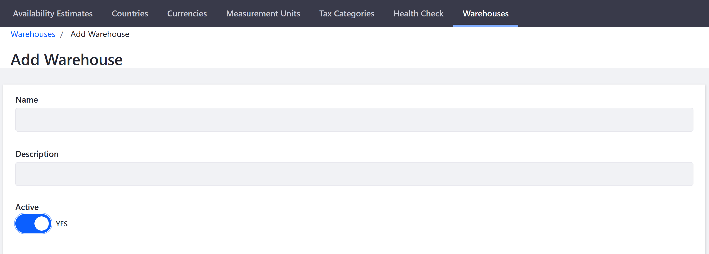

# Warehouse Reference Guide

Warehouses represent physical locations where product inventory is managed and shipped for order fulfillment. Product inventory quantities can be managed per Warehouse. Available inventory is then calculated by Liferay Commerce to determine the total available inventory for sale across Warehouses. Channels must have a Warehouse associated with it in order to source product inventory. Multiple Warehouses can be created and associated with a given channel.

To manage your Warehouses, navigate to the _Global Applications_ → _Commerce_ → _Settings_. Click the _Warehouses_ tab.

```note::
   Warehouse settings are located in the _Control Panel_ if using Commerce 2.0 or 2.1.
```

## Warehouse Name



| Field | Description |
| --- | --- |
| Name | Name of the Warehouse |
| Description | Additional Information |
| Active | Toggle to designate Warehouse as active |

## Channels


| Field | Description |
| --- | --- |
| Channels | List of checkboxes for all channels this Warehouse serves |

## Address Fields


| Field | Description |
| --- | --- |
| Street 1 | Address's first line |
| Street 2 | Address's second line |
| Street 3 | Address's third line |
| Country | Dropdown menu to select a country |
| Region | Dropdown menu to select the state or province |
| Postal Code | Field to enter the postal code |
| City | City where the Warehouse is located |

## Geolocation


| Field | Description |
| --- | --- |
| Latitude | Warehouse's Latitude |
| Longitude | Warehouse's Longitude |

A Warehouse's geolocation is used by the FedEx shipping method to calculate shipping costs during checkout. Commerce uses the Warehouse with the best rate for the customer.

## Additional Information

* [Introduction to Shipments](../../orders-and-fulfillment/shipments/introduction-to-shipments.md)
* [Setting Up Commerce Warehouses](./setting-up-commerce-warehouses.md)
* [Setting Inventory by Warehouse](./setting-inventory-by-warehouse.md)
