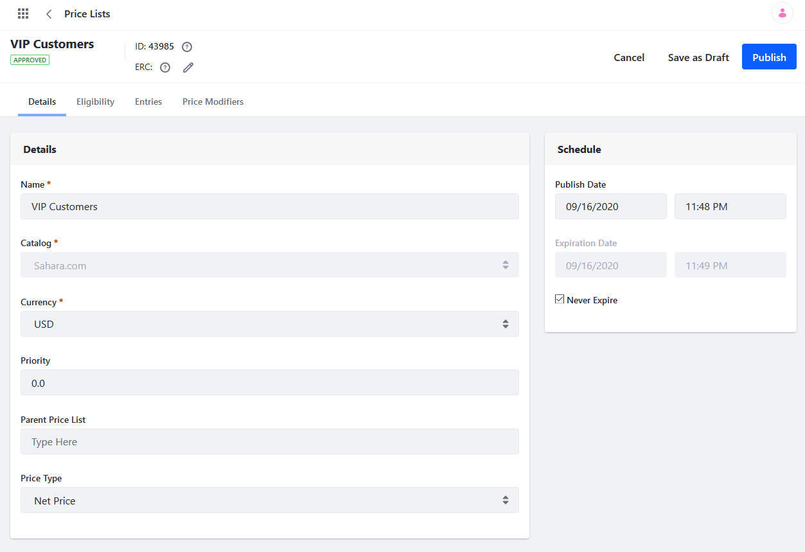

# Creating a Price List

Price Lists provide a convenient way to set alternate prices for a product, as well as alternate currencies for selected Accounts, Account Groups, and Channels.

Follow these steps to create a new Price List:

1. Open the *Global Menu* (), click on the *Commerce* tab, and go to *Pricing* &rarr; *Price Lists*.

1. Click on the *Add* button ().

1. Enter a *Name*, *Catalog*, and *Currency* for the new Price List. While its name and currency can be changed at any time after creation, its catalog cannot be changed.

   ```note::
      Creating a Price List requires your Commerce instance to have at least one `Catalog <../catalogs/creating-a-new-catalog.html>`_.
   ```

1. Click on *Submit*.

Once created, you can [add Product price entries](./adding-products-to-a-price-list.md) to it and configure its general settings. These settings include the list's relative priority, parent Price List, and price type (i.e., net or gross). You can also determine Account and Channel eligibility and [add Price Modifiers](./using-price-modifiers.md) if desired.

When finished, click on *Publish* to make your changes live, or *Save as Draft* to publish them at a later time.



```note::
   When a catalog is first created, a Base Price List is automatically created to store the base price for each of its entries. For these Price Lists, only the *Details* and *Entries* tabs are available. Eligibility and price modifier settings are only available to subsequently created Price Lists.
```

## Commerce 2.1 and Below

To add a price list:

1. Navigate to the _Control Panel_ → _Commerce_ → _Price Lists_.
1. Click the () button.
1. Enter the following fields (example values shown below):
    * **Catalog**: Sahara.com
    * **Name**: VIP Customers
    * **Store Currency**: USD
    * **Priority**: 1.0
1. Under _Account Groups_, click _Select_.
1. Choose one or more Account Groups to have access to this price list (example account groups shown below):
    * _General_
    * _Auto Repair Shops_
1. Click _Add_.
1. Under _Accounts_, click _Select_.
1. Choose one or more Accounts to have access to this price list (example accounts shown below):
    * Mike’s Car Repair
    * Fountain Valley Car Wash
1. Click _Add_.
1. Choose a Schedule for the price list. (Leave the _Never Expire_ checkbox checked in this example. Alternatively, you can set a date range for when the price list is active.)

    

1. Click _Publish_.

The price list (_VIP Customers_ in this example) has been created and applied to the chosen Account Groups and Accounts. Repeat the steps to create other price lists as necessary.

## Additional Information

* [Creating a New Account Group](../../account-management/creating-a-new-account-group.md)
* [Creating a New Account](../../account-management/creating-a-new-account.md)
* [Adding Products to a Price List](./adding-products-to-a-price-list.md)
* [Using Price Tiers](./using-price-tiers.md)
