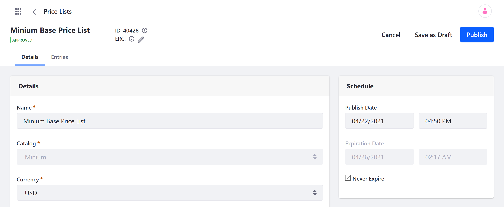
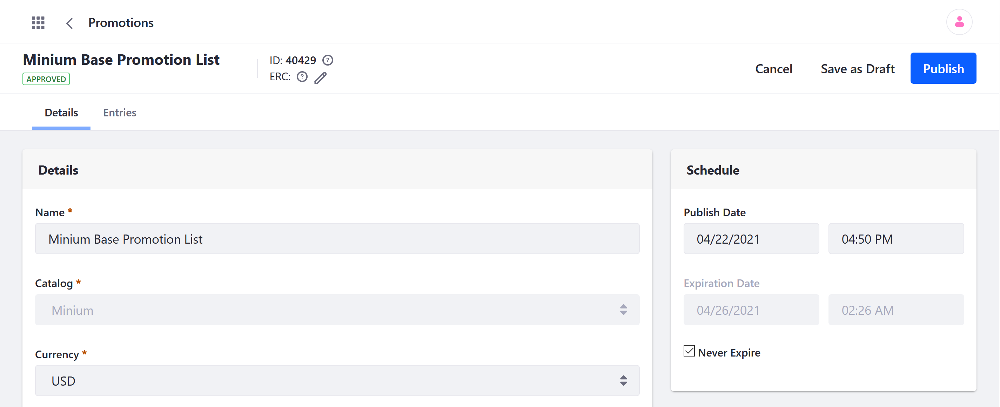
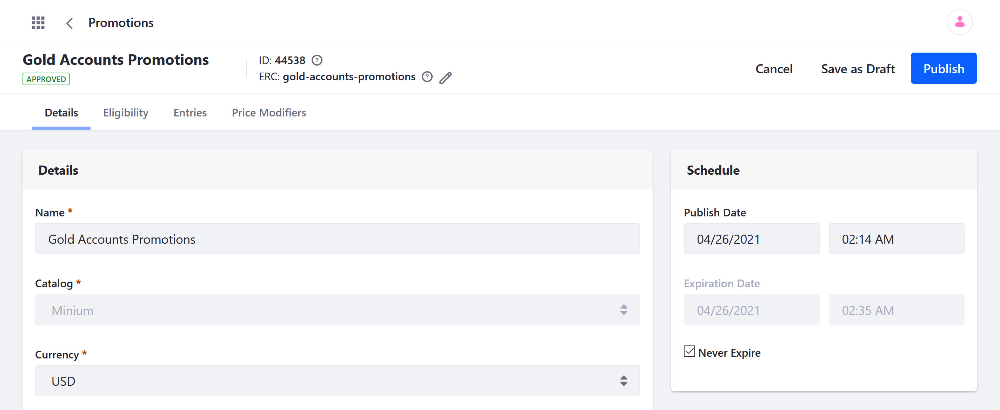

# Introduction to Pricing

Liferay Commerce provides a robust pricing system to fine-tune Product prices. You can define multiple price entries for a single Product SKU and determine which Accounts, Account Groups, and Channels are eligible to receive each price. If multiple price entities exist for the same SKU, Commerce's pricing engine calculates which entities should be used for each Channel customer.

The following article provides an overview of Commerce pricing and how Product and order prices are determined for customers.

* [Components of Commerce's Pricing System](#components-of-commerces-pricing-system)
* [How Commerce Calculates Product Prices](#how-commerce-calculates-product-prices)
* [How Commerce Calculates Order Prices](#how-commerce-calculates-order-prices)

```note::
   The following overview describes the Commerce Pricing Engine v2.0+. This engine version is the default algorithm used for Commerce 3.0+ and Portal/DXP 7.3+. Commerce 2.1.x and earlier versions use Commerce's `Pricing Engine v1.0 <#pricing-engine-v1-0-reference>`_ by default. If desired, you can `change the Pricing Engine version <#enabling-pricing-engine-v2-0-in-commerce-2-1-x>`_ used for the instance.
```

## Components of Commerce's Pricing System

In Commerce, every Product is stored in a Catalog, and each Catalog has its own default [Base Price List](#base-price-list) and [Base Promotion List](#base-promotion-list). These lists are used to store base price entries for all Product SKUs contained in a Catalog and are made available to all customers. You can also create custom [Price Lists](#price-lists) and [Promotion Lists](#promotion-lists) to define more targeted and configurable price entities. As part of each entry, you can also define [Price Tiers](#price-tiers) that set special prices for Products based on quantity. Finally, create [Discounts](#discounts) that are applied on top of price entries without overriding them.

### Base Price List

The Base Price List stores the starting price entry for every Product SKU in a Catalog. These entries set the standard currency and price used for each SKU when no overrides are applied to it. This list is automatically created for every Catalog and is made available to all Accounts and Channels. See [Setting a Product's Base Price](./setting-a-products-base-price.md) to learn more.

   

### Base Promotion List

The Base Promotion List stores base promotional price entries for all Product SKUs in a Catalog. When applied to an SKU, the base promotional price entry overrides its base price for all customers. This list is automatically created for every Catalog and is made available to all Accounts and Channels. See [Promotion Base List Reference](./../../promoting-products/promotion-base-list-reference.md) for more information.

   

### Price Lists

Custom Price Lists store price entries for specific Products and are made available only to eligible customers. These lists can use a different currency from the Base Price List and can include all or only some of a Catalog's Products. Price List entries override an SKU's base price for eligible customers. You also define [Price Modifiers](./using-price-modifiers.md) to modify specific price entries. See [Creating a Price List](./creating-a-price-list.md) for more information.

   

### Promotion Lists

Custom Promotion Lists store sale price entries for specific Products and are made available only to eligible customers. These lists can use a different currency from the Base Price List and only include manually selected Products. When applied, they override an SKU's other price entries (e.g., base prices, tiered prices) for eligible users. In these lists, you also define [Price Modifiers](./using-price-modifiers.md) to modify specific price entries. While active, both the original price and promotional price appear together on the Product page so that buyers see the markdown. See [Creating a Promotion](./../../promoting-products/creating-a-promotion.md) for more information.

   

### Price Tiers

Price Tiers are set directly within a price entry and define specific prices for orders that meet minimum quantity requirements. These prices are displayed to Customers as discounted order options. See [Using Price Tiers](./using-price-tiers.md) for more information.

### Discounts

Discounts are applied on top a price and modify it without superseding it. They can be defined within an existing price entry, or created as separate entities and used to target Products, Product Groups, Categories, Shipping costs, Subtotals, or Totals. See [Introduction to Discounts](./../../promoting-products/introduction-to-discounts.md) to learn more.

   

## How Commerce Calculates Product Prices

Commerce's pricing algorithm determines how each pricing component contributes to an SKU's price in a Channel. When the algorithm receives a price request, Commerce first calculates the Product's *unit price* and *promo price*. These prices are then used to determine the *final price* made available to the Channel customer.
<!--TASK: Consider adding details about net/gross price types and how taxes are calculated-->

### Calculating an SKU's Unit Price

When calculating an SKU's unit price, Commerce first searches for any Price Lists applicable to the Channel and customer, according to the list's eligibility.

* If an applicable Price List exists, then Commerce searches its price entries for the Product SKU.

  * If an entry for the SKU exists, the algorithm applies any existing price modifiers to it and uses the total for the SKU's unit price.

  * If no entry for the SKU exists, the algorithm applies any existing price modifiers to the SKU's Base Price List entry and uses the total for the SKU's unit price.

* If no applicable Price List exists, the SKU's Base Price List entry is used for the SKU's unit price.

```note::
   During this process, Commerce also checks for applicable tier prices. If one exists, its price is used in place of the default list price for specific quantities.
```

### Calculating an SKU's Promo Price

After calculating the SKU's unit Price, Commerce calculates the SKU's promo price. This calculation is essentially the same as the process for calculating the unit price with two exceptions:

* If an applicable Promotion List does not have a price entry for the SKU, any existing price modifiers are applied to the unit price, and the total is used for the promo price.

* If there is not applicable Promotion List and the Base Promotion List is set to 0, the promo price

### Calculating an SKU's Final Price

Once the unit and promo prices have been calculated, Commerce compares the two prices and selects the better of the two. The pricing algorithm then searches for all applicable discounts and applies them to the best SKU price. The total is the SKU's final price--the price used by the customer to purchase the product.

## How Commerce Calculates Order Prices

When calculating order prices, Commerce first retrieves the shipping costs and applies any discounts that target shipping.

Commerce then adds together the final price of all SKUs included in the order to determine its subtotal. Any discounts targeting the subtotal are then applied.

Finally, Commerce adds together the discounted shipping cost and discounted subtotal to get the order's total. Any discounts targeting the total are then applied.

## Pricing Engine v1.0 Reference

| Pricing Method | Summary | Overrides the Base Price? | Where is it set? | Applies to who? | Applies to what? |
| --- | --- | :---: | --- | --- | :---: |
| Base Price | The base price | n/a | Product SKU | All buyers | Product SKU |
| Base Promo | Marked down price | Yes | Product SKU | All buyers | Product SKU |
| Price List (List Price, List Promo) | Special pricing (or currencies) per Product and buyer | Yes | Price Lists | Selected buyers (Accounts & Account Groups) | Individual Product SKUs |
| Tiered Price List (Tiered Price, Tiered Promo) | Special pricing (or currencies) per Product and buyer _at bulk quantities_ | Yes | Price Lists | Selected buyers (Accounts & Account Groups) | Individual Product SKUs |
| Discount | Modifies price for a group of Products or buyers (Can limit quantity and use coupon codes) | No | Discounts | Selected Buyers (Accounts & Account Groups or those who meet certain qualifications) | Groups of Products (or Individual Product SKUs) |

```note::
   In the Commerce Pricing Engine v1.0, price entries include three components: an SKU, a standard price, and a promo price. In v2.0, each is a separate entity.
```


## Enabling Pricing Engine v2.0 in Commerce 2.1.x

By default, Commerce 2.1.x and earlier versions use Commerce Pricing Engine v1.0. Follow these steps to enable Commerce Pricing Engine v2.0:

1. Open the Control Panel, and go to *System Settings* &rarr; *Commerce* &rarr; *Pricing*.

1. Click on *Commerce Pricing Configuration* in the left panel.

1. Replace `v1.0` with `v2.0` in the *Pricing Calculation Key* field.

1. Click on *Save*.

Commerce is updated to use the Pricing Engine v2.0 for all price calculations in the Liferay instance.

## Additional Information

* [Setting a Product's Base Price](./setting-a-products-base-price.md)
* [Creating a Price List](./creating-a-price-list.md)
* [Adding Products to a Price List](./adding-products-to-a-price-list.md)
* [Using Price Tiers](./adding-products-to-a-price-list.md)
* [Creating a Discount](../../promoting-products/creating-a-discount.md)
