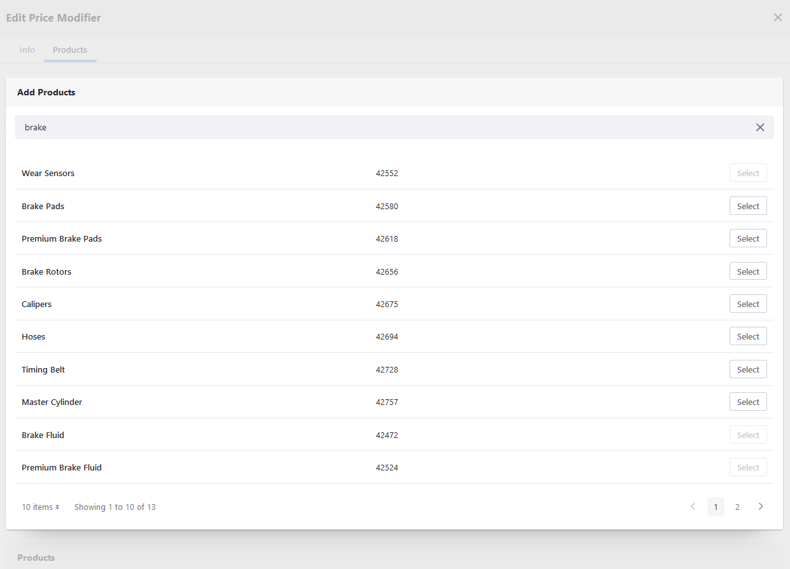
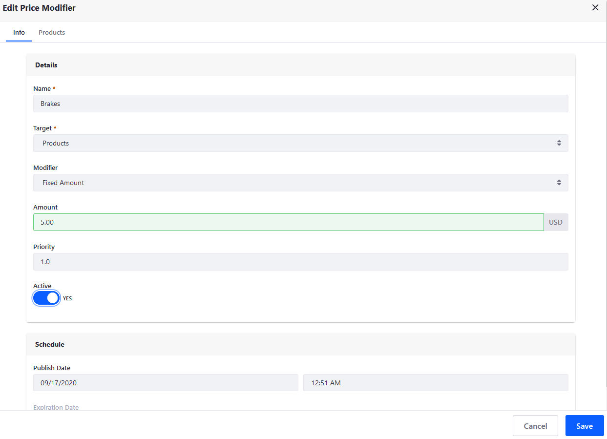

# Using Price Modifiers

Price modifiers are defined at the Price List level and modify the price of list entities according to set conditions. <!--TASK: Improve introduction-->

## Adding Price Modifiers to a Price List

Follow these steps to add a new price modifier to a Price List:

1. Open the *Global Menu* (), click on the *Commerce* tab, and go to *Pricing* &rarr; *Price Lists*.

1. Click on the *Price List* you want to configure, and go to the *Price Modifiers* tab.

1. Click on the *Add* button ().

1. Enter a *Name* for the modifier.

1. Determine a *Target* for the price modifier:

   * **Catalog**: Apply the modifier to all Products in the current Catalog.
   * **Categories**: Apply the modifier to all Products within a specific Category.
   * **Products**: Apply the modifier to Products individually.
   * **Product Groups**: Apply the modifier to all Products within specific Product Groups.

1. Determine the type of *modifier* used:

   * **Percentage**: Modify targeted prices by a certain percentage.
   * **Fixed Amount**: Modify targeted prices by a fixed amount.
   * **Replace**: Override targeted priced with a fixed value.

1. Click on *Submit* when finished.

Once created, you can finish configuring the modifier by clicking on it in the Price Modifiers tab.

```note::
   Available configuration options vary depending on the selected target for your modifier.
```

## Configuring a Modifier's General Information

Follow these steps to configure a Price Modifier's general details:

1. Click on the *Price Modifier* you want to edit, and go to the *Info* tab.

1. Enter an *Amount* to use for the selected type of modifier.

1. Optionally, manually enter the Price Modifier's Priority, which is used as a tie breaker in the case of multiple matches.

1. Slide the *Active* toggle to *YES*.

1. Optionally, you can *schedule* when the Price Modifier takes effect, as well as if and when it expires.

1. Click on *Save* when finished.

   

## Configuring a Modifier's Target

Once you've determined a Price Modifier's general details, additional configuration options are available based on the modifier's target. Each modifier can target Products, Product Groups, or Categories.

Follow these steps to configure a Price Modifier's target:

1. Click on the *Price List* you want to configure, and go to the *Price Modifiers* tab.

1. Click on the additional editing tab (e.g., *Categories*, *Products*, or *Product Groups*).

1. Use the provided search bar to locate the desired target for the modifier, and then click on *Select* to make them subject to the price modifier.

   

1. After selecting the desired targets, return to the *Info* tab, and click on *Save*.

## Additional Information

* [Introduction to Pricing](./introduction-to-pricing.md)
* [Creating a Price List](creating-a-price-list.md)
* [Adding Products to a Price List](adding-products-to-a-price-list.md)
