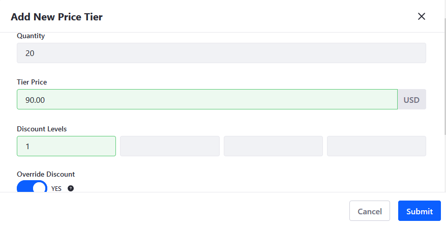
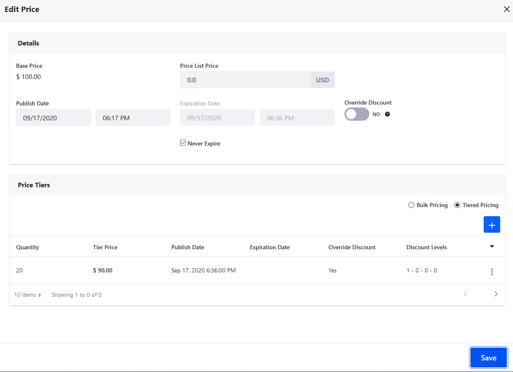

# Using Price Tiers

With Liferay Commerce, you can use *Price Tiers* to offer price reductions based on the quantity of a product ordered. Prices set in this way take precedence for associated users if the specified minimum quantity is met.

Follow these steps to add tiered pricing to an existing Price List:

1. Open the *Global Menu* (), click on the *Commerce* tab, and go to *Pricing* &rarr; *Price Lists*.

1. Click on the desired *Price List*, and go to the *Entries* tab.

1. Click on the desired price entry.

1. Use the radio button in the *Price Tiers* section to select either *Bulk Pricing* or *Tiered Pricing*.

   ```note::
      While both price tier options are configured in the same way, they apply prices differently. *Bulk Pricing* applies the same tier price to all items in qualifying bulk orders, while *Tiered Pricing* applies different prices to order items according to defined pricing tiers.      
   ```

1. Click the *Add* button ().

1. Enter a *Quantity* to determine the minimum quantity for receiving the bulk price.

1. Enter a *Tier Price* to determine the individual price of each product in the bulk order.

1. Determine whether the tier price overrides active discounts on the product. If enabled, you can define custom discount levels for buyers who have been offered the list price and purchased the minimum quantity.

   ```note::
      You can set different discount levels that are applied on top of each other and modify the price. If there are two discounts on the same level (e.g., L1), the algorithm applies the better of the two. However, if there are two discounts on different levels (e.g., L1 and L2) the algorithm applies both.
   ```

   

1. Determine when the new price tier takes effect, as well as if and when it expires.

1. Click on *Submit*, and then click on *Save* in the *Edit Price* window.

   

When finished, click on *Publish* for the selected Price List to make your changes live, or click on *Save as Draft* to publish them at a later time.

## Commerce 2.1 and Below

1. Navigate to the _Control Panel_ → _Commerce_ → _Price Lists_.
1. Click on a price list (_VIP Customers_ in this example).
1. Click the _Entries_ sub-tab.
1. Click on a product (_Premium Brake Fluid_ in this example).
1. Click the _Tier Price Entries_ sub-tab.
1. Click the () button.
1. Enter the following fields (example values shown below):
    * **Price**: 90
    * **Promo Price**: (leave it blank)
    * *Minimum Quantity*: 20 (This is the minimum quantity needed to receive the price for bulk quantity.)

        

1. Click Save.

A pricing tier ($90) has been created for orders that reach the minimum quantity (20) for the product (_Premium Brake Fluid_) on the price list (_VIP Customers_). Repeat the steps to add successive price tiers to the same product and price list (for other minimum quantities), or to add a price tier to another product and price list.

## Additional Information

**Note**: Price Tier Entries can also be reached by directly viewing Product SKUs.

* [Creating a Price List](./creating-a-price-list.md)
* [Adding Products to a Price List](./adding-products-to-a-price-list.md)
