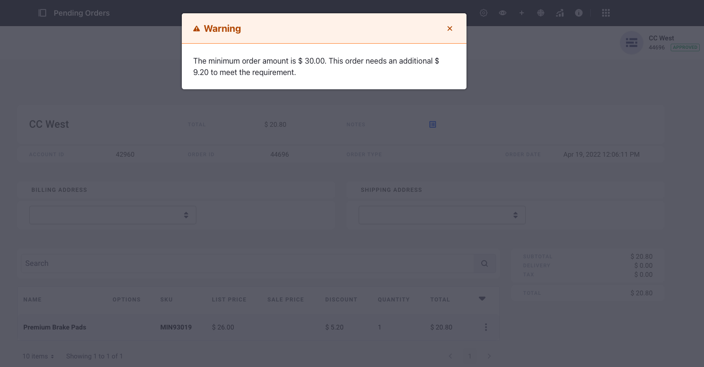
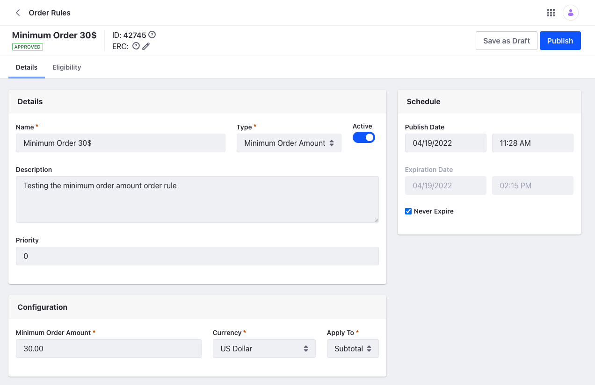

# Using the Minimum Order Amount Rule

{bdg-secondary}`Available DXP 7.4 U1+/GA5+`

Sometimes, orders of low value are not accepted due to the cost involved in fulfillment. To overcome this, only orders above a certain value are fulfilled. In Liferay, this is done through Order Rules. Using this, you can set a minimum order amount and if the validation fails, the buyer will not be able to check out.

## Order Rules Overview

When there is an Order Rule applied, the buyer needs to fulfill the rule to continue checking out. In the case of the minimum order amount rule, the buyers need to have a total or subtotal cart value set in the rule in order to checkout. If not, a warning message displays the minimum order amount and the difference in amount that must be added to proceed.

## Creating an Order Rule

The Minimum Order Amount rule is available OOTB.

1. Open the *Global Menu* (), click on *Commerce* &rarr; *Order Rules*.
1. Click the *Add* button () and enter the following information.

    **Name:** Minimum Order $30

    **Description:** Testing the minimum order amount order rule

    **Type:** Minimum Order Amount

1. Click *Submit*.

    

This opens a configuration view for the Order Rule. The *Priority* decides which Order Rule takes precedence when there's more than one rule. The lower number takes priority over the higher one. You can activate it using the *Active* toggle and configure it to apply the minimum order amount to the total or subtotal. You can also set the currency here.

## Order Rule Eligibility

Under the eligibility tab, you can set the Order Rule eligibility for Accounts, Account Groups, Channels or Order Types. By default it will be applicable to all of these. If you want to associate it with a specific entity, click the radio button and use the search bar to select it.
