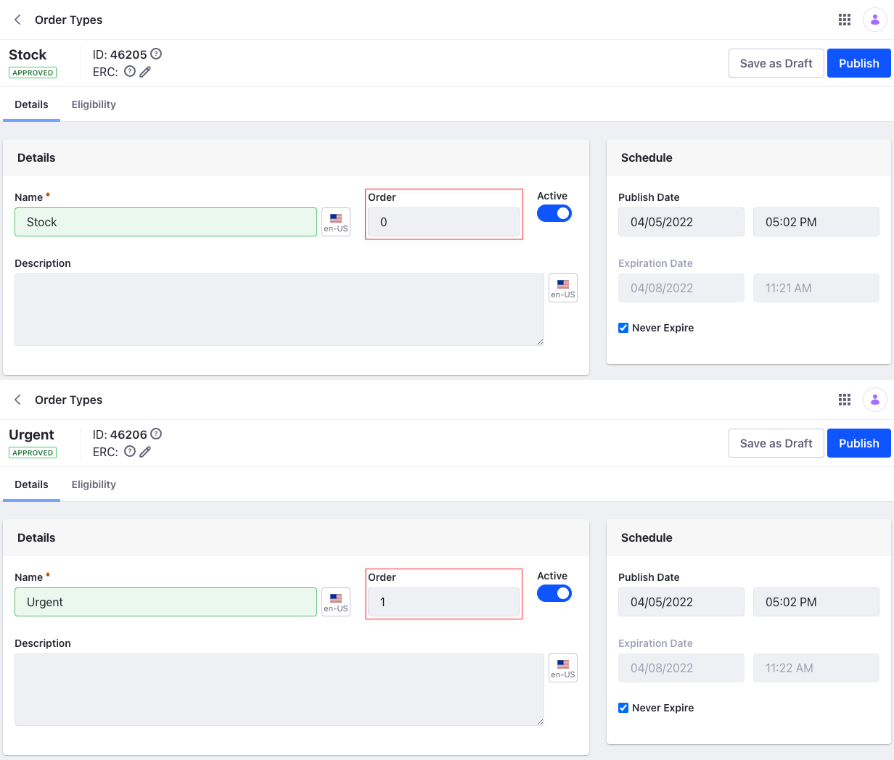

# Using Order Types

To support the example scenario of stock and urgent orders, you can create two Order Types. Stock orders have regular pricing for the buyer, while urgent orders incur a surcharge.

```{important}
For orders created using the *Add Order* or *Create New Order* buttons, buyers can choose the Order Type. This updates the product page with the correct prices linked to that Order Type, if any.
```

## Creating an Order Type

If only one Order Type exists, it's assigned to a new order automatically. For Products added to the cart directly, the Order Type with the lower Order number takes precedence over the others. You can always change the Order number in the Order Type to set the default to what you want.



1. Open the *Global Menu* () and click on *Commerce* &rarr; *Order Types*.
2. Click the *Add* button(), and enter the following information.

    **Name:** Stock

    **Description:** Order Type for all regular orders

3. Click *Save*.

    This creates the new Order Type and opens a configuration page. The Order field determines the sorting order of the Order Type in the dropdown menu. Set the value for the Order field as 0 for the Stock Order Type. Create** one more Order Type with the following information.

    **Name:** Urgent

    **Description:** Order type for urgent orders that is subject to a 10% surcharge

Set the value for the Order as 1 for this Order Type. You can use the *Active* toggle to enable it. Under the *Eligibility* tab, you can link the Order Type to a specific Channel or all Channels.

## Linking an Order with an Order Type

You can create a custom Price List and link it to the Urgent Order Type. To add a surcharge, you can create a Price Modifier on the Price List.

1. Open the *Global Menu* (), and click on *Commerce* &rarr; *Price Lists*.
1. Click the *Add* button() to create a new Price List and enter the following information.

    **Name:** Urgent Order Surcharge

    **Catalog:** Minium

    **Currency:** USD

    

1. Click *Submit*.
1. Under the Price Modifiers tab, click the *Add* button() to create a new Price Modifier and enter the following information.

    **Name:** 10% Surcharge

    **Target:** Catalog

    **Modifier:** Percentage

    

1. Click *Submit*.
1. Click on the new Price Modifier and activate it using the *Active* toggle and set the *Amount* to 10.
1. Click *Save*.

    This creates the new Price List with the Price Modifier. You must link it to the Order Type to add the surcharge.

1. Click the *Eligibility* tab and scroll down to *Order Type Eligibility*.
1. Search for the Urgent Order Type and click *Select*.
1. Click *Publish*.

    
