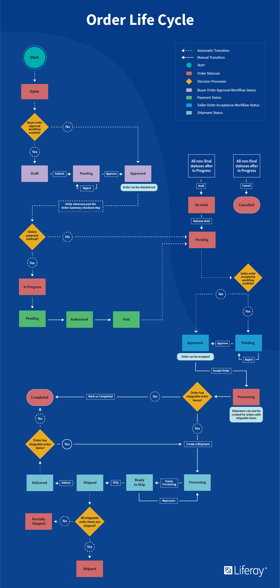

# Order Life Cycle

An Order stores data regarding a potential or past transaction. This article provides an overview of the order life cycle from open cart to [fulfilled order](../shipments/introduction-to-shipments.md).

## Liferay Commerce 2.0

An Order stores data regarding a potential or past transaction. This article provides an overview of the order life cycle from open cart to [fulfilled order](../shipments/introduction-to-shipments.md).

### Step 1: Products Added to Cart

A new order is created when a buyer places products into the cart. At this starting point, the data stored in the order includes the identity and quantity of the products, as well as the account which created it.

### Step 2: Order Placed

After providing information to the seller and viewing an order summary, the buyer places the order. If an Order Workflow has been enabled, the order is reviewed before submission. While the order is processed, the buyer can receive [notifications](../../store-administration/sending-emails/store-emails.md) tracking the order's status.

### Step 3: Order Transmitted

When the seller advances an order from pending to transmitted, the order is sent to an external system, such as Microsoft’s Dynamics GP, Oracle’s NetSuite, or SAP. If a Seller Order Acceptance Workflow has been enabled, the seller must receive approval before the purchase is allowed.

### Step 4: Order Fulfilled

The seller completes the remaining steps to deliver the ordered products to the buyer. Additional information can be added to the order, such as an updated order status, shipping information, and estimated arrival time. Buyers and sellers may then be notified that the order has been fulfilled.

## Additional Information

* [Introduction to Order Workflows](../order-workflows/introduction-to-order-workflows.md)
* [Processing an Order](./processing-an-order.md)
* [Orders Menu](./orders-menu-reference-guide.md)
* [Introduction to Shipments](../shipments/introduction-to-shipments.md)
* [Store Emails](../../store-administration/sending-emails/store-emails.md)
