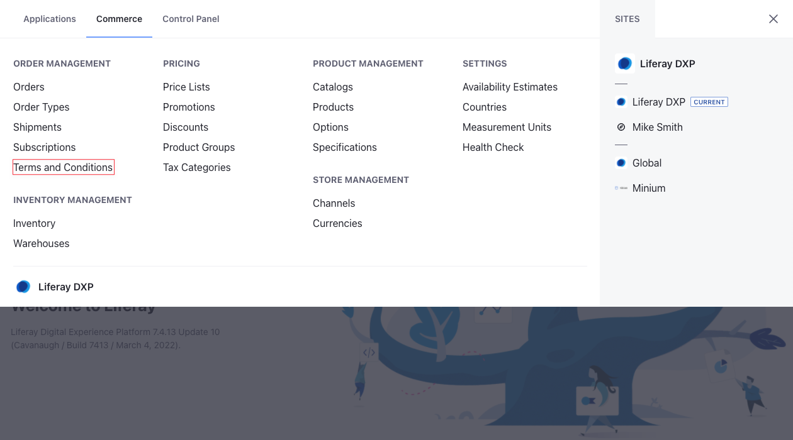
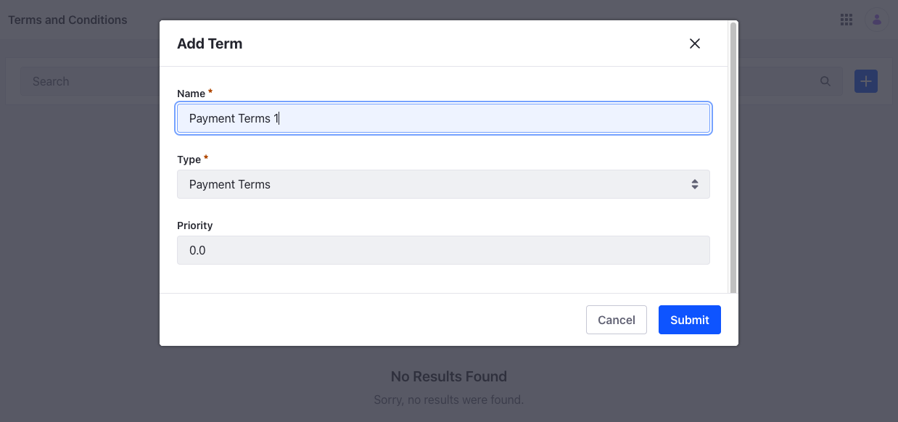
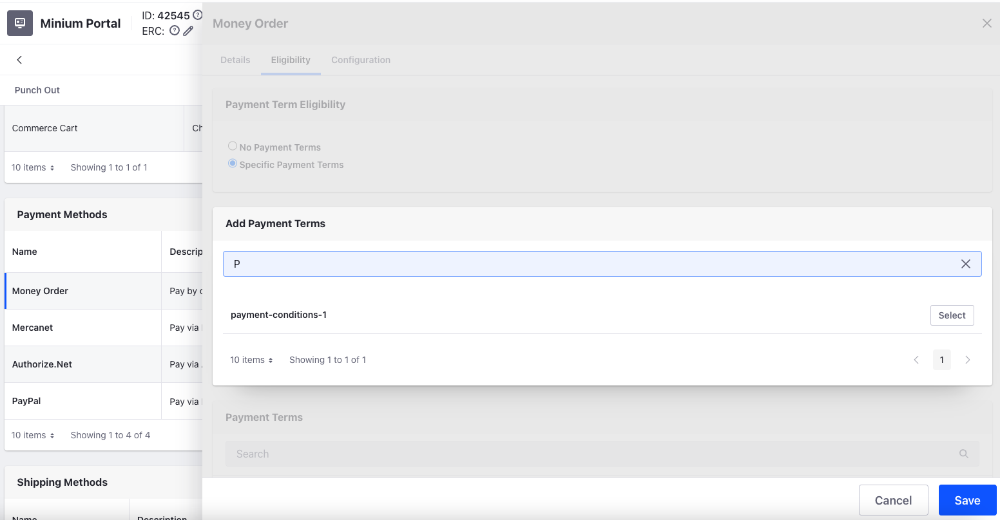
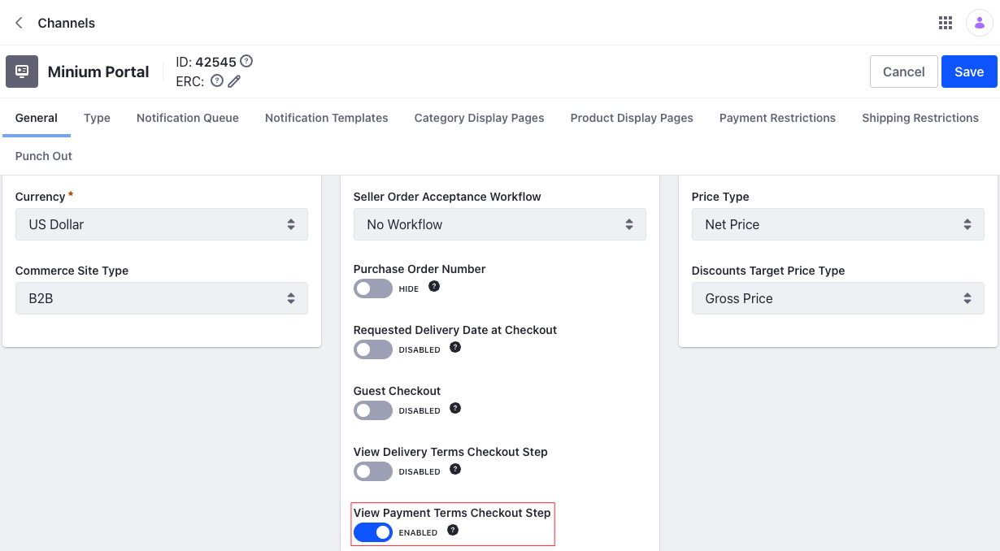
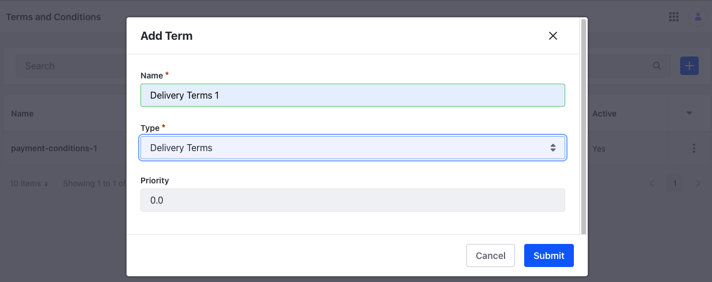
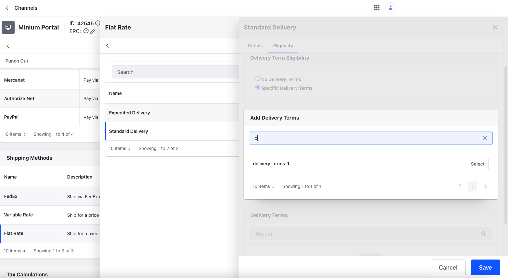
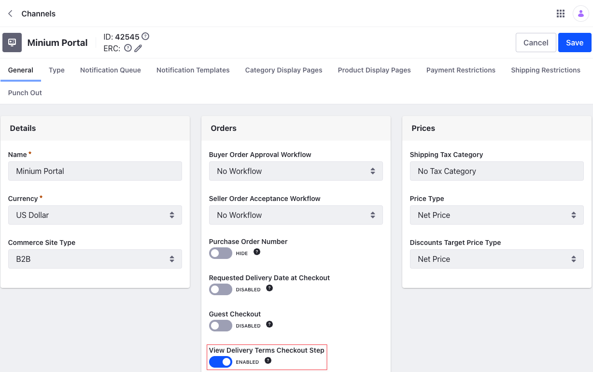
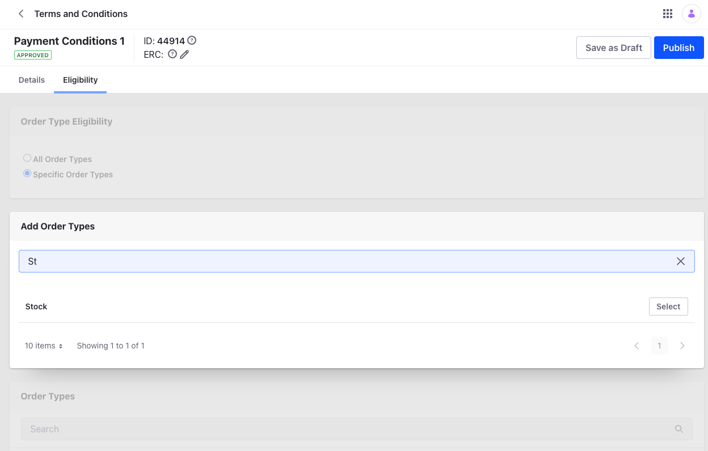

# Payment and Delivery Terms

{bdg-secondary}`Available DXP 7.4 U16+/GA16+`

## Payment Terms

Payment Terms govern the terms of a transaction between a buyer and seller. You can specify different Payment Terms for different customers. Liferay provides an editable text field that allows you to the following conditions, but are not limited to it.

* The number of days the buyer has to clear their dues.
* Late fees, if any, for failing to pay on the due date.
* Discounts, if any, for settlements made ahead of the due date.
* Any other conditions agreed between the seller and the buyer.

```{note}
Payment Terms may also be referred to as Negotiable Instruments, and Invoice Payment Terms.
```

### Creating Payment Terms

Follow these steps to create Payment Terms.

1. Open the *Global Menu* () and click on *Commerce* &rarr; *Terms and Conditions*.

    

1. Click the *Add* button (), and enter the following information.

    **Name:** Payment Terms 1

    **Type:** Payment Terms

    **Priority:** 0.0

    

1. Click *Submit*.
1. This creates the new Payment Terms. You can add terms agreed with the buyer in the editable Description text field and use the *Active* toggle to enable it.

    

1. Click *Publish*.

### Linking Payment Terms to a Payment Method

A Channel can have multiple payment methods, and you can associate Payment Terms with each of them. When there are multiple Payment Terms linked to a single payment method, the priority determines which one to be used.

1. Open the *Global Menu* () and click on *Commerce* &rarr; *Channels*.

1. Select the Channel and scroll down to *Payment Methods*.

1. Click the desired payment method, and open the *Eligibility* tab.

    

1. Click on *Specific Payment Terms* under *Payment Terms Eligibility*.

1. Under *Add Payment Terms*, search for the Payment Terms and click *Select*.

1. Click *Save* to link the Payment Terms, and close the configuration view.

1. Click *Save*.

### Enabling Payment Terms Checkout Step

If there are multiple Payment Terms linked to a payment method, the one with the highest priority takes precedence over the others. To allow the user to select Payment Terms during checkout, it has to be enabled in the Channel settings. If the user does not have permission to alter the default Payment Terms, the additional step does not appear during checkout.



## Delivery Terms

Delivery Terms define the conditions for the delivery of an order between a buyer and a seller. You can specify different Delivery Terms for different customers. Delivery Terms can have the following conditions, but are not limited to it.

* Anticipated delivery time for an order
* Conditions surrounding delayed deliveries
* Returns policy
* Any other conditions agreed between the seller and the buyer.

### Creating Delivery Terms

Follow these steps to create Delivery Terms.

1. Open the *Global Menu* () and click on *Commerce* &rarr; *Terms and Conditions*.
1. Click the *Add* button (), and enter the following information.

    **Name:** Delivery Terms 1

    **Type:** Delivery Terms

    **Priority:** 0.0

    

1. Click *Submit*.
1. This creates the new Delivery Terms. You can add terms, agreed with the buyer, in the *Description* text area and use the toggle to enable it.

    

1. Click *Publish*.

### Linking Delivery Terms to a Delivery Method

A Channel can have multiple shipping methods, and you can associate Delivery Terms with each of them. When there are multiple Delivery Terms linked to a single shipping method, the priority determines which one to be used.

1. Open the *Global Menu* () and click on *Commerce* &rarr; *Channels*.

1. Select the Channel and scroll down to *Shipping Methods*.

1. Click the desired shipping method, and open the *Shipping Options* tab.

1. Select the appropriate shipping option and open the *Eligibility* tab.

    

1. Click on *Specific Delivery Terms* under *Delivery Terms Eligibility*.

1. Under *Add Delivery Terms*, search for the Delivery Terms and click *Select*.

1. Click *Save* to link the Delivery Terms, and close the configuration view.

1. Click *Save*.

### Enabling Delivery Terms Checkout Step

If there are multiple Delivery Terms linked to a shipping method, the one with the highest priority takes precedence over the others. To allow the user to select Delivery Terms during checkout, it has to be enabled in the Channel settings. If the user does not have permission to alter the default Delivery Terms, the additional step does not appear during checkout.


## Terms and Conditions Eligibility

You can link both Payment and Delivery Terms to specific Order Types using the Eligibility tab.

1. Click the *Eligibility* tab of the Payment or Delivery Terms.

1. Click the *Specific Order Types* radio button.

    

1. Search for the Order Type and click *Select*.

1. Click *Publish*.
