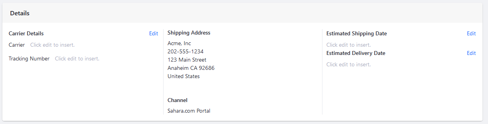
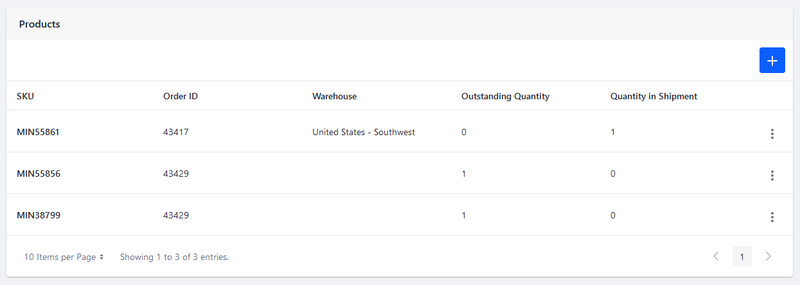
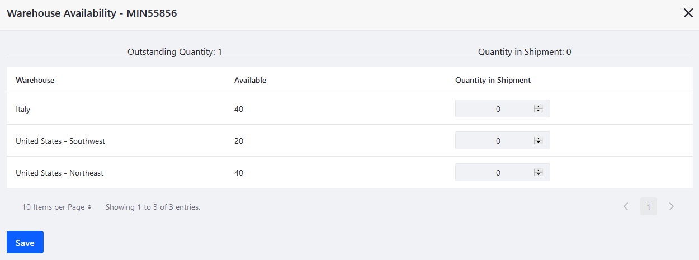
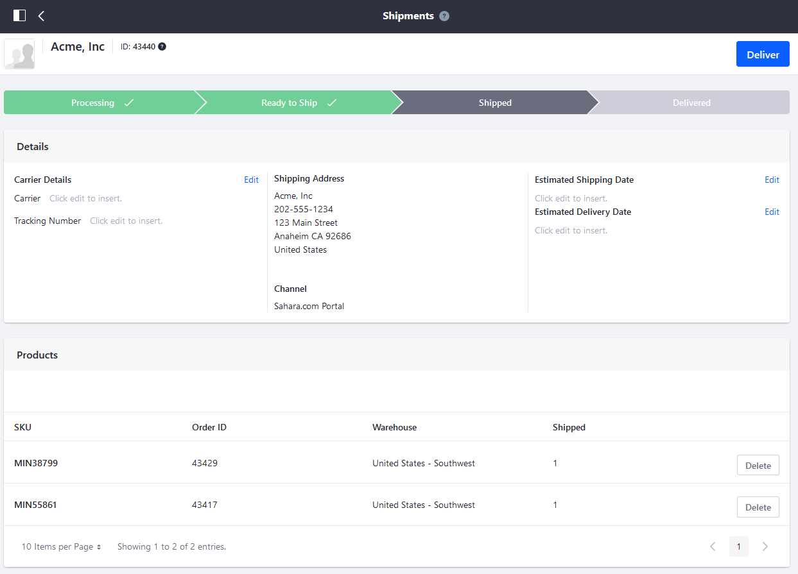
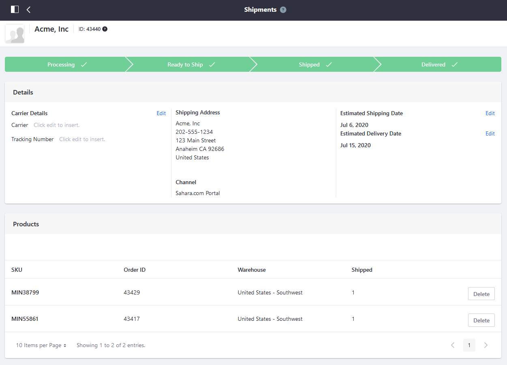

# Shipments Management Reference Guide

This guide documents all the features in _Shipments Management_ menu. To access _Shipments Management_, navigate to the _Global Applications_ &rarr; _Shipments_.

| Field | Description |
| --- | --- |
| Shipment ID | The shipment ID is auto-generated and is distinct from the Order ID. |
| Account | This is the account that placed the order. |
| Channel | This is the channel (store site) where the order was placed. |
| Shipment Address | This is the account's shipping address. |
| Tracking Number | This is the auto-generated track number created by the carrier (FedEx, UPS, DHL, the postal service, and so on) |
| Create Date | This is the date the shipment was created. |
| Estimated Shipping Date | This is the estimated date the order will be shipped. |
| Estimated Delivery Date | This is the estimated delivery date. |

## Processing Tab

### Details

The _Details_ section allows users to enter key information about the shipment.

### Products

The _Products_ section tracks all the products to be included in this shipment.

| Field | Description |
| --- | --- |
| SKU | This is the product SKU. |
| Order ID | This is the Order ID associated with this shipment. You can fulfill multiple orders in the same shipment as long as these are all from the same account.  |
| Warehouse | This is the warehouse where the order will be drawn from. |
| Outstanding Quantity | The Outstanding Quantity refers the required quantity yet to be included in the shipment. |
| Quantity in Shipment | This quantity refers to how many items are included in the shipment; this is subtracted from the _Outstanding Quantity_. |

Clicking the () icon allows users to select the items.

Clicking the 3-dot icon () allows users to choose the warehouse where the inventory will be drawn from.

Next to the corresponding warehouse, users can enter a quantity in the field or use the arrows to increment up or down. Clicking the _Save_ button applies the changes.

Lastly, clicking _Finish Processing_ advances to the next phase in shipment processing. There is a validation check when clicking _Finish Processing_: if the _Quantity in Shipment_ value for any SKU is 0, the following error message is displayed: `Error: Please select a valid warehouse and quantity for all shipment items.`

## Ready to Ship Tab

On this tab, the _Details_ section remains the same. Users can still modify the Carrier Details and the Estimated Shipping and Delivery Dates.

There is a small change in the _Products_ section. Here, users can delete an item from the shipment for various business reasons before the order is shipped.

## Shipped Tab

The _Shipped_ tab is where users can view the current status of the shipment. Users can always modify the Carrier Details and the Estimated Shipping and Delivery Dates.

| Field | Description |
| --- | --- |
| SKU | This is the product SKU |
| Order ID | This is the Order ID associated with this shipment. |
| Shipped | This is the quantity included in the shipment. |

## Delivered Tab

The _Delivered_ tab displays the same information as the _Shipped_ tab.

## Additional Information

* [Creating a Shipment](./creating-a-shipment.md)
