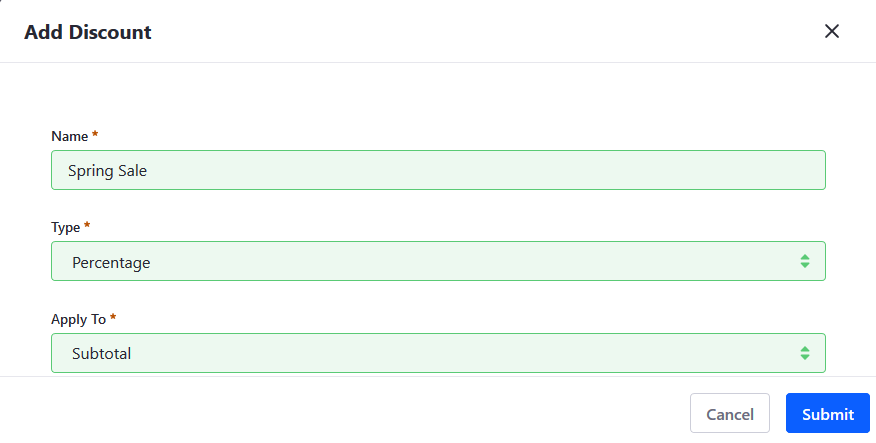
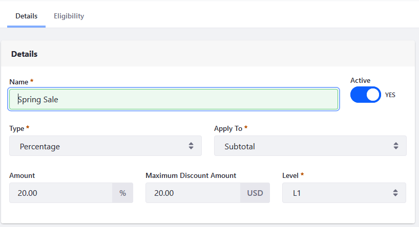
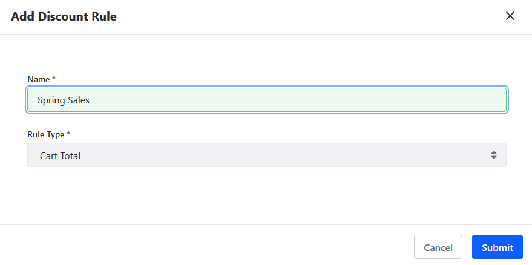
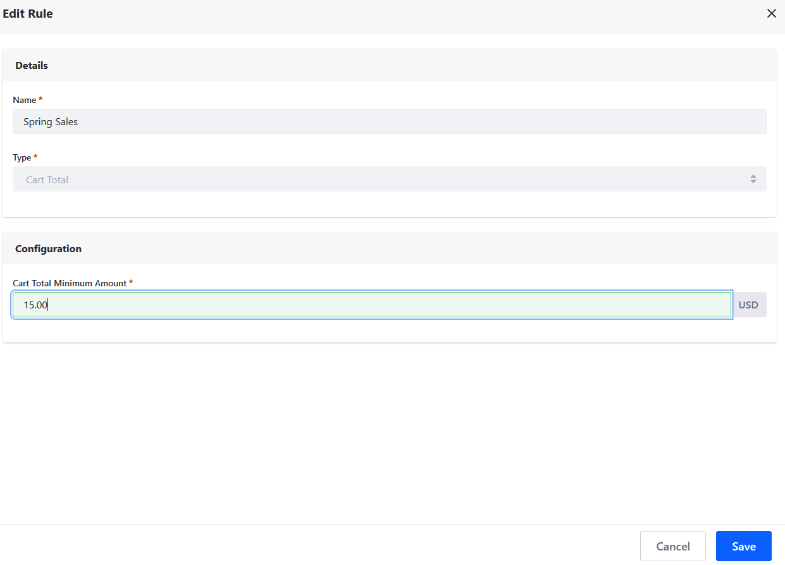
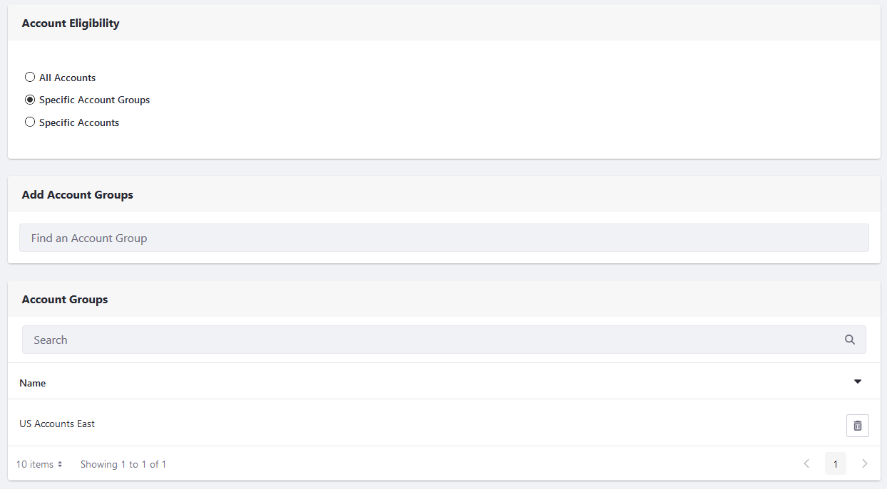
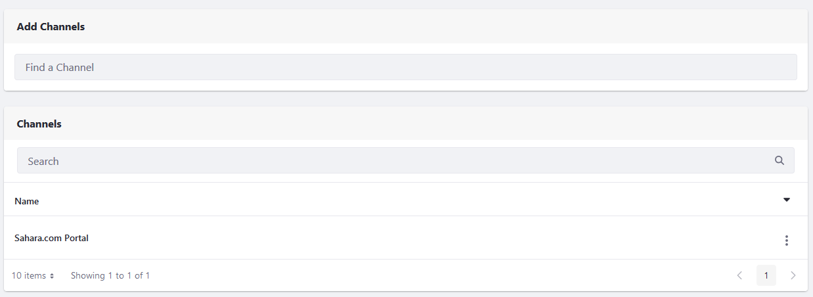
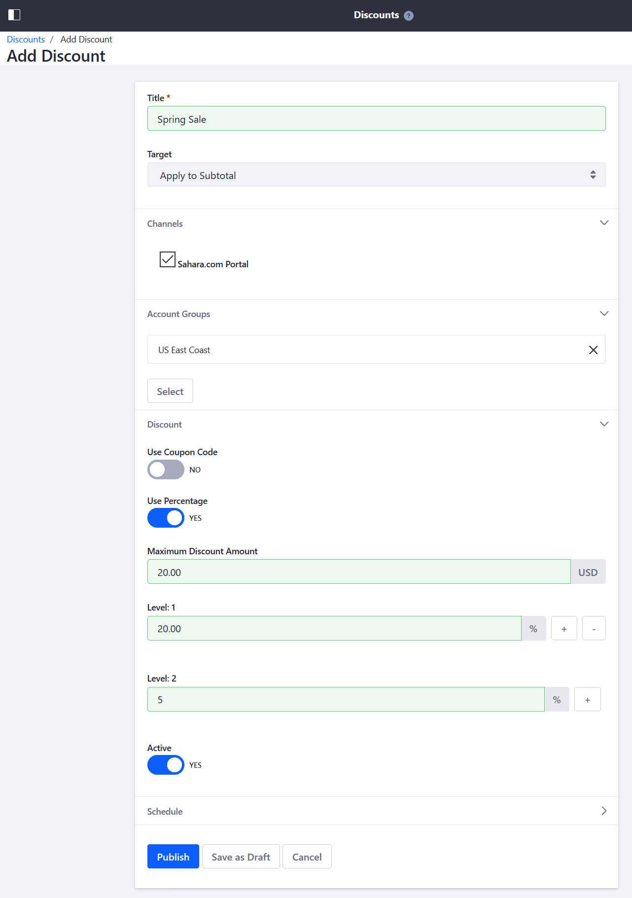

# Creating a Discount

Follow the steps below to create a discount by selecting the discount type, the target customers, and setting the discount rates. Once the discount has been created, specify additional conditions to qualify for the discount.

To create a new discount:

1. Go to the _Global Applications_ → _Commerce_ → _Discounts_.
1. Click the () button to add a new Discount.
1. Enter a name: _Spring Sale_.
1. Select a discount type (for example, _Apply to Subtotal_) from the _Apply to_ drop down. (See [Discount Types](./introduction-to-discounts.md#types-of-discounts) to learn more about the different discount types.)
1. Select _Percentage_ or _Fixed Amount_ from the _Type_ dropdown menu.

    

1. Click _Submit_.

## Configuring a Discount

You can specify a discount's details, such as the percentage (if using a percentage based discount), the maximum discount amount, the [discount level](./introduction-to-discounts.md#tiered-discounts), and then activate it.

In the Details section:

1. Enter the following:

    * **Amount**: 20%
    * **Maximum Discount Amount**: 20.00
    * **Level**: L1

1. Slide the _Active_ toggle to _YES_.

    

1. Click _Publish_ when finished.

The discount is now active. Configure the discount's rules and eligibility.

### Configuring Coupon Codes

If using a coupon code,

1. Switch the _Use Coupon Code_ toggle to _Yes_.
1. Enter the following:

    * **Coupon Code**: spring-sale
    * **Maximum Total Uses**: 1
    * **Maximum Uses Per Account**: 1

1. Click _Publish_ when finished.

The coupon code has been added.

## Adding Rules to a Discount

You can define rules that specify requirements to qualify for a discount. See [Discount Rules](./introduction-to-discounts.md#discount-rules) to learn more.

If using more than one rule, you can either aggregate the rules or decide which one is effect; click either _And_ or _Or_ radio button.

To add a new discount rule:

1. Once the rule has been created, scroll down to the _Rules_ section.
1. Click () button to add a new Discount Rule.
1. Enter a name: _Spring Sales_.
1. Select _Cart Total_ from the _Rule Type_ drop down menu.

    

1. Click _Submit_.
1. Click the _Spring Sales_ to configure the rule.
1. Enter _15.00_ in the _Cart Total Minimum Amount_ field.

    

1. Click _Save_.
1. Close the window.

The discount rule has been configured.

## Configure Discount's Eligibility Rules

You can make this discount available for all accounts or specific accounts or account groups.

To specify which accounts and account groups are eligible for this discount:

1. Click the _Eligibility_ tab.
1. Click the [Select Account Groups](../../users-and-accounts/account-management/creating-a-new-account-group.md) radio button.
1. In the _Add Account Groups_ search bar, search for the desired account groups; in this example, _US Accounts East_.
1. Click _Select_ to add the account group.

    

1. Click _Publish_ when finished.

You can make this discount available on all channels or specific ones. To specify which channels are eligible for this discount:

1. In the _Eligibility tab_, click the _Specific Channels_ radio button.
1. In the _Add Channels_ search bar, search for the desired channels.
1. Click _Select_ to add the channel.

    

1. Click _Publish_ when finished.

Your store now has an active discount with 20% off selected goods for those in the specified Account Group.

## Understanding Discount Specificity

If an order is eligible for multiple discounts, the discount's rules and eligibility determine whether it qualifies or not. See the table below to understand discount specificity for the given eligibility.

| **Account** | **Account Group** | **Channel** | **Order Type** | **Rank** |
| :--- | :--- | :--- | :--- | :--- |
| &#10004; | | &#10004; | &#10004; | 1 |
| &#10004; | | | &#10004; | 2 |
| &#10004; | | &#10004; | | 3 |
| &#10004; | | | | 4 |
|  | &#10004; | &#10004; | &#10004; | 5 |
|  | &#10004; | | &#10004; | 6 |
|  | &#10004; | &#10004; | | 7 |
|  | &#10004; | | | 8 |
|  | | &#10004; | &#10004; | 9 |
|  | | | &#10004; | 10 |
|  | | &#10004; | | 11 |

For instance, consider Account Group A has a discount of 50% applied to shipping. There's another discount of 60% applied to shipping that is eligible to all accounts, account groups, channels and order types. In this case, Account Group A is only eligible for the discount of 50% since it is the most specific.

## Commerce 2.1 and Below

To create a discount:

1. Navigate to the _Control Panel_ &rarr; _Commerce_ &rarr; _Discounts_.
1. Click the () button to add a new Discount.
1. Enter a name: _Spring Sale_.
1. Select a discount type (for example, _Apply to Subtotal_) from the _Target_ drop down. (See [Discount Types](./introduction-to-discounts.md#types-of-discounts) to learn more about the different discount types.)
1. Check the box for which channel this discount applies to.
1. Select which [Account Groups](../../users-and-accounts/account-management/creating-a-new-account-group.md) this discount applies to. In this example, _US East Coast_.
1. If using a coupon code, switch the _Use Coupon Code_ toggle to _Yes_. Then enter a code in the _Couple Code_ field. Otherwise leave it as _NO_.
1. If using a percentage, switch the _Use Percentage_ toggle to _Yes_.
1. Enter the _Maximum Discount Amount_: $20.00
1. Enter the [_Level_](./introduction-to-discounts.md#tiered-discounts): 20.00. This takes 20% off the subtotal.
1. Switch the _Active_ toggle to _YES_.

    

1. Click _Publish_.

Your store now has an active discount with 20% off selected goods for those in the specified Account Group.

### Adding Discount Rules

1. Once the discount has been created, there are 2 tabs: _Detail_, and _Rules_. Click on the _Rules_ tab.

    

1. Click () button to add a new Discount Rule.
1. Select _Cart Total_ from the _Type_ drop down menu.
1. Enter 15.00 in the _Cart Total Minimum Amount_ field.
1. Click _Save_.

In this example, a Discount Rule has been applied to this particular Discount. Customers will receive this discount for all purchases over the set amount.

## Additional Information

* [Introduction to Discounts](./introduction-to-discounts.md)
* [Creating a New Account Group](../../users-and-accounts/account-management/creating-a-new-account-group.md)
* [Creating a Price List](../creating-a-price-list.md)
* [Using Price Tiers](../using-price-tiers.md)
