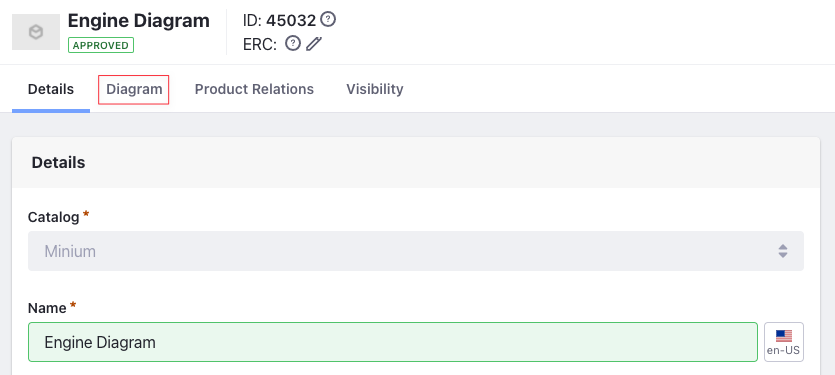
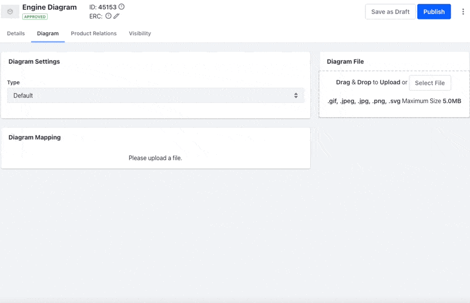

# Shop by Diagram

{bdg-primary}`Subscription`

With Shop by Diagram you can easily find parts for larger equipment visually through diagrams. This can be an automotive spare part, electronic component, or spares of heavy machinery.
 
You can browse through an exploded view of the product, select the part and its quantity, and add it to your cart. With Shop by Diagram it's easy to find the right component when you don’t have the product name or model number.

```{note}
Shop by Diagram is available in Liferay DXP 7.4+/Commerce 4.0+ and is a more robust replacement for the *Bill of Materials (BOM)* feature.
```

## Creating a Diagram product

A Diagram is like any other Product type in Liferay Commerce ([Simple](./creating-a-simple-product.md), [Grouped](./creating-a-grouped-product.md), [Virtual](./creating-a-virtual-product.md)) with some key differences. A Diagram by itself cannot be shipped, does not have inventory, pricing, or tax, and does not allow subscriptions or [Product Options](../products/using-product-options.md). But the steps to create it are the same as other product types.

1. Open the *Global Menu*, click on *Commerce* &rarr; *Products*.
1. Click the *Add* () button and select *Diagram*.

   

1. Enter the following information.

   **Name:** Engine Diagram

   **Catalog:** Minium

1. Click *Submit*.

## Configuring a Diagram product

This creates a new Diagram product and opens a Configuration view. Now, you must upload an image with the exploded view of the product. You can map SKUs or other Diagrams from your catalog to the constituent parts within the image.

1. Click the *Diagram* tab

   

1. Under *Diagram Settings*, select *SVG* if you are uploading an SVG image, otherwise set it to *Default*.
1. Under *Diagram File*, you can drag and drop an image or upload an image of your choice.
1. Click *Select File* and upload the image.

The *Diagram Mapping* section becomes active after the upload is complete.



| | <div style="margin-left:35px"><b>Diagram Mapping Reference</b> |
| :--- | :--- |
| **Field** | <div style="width:400px"><b>Purpose</b> |
| Position | Denotes the label given to a pin. It can be numbers or letters. For non-exploded diagrams, the pins can be used as labels. There can be more than one component with the same position. For instance, equipment might use the same gear in different areas. In a Diagram, all the gears use the same position to denote that they are the same component but at different places in the equipment. |
| Type | Choose *Linked to a SKU*, *Linked to a Diagram* or *Not Linked to a Catalog*.<ul><li>Linked to a SKU - Link the pin on the Diagram to an SKU in the Catalog.</li><li>Linked to a Diagram - Link the pin on the Diagram to another Diagram in the Catalog.</li><li>Not Linked to a Catalog - Link the pin on the Diagram to a label. Sellers might want to show the name of a part or component in the Diagram that they don't sell in their online catalog for informational purposes. These products use labels.</li></ul>|
| SKU | Becomes active if Type is *Linked to a SKU*. You can type the SKU in the search bar and select the appropriate one. |
| Diagram | Becomes active if Type is *Linked to a Diagram*. You can search for the Diagram using the search bar and select the appropriate one. |
| Label | Becomes active if Type is *Not Linked to a Catalog*. A label is used when sellers want to show the name of a part or component in the Diagram that they don't sell in their online catalog for informational purposes.  |
| Quantity | Denotes the quantity of the component necessary to complete the equipment. |

## Mapping SKUs to the Diagram

You must map points in the image to SKUs or other Diagrams from the catalog.

1. Click the part in the diagram that must map to an SKU or another Diagram.
1. Search for the SKU or Diagram in the search bar, set its quantity, and assign a position in the dialog box.
1. Click *Save*.

    

1. Click *Publish* when done.

You can view the SKUs with their positions and quantities on the right side. After publishing the product, you can view it in the storefront.


```{note}
Diagrams appear the same way as other products in Liferay Commerce in the Product Details widget, Product Publisher widget, and Search Results. You can also use tags and categories with Diagrams, the same way as with other products.
```

```{note}
Image: “[Bultaco engine exploded view](https://flickr.com/photos/tom-margie/1253798184/in/photolist-4XXvtu-2mn7DP8-NmN3U5-aq4SCB-H8ZMN9-dzT17o-pZgiwZ-2kLJEjC-bRALa6-9xjArz-aNgnMn-pjF6jp-NNVRDe-2jCWou9-niHeTv-2UN3w5-2mD79VN-bz84rF-7HSLu4-yQe2wr-9ptWiW-CY6AP-bzmZP9-9jRWia-chdwUu-Mp16Ah-8pHHKM-2mwEAZi-2kUCwFf-u4fJFj-aQS5mv-2iWwYAU-2iQKbJz-kHQyfH-2jE3t4n-3BBRmw-deC9th-25aFqYT-imHEdi-imH7SU-imH5gS-imGVyn-imGT5W-imHzii-imGNMX-imHxLR-UepKvn-4V5F4T-a48scN-4V5Fjp)” by [Tom Margie](https://flickr.com/photos/tom-margie/) / [CC BY-SA 2.0](https://creativecommons.org/licenses/by-sa/2.0/)
```

## Additional Information

* [Creating a Simple Product](./creating-a-simple-product.md)
* [Creating a Grouped Product](./creating-a-grouped-product.md)
* [Creating a Virtual Product](./creating-a-virtual-product.md)
