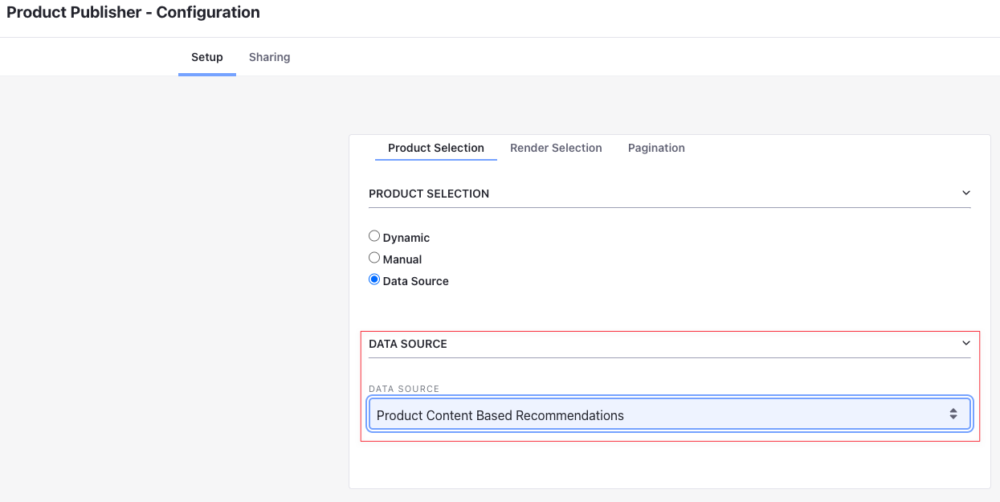
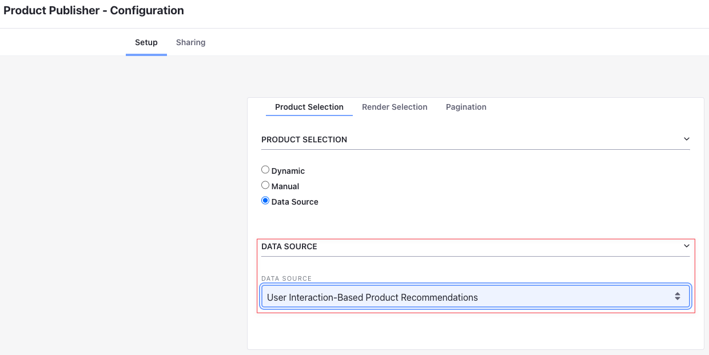
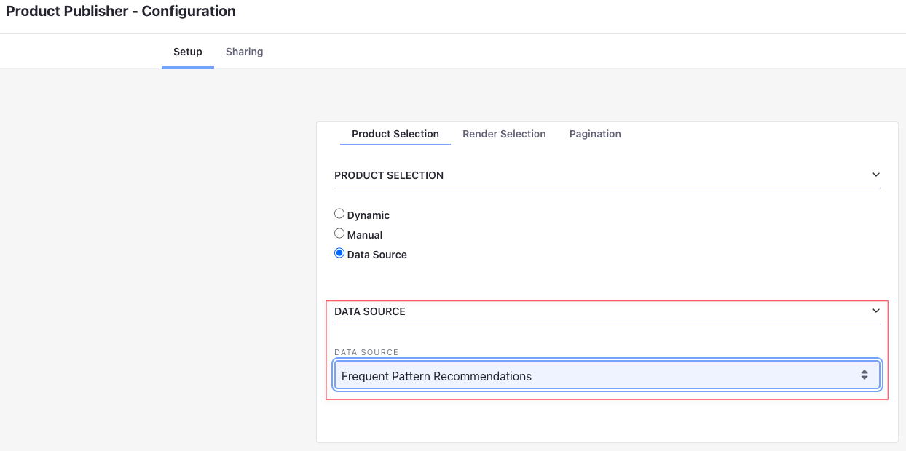

# Understanding Recommendation Types

| Type | Includes Product Data  | Includes Order Data  | Personalized  | Context Aware  | Frequency  | Description  |
|:--|:--|:--|:--|:--|:--|:--|
| Content-Based Product Recommendations  |  &#10004; |   |   |  &#10004;  |   | Recommends similar products to the Product being viewed  |
| User Personalized Recommendations  |  &#10004;  |  &#10004;  |  &#10004;  |   |   | Recommends products based on the purchase history of similar customers  |
| Context Aware User Personalized Recommendations   |  &#10004;  |  &#10004;  |  &#10004;  |  &#10004;  |   | Recommends products of similar categories based on the purchase history of similar customers  |
| “You May Also Like” Product Recommendations  |  &#10004;  |  &#10004;  |   |   |   | Recommends products based on the purchase history of all customers  |
| “Also Bought” Product Recommendations  |  &#10004;  |  &#10004;  |  &#10004;  |  &#10004;  |  &#10004;  | Recommends products frequently purchased with the viewed Product  |

```{important}
Customer similarity is currently determined by their purchase histories only. Two customers are similar if they have both purchased the same product.
```

## Content-Based Product Recommendations

It provides product recommendations based on product data like name, description, specifications, and categories. It compares product pairs based on their features, scores their similarity, and creates recommendations for each product. Customer order data does not contribute to these recommendations. The products shown to the user have similar features to the product they are currently viewing.

To view them, use the Product Publisher widget with data source set to *Product Content Based Recommendations*.



## User Personalized Recommendations

It uses both Product and Order data from past purchases of the account to provide customers with personalized product recommendations. The algorithm uses the purchase history of similar customers to extract an implicit connection between products. It then generates and stores predictions for each user.

Since this recommendation type is not context aware, it does not account for the Product context in which the recommendations are displayed. It may end up recommending Products unrelated to the Product the customer is currently viewing.

To view them, use the Product Publisher widget with data source set to *User Interaction Based Recommendations*.



## Context Aware User Personalized Recommendations

This type provides personalized and context aware product recommendations. It uses the purchase history of similar customers to extract an implicit connection between Products and generate predictions for each user. It is also context aware, meaning the predictions are further narrowed down according to the Product they are currently viewing.

To view them, use the Product Publisher widget with data source set to *User Interaction Based Recommendations*.


## “You May Also Like” Product Recommendations

This type recommends products that use both Product and customer data. It uses the entire purchase history of customers to extract an implicit connection between Products. These recommendations are not personalized, meaning the algorithm does not factor in the similarity or dissimilarity between customers.

To view them, use the Product Publisher widget with the data source set to *Product Interaction Based Recommendations*.


## “Also Bought” Product Recommendations

This type provides customers with Product recommendations based on the current cart content. The algorithm analyzes global order data and extracts a common pattern from each customer's purchase history. It then identifies sets of products that are frequently purchased together.

To view them, use the Product Publisher widget with the data source set to *Frequent Pattern Recommendations*.



## Additional Information

* [Using Product Recommendations](./using-product-recommendations.md)