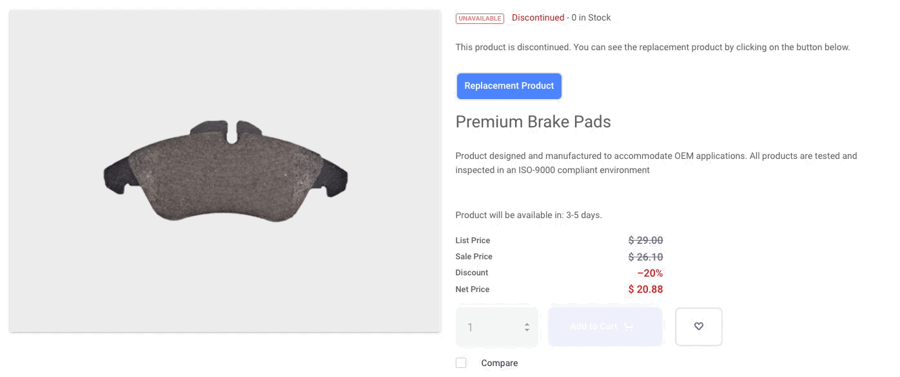

# Replacement Products

Products undergo a life cycle after which they reach end-of-life (EOL). Some products are discontinued completely while others can have a replacement, to bring newer and better variants to the buyers. Using *Replacement Products*, you can direct buyers to the replacement and curb potential loss.

```{note}
Replacement Products are available in Liferay DXP 7.4+/Commerce 4.0+.
```

## Feature Overview

### Viewing a discontinued product

All discontinued products have a label that shows current availability along with its status. A *Replacement Product* button displays the Product Details for the replacement. A *Replacements* section directs users to the replacement product.



### Replacing discontinued products while importing Orders

If an order imported from a CSV file or wishlist contains a discontinued product, it is replaced by its replacement. The discontinued product is not replaced if it's still in stock or allows back orders.


<!-- TO BE ADDED ONCE FEATURE IS AVAILABLE

### Searching for a discontinued product and viewing the replacement

[Screenshot]
-->

## Marking an SKU as Discontinued

When a Product has reached end of life or is being retired, you can mark it as discontinued.

1. Open the *Global Menu* and click on *Commerce* &rarr; *Products*.

1. Select the product you want to discontinue.

1. Click the *SKUs* tab and select the SKU.

1. In the *End of Life* section, enable the option to *Mark the SKU as Discontinued* and select the appropriate date.


```{important}
This date is for informational purposes only and appears on the Product Details page. It does not schedule a product to be discontinued.
```

## Setting a Replacement

It is optional to set a replacement for a discontinued product. The customer is then directed to the replacement from the discontinued product's page.

1. Search for the replacement in the *Replacement* search bar and select the SKU.

1. Click *Publish*.


The product is available to buy only if back orders are allowed or until stock lasts, after which the Add to Cart button becomes inactive. Users can click on the active Replacement Product button to view the replacement. There is a section for replacements in the Product Details widget that displays the replacement product.

## Replacement Chaining


Replacement Products support chaining. If Product B replaces Product A and Product C replaces Product B, Product C becomes the replacement for Product A, when both A and B are out of stock and back orders are not allowed.
