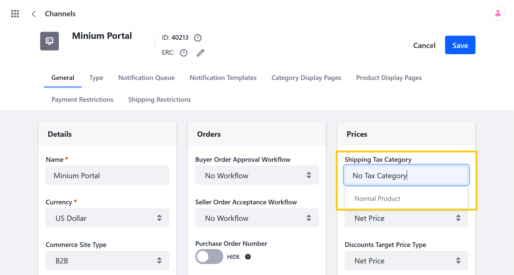

# Applying Tax Rates

Once you've [added tax rates](./setting-rates-for-tax-calculations.md) to a Tax Category, you can apply those rates to Channel Products and shipping costs by assigning the Tax Category to them. When assigned, all applicable tax rates are calculated individually and added to the order's total. This includes rates created using the same or different tax engines.

## Applying Tax Rates to Products

Follow these steps to apply tax rates to Products:

1. Open the *Global Menu* (), click on the *Commerce* tab, and go to *Products*.

1. Click on the *Product* you want to configure, and go to the *Configuration* tab.

1. Use the drop-down menu to select a *Tax Category*.

1. Click on *Publish* or *Save as Draft* to publish your changes at a later time

   

## Applying Tax Rates to Shipping Costs

Follow these steps to apply tax rates to a Channel's shipping costs:

1. Open the *Global Menu* (), click on the *Commerce* tab, and go to *Channels*.

1. Click on the *Channel* you want to configure.

1. Use the drop-down menu in the *Prices* section to select a Tax Category.

1. Click on *Save*.

   Applicable tax rates for shipping costs are then added to all channel orders.

   

## Additional Information

* [Creating Tax Categories](./creating-tax-categories.md)
* [Setting Rates for Tax Calculations](./setting-rates-for-tax-calculations.md)
