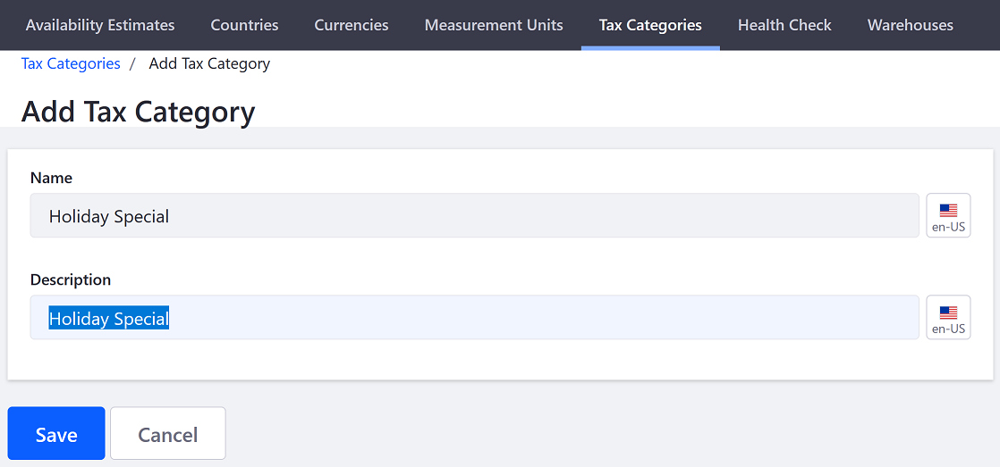

# Creating Tax Categories

Liferay Commerce uses Tax Categories to store and apply tax rates to Channel Products and shipping costs. Once a Tax Category is created, you can use Tax Calculation Engines to [add multiple tax rates](./setting-rates-for-tax-calculations.md) to it. These rates are scoped to the Channel in which they're created. You can then [apply tax rates](applying-tax-rates.md) to Channel Products and shipping costs by assigning the Tax Category to them.

```note::
   Tax Categories serve as containers for tax rates and must be created before you can apply tax rates to any Products or shipping costs.
```

Follow these steps to create a new Tax Category:

1. Open the *Global Menu* (), and go to *Tax Categories* in the *Commerce* tab.

1. Click on the *Add* button ().

1. Enter a *Name* for your Tax Category.

1. Optionally, enter a *Description* and *External Reference Code*.

1. Click *Save* when finished to create your new Tax Category.

Once created, you can add tax rates to a Tax Category in each of your Channels. See [Setting Rates for Tax Calculations](./setting-rates-for-tax-calculations.md) for more information.

## Commerce 2.1 and Below

1. Navigate to the _Control Panel_ &rarr; _Commerce_ &rarr; _Settings_.
1. Click the _Tax Categories_ tab.

    

1. Click the Add Tax Category () button.
1. Enter the following:

    * **Name**: Holiday Special
    * **Description**: Taxes for holidays

    

1. Click _Save_.

A new tax category has been created.

## Commerce 2.0 and Below

To create a new tax category:

1. Go to _Site Administration_ → _Commerce_ → _Settings_.
1. Click the _Taxes_ tab.
1. Click the _Tax Categories_ sub-tab.
1. Click the _Add Tax Category_ button.
1. Enter a name and a description.

    

1. Click _Save_.

The Tax Category is now available for your store.

## Additional Information

* [Setting Rates for Tax Calculations](./setting-rates-for-tax-calculations.md)
* [Applying Tax Rates](./applying-tax-rates.md)
