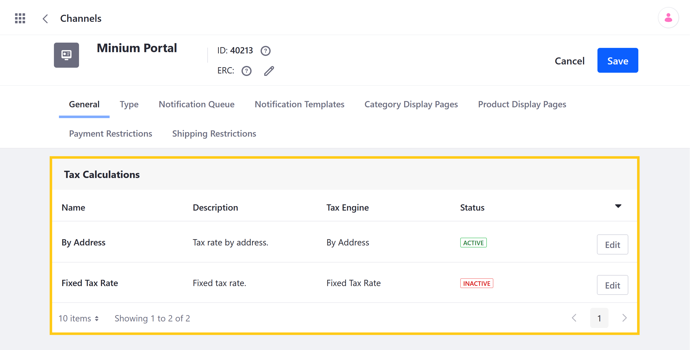
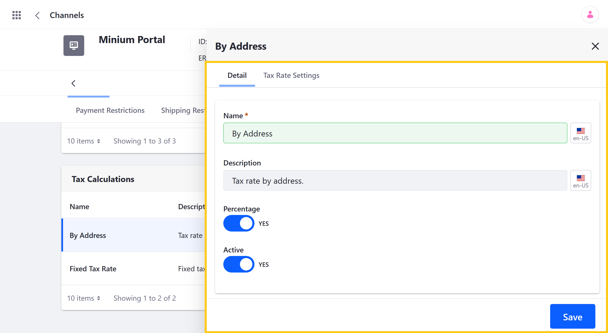
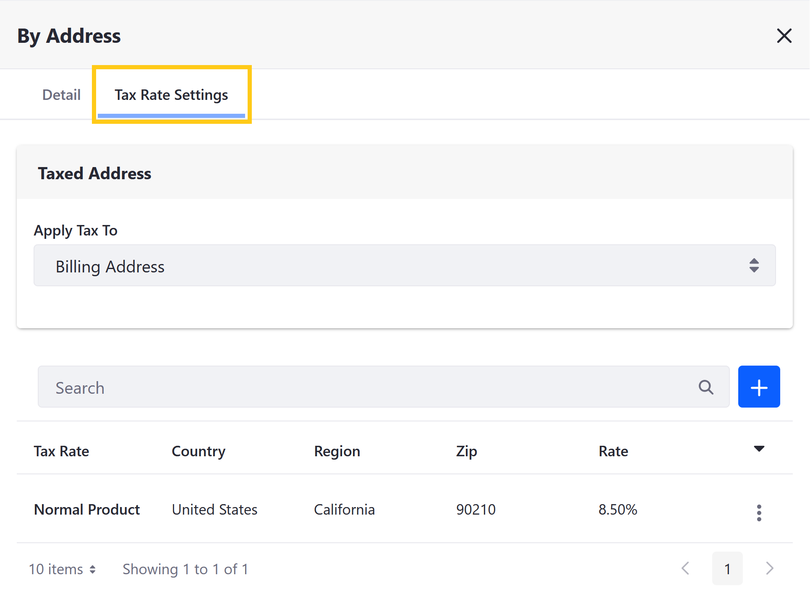
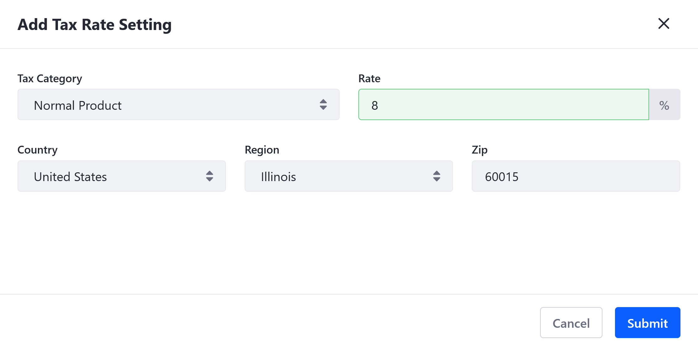

# Setting Rates for Tax Calculations

Liferay Commerce includes built-in tools for defining and applying tax rates to Product and shipping costs. These rates are calculated using configurable Tax Engines and are added to [Tax Categories](./creating-tax-categories.md). You can then [apply tax rates](./applying-tax-rates.md) to Channel Products and shipping costs by assigning the Tax Category to them.

* [Understanding Tax Engines](#understanding-tax-engines)
* [Configuring Tax Calculations](#configuring-tax-calculations)
* [Setting Tax Rates](#setting-tax-rates)

## Understanding Tax Engines

Commerce tax engines define calculations for tax rates when a transaction is made. Liferay provides two out-of-the-box engines (i.e., *Fixed Tax Rate* and *By Address*), though you can design and implement [custom engines](../../developer-guide/implementing-a-new-tax-engine.md).

```note::
   Tax Categories can contain multiple tax rates created using either the same or different tax engine.
```

### Fixed Tax Rate

The *Fixed Tax Rate* engine applies the same rate for all Products and shipping costs to which it's category is assigned. This rate is applied regardless of the buyer's location.

### By Address

The *By Address* engine applies specific rates based on the buyer's location and uses the buyer's billing or shipping address. If there are multiple By Address rates for a Tax Category, only the rates appropriate to the buyer’s location are applied.

## Configuring Tax Calculations

Follow these steps to configure a tax calculation type:

1. Open the *Global Menu* (), click on the *Commerce* tab, and go to *Channels*.

1. Click on the *Channel* you want to configure.

1. Scroll down to *Tax Calculations* in the *General* tab, and click *Edit* for the type of calculation you want to configure: *By Address* or *Fixed Tax Rate*.

    

1. In the *Details* tab, configure the following details for the selected tax calculation:

   * **Name**: Determine the display name for the selected tax calculation.

   * **Description**: Determine the description for the selected tax calculation.

   * **Percentage**: Use the toggle switch to determine whether or not the selected tax calculation uses *Percentages* for its tax rates.

   * **Active**: Use the toggle switch to activate or deactivate the selected tax calculation.

1. Click on *Save* when finished.

```note::
   You must save your changes before navigating to another tab. Otherwise, they are lost.
```



Once activated, you can access additional settings for the selected type of Tax Calculation.

## Setting Tax Rates

Follow these steps to add tax rates to a Tax Category:

1. Open the *Global Menu* (), click on the *Commerce* tab, and go to *Channels*.

1. Click on the desired *Channel*.

1. Click *Edit* for the tax calculation engine you want to use for your new tax rates.

1. Click on the *Tax Rate*/*Tax Rate Settings* tab in the modal window.

   

1. (*By Address*) Use the dropdown menu to determine whether tax rates are applied to a buyer's *Billing* or *Shipping* address.

1. Click on the *Add* button () to create a new tax rate.

1. Select a *Tax Category* for your tax rate.

1. Enter a value for your tax rate.

1. (*By Address*) Enter geographic details to determine the Tax Rate's scope of applicability.

   You can designate a tax rate for a country by leaving the *Region* and *Zip* fields blank, or designate a tax rate for a region by leaving the *Zip* field blank.

1. Click on *Submit*.

   

## Commerce 2.1 and Below

1. Navigate to the _Control Panel_ &rarr; _Commerce_ &rarr; _Channels_.
1. Click on the channel you are configuring a tax rate for. If you used an accelerator like Minium, a channel is created by default.
1. Scroll down to _Tax Calculations_.
1. Click _Edit_ next to By Address.
1. Slide the _Percentage_ and _Active_ toggles to _YES_.
1. Click _Save_.

Next, set the Tax Rate by Category and by Address:

1. Click _Tax Rate Settings_.
1. Select whether the taxed address is the Billing Address or the Shipping Address from the _Apply Tax to_ dropdown menu.
1. Click the Add () button to add a Tax Category.
1. Select the Tax Category (for example, _Holiday Special_).
1. Enter the following:

    * **Rate**: Your tax rate
    * **Country**: Applicable country
    * **Region**: Leave blank to apply to the whole country
    * **Zip**: Leave blank to apply to the whole country

1. Click _Submit_.

Address specific tax rates are now configured.

## Commerce 2.0 and Below

To set a tax rate by address:

1. Go to _Site Administration_ → _Commerce_ → _Settings_.
1. Click the _Taxes_ tab and then the _Tax Calculations_ sub-tab.
1. Click _By Address_.
1. Switch the _Percentage_ toggle to _YES_ if you want the tax to be defined as a percentage of the purchase price. Leave the toggle disabled to define the tax as a fixed amount.
1. Switch the _Active_ toggle to _YES_.
1. Click _Save_.

Next, set the Tax Rate by Category and by Address:

1. Click the _Tax Rate Settings_ sub-tab and then on the _Add Tax Rate Setting_ button.
1. Select the _Tax Category_ from the _Tax Category_ field.
1. Enter the tax rate in the _Rate_ field.
1. Select the country, region, enter the Zip code.
1. Click _Save_.

Address specific tax rates are now configured.

## Additional Information

* [Creating Tax Categories](../configuring-taxes/creating-tax-categories.md)
