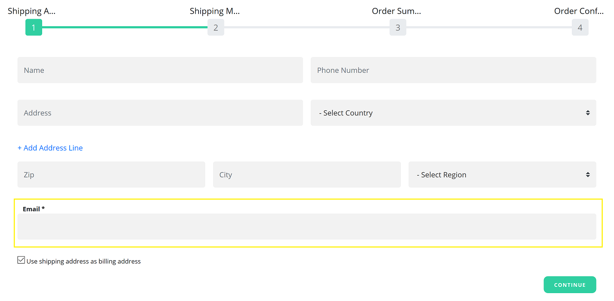
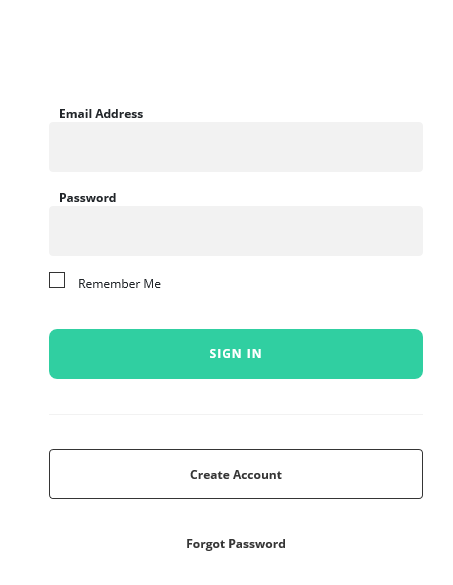
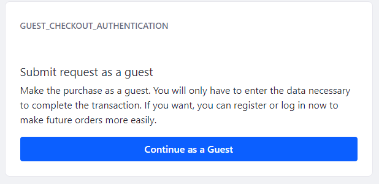

# Guest Checkout Overview

Guest checkout functionality can be enabled on a per-[channel](../../starting-a-store/channels/introduction-to-channels.md) basis and allows users to submit orders without a registered account on the site. See [Enabling Guest Checkout](./enabling-guest-checkout.md) to learn more.

With Guest Checkout enabled, guest users are required to enter an email address during the checkout process.



After providing their email, Guests are then prompted to log in, create an account, or continue as a Guest. Guests who adds items to the cart and then later sign in prior to checking out, have their items automatically carried over to their account's cart.



## Processing a Guest Order

When a Guest submits an order, it is processed the same as any other order. See [Processing an Order](../../orders-and-fulfillment/orders/processing-an-order.md) for more information.

```note::
   Guests do not share order histories with other authenticated users, even if they have the same email addresses.
```

## Creating a Guest Checkout Authentication Page

Guest checkout requires a [site page](https://learn.liferay.com/dxp/latest/en/site-building/creating_pages.html) with the _Guest Checkout Authentication_ widget. Use the Health Check function on the [Channels setting](../../starting-a-store/channels/channels-reference-guide.md) to generate this page and widget.

Clicking the _Continue as a Guest_ allows customers to complete the purchase without logging in or having to create an account.



If this authentication page does not exist, Guests will be redirected to the page with the _Checkout_ widget.

## Additional Information

* [Enabling Guest Checkout](./enabling-guest-checkout.md)
* [Introduction to Channels](../../starting-a-store/channels/introduction-to-channels.md)
* [Managing Channels](../../starting-a-store/channels/managing-channels.md)
* [Channels Reference Guide](../../starting-a-store/channels/channels-reference-guide.md)
