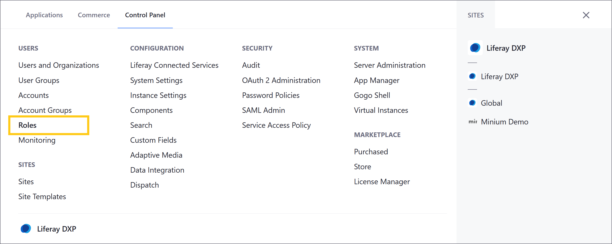
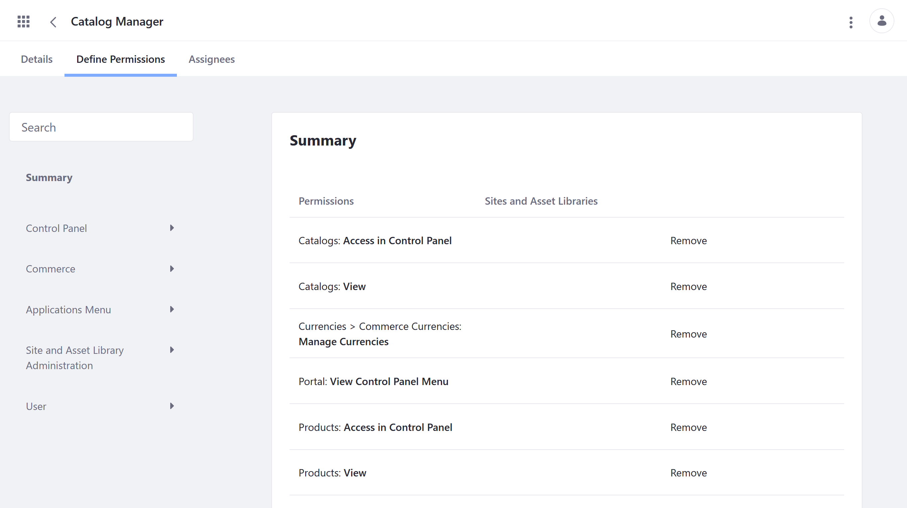
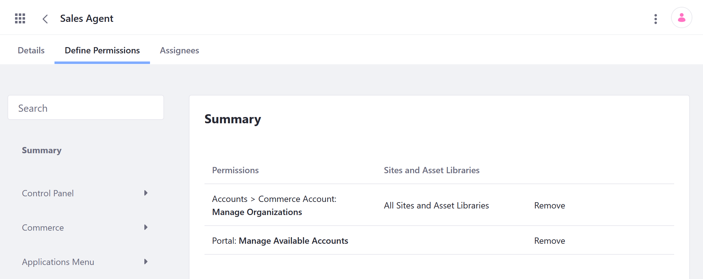

# Commerce Roles Reference

User roles group permissions necessary for accessing and using Liferay applications and resources. Each role can be scoped to an instance, Site, Organization, Asset Library, or Account. This scope determines which permissions can be assigned to the role. Each permission also has its own scope that determines which applications and resources can be accessed and used. See [Understanding Roles and Permissions](https://learn.liferay.com/dxp/latest/en/users-and-permissions/roles-and-permissions/understanding-roles-and-permissions.html) for more details.

Commerce includes four [out-of-the-box roles](#out-of-the-box-roles): Account Administrator, Account Member, Buyer, and Order Manager.

While these roles may satisfy your needs, you may want to create additional Commerce roles to better suit your use case. Some [common custom roles](#custom-roles) include Catalog Manager, Inventory Manager, Shipments Manager, Instance Order Manager, and Discount Manager.

```{note}
For Liferay 7.3.x and earlier Commerce versions, [Sales Agent](#sales-agent) is also included as an out-of-the-box role.
```

## Viewing Permissions

Follow these steps to view and manage permissions associated with a Commerce role:

1. Open the *Global Menu* (), click on the *Control Panel* tab, and go to *Users* &rarr; *Roles*.

   

1. Click on the desired role:

   * *Account Administrator* (Account Role)
   * *Account Member* (Account Role)
   * *Buyer* (Site Role)
   * *Order Manager* (Site Role)

   ```{note}
   In Liferay 7.3 and earlier versions, the Account Administrator is a Site Role, and the Account Member role is not a default role. 
   ```

1. Click on the *Define Permissions* tab.

   From here, you can view a summary of all application and resource permissions assigned to the role.

   You can also remove or add permissions.

   

## Out-of-the-Box Roles

The following roles are automatically added to your DXP instance during Commerce activation. They are included alongside default DXP roles and can be modified if desired. See [Defining Role Permissions](https://learn.liferay.com/dxp/latest/en/users-and-permissions/roles-and-permissions/defining-role-permissions.html) for more information.

### Account Administrator

> Account Role

Account Administrators can modify their Account, invite or add users to it, and assign roles to other Account members. Account Administrators cannot create or delete Accounts. This permission is reserved for instance administrators.

The following Accounts permissions pertain to the Account Administrator's ability to modify accounts in a B2B setting, while the Open Carts permissions pertain to the administrator's ability to modify Channel orders regardless of the store type.

| Permissions | Description |
| --- | --- |
| Accounts > Account: Add Account Entry | Ability to add Account entries |
| Accounts > Account Entry: Manage Users | Ability to manage Account users |
| Accounts > Account Entry: Update | Ability to modify Account entries |
| Accounts > Account Entry: View | Ability to view an Account |
| Accounts > Account Entry: View Users | Ability to view Account users |
| Accounts > Commerce Account: Manage Addresses | Ability to add a new billing, a shipping, or a combined address to an Account |
| Accounts > Commerce Account: Manage Members | Ability to invite Users and Organizations to an Account; also ability to edit their details |
| Accounts > Commerce Account: Update | Ability to modify an Account |
| Accounts > Commerce Account: View | Ability to view an Account |
| Accounts > Commerce Account: View Addresses | Ability to view all addresses associated with an Account |
| Accounts > Commerce Account: View Members | Ability to view all members in an Account |
| Open Carts > Commerce Order: Add Order | Ability to add an Order to a buyer's Account |
| Open Carts > Commerce Order: Approve Open Orders | Ability to approve Orders when workflow is enabled |
| Open Carts > Commerce Order: Check Out Open Orders | Ability to complete the checkout process for Orders |
| Open Carts > Commerce Order: Delete Orders | Ability to delete Orders |
| Open Carts > Commerce Order: Manage Orders | Ability to change Order details, such as mailing and billing addresses; ability to add a note to the Order |
| Open Carts > Commerce Order: View Open Orders | Ability to view all open Orders |
| Open Carts > Commerce Order: View Orders | Ability to view Orders regardless of status |

### Account Member

> Account Role (included in Liferay 7.4+)

This role is automatically assigned to all users within an account and grants basic view permissions.

| Permission | Description |
| --- | --- |
| Accounts > Account Entry: View | Ability to view an Account |

### Buyer

> Site Role

Users assigned this role can view, create, and check out orders.

| Permissions | Description |
| --- | --- |
| Open Carts > Commerce Order: Add Order | Ability to add an Order to a buyer's Account |
| Open Carts > Commerce Order: Checkout Open Orders | Ability to complete the checkout process for Orders |
| Open Carts > Commerce Order: View Open Orders | Ability to view open Orders |
| Open Carts > Commerce Order: View Orders | Ability to view Orders regardless of status |

### Order Manager

> Site Role

This Order Manager role grants users all the permissions of Buyers and allows them to also manage, delete, and approve orders in a specific Channel Site.

| Permissions | Description |
| --- | --- |
| Open Carts > Commerce Order: Add Order | Ability to add an Order to a buyer's Account |
| Open Carts > Commerce Order: Approve Open Orders | Ability to approve Orders when workflow is enabled |
| Open Carts > Commerce Order: Check Out Open Orders | Ability to complete the checkout process for Orders |
| Open Carts > Commerce Order: Delete Orders | Ability to delete Orders |
| Open Carts > Commerce Order: Manage Orders | Ability to change Order details, such as mailing and billing addresses; ability to add a note to the Order |
| Open Carts > Commerce Order: View Open Orders | Ability to view all open Orders |
| Open Carts > Commerce Order: View Orders | Ability to view Orders regardless of status |

## Custom Roles

The following list includes common custom roles you may want to create for your own Commerce instance. These roles can be created in the same way as other DXP roles. See [Creating and Managing Roles](https://learn.liferay.com/dxp/latest/en/users-and-permissions/roles-and-permissions/creating-and-managing-roles.html) and [Defining Role Permissions](https://learn.liferay.com/dxp/latest/en/users-and-permissions/roles-and-permissions/defining-role-permissions.html) for more information

### Catalog Manager

> Regular Role

The Catalog Manager role grants permissions to access, create, edit, and manage Products within a specific Catalog. This role is useful in multiple Catalog scenarios, where different vendors or company teams manage different Products in separate Catalogs. Catalog Managers cannot manage inventory. For this responsibility, see [Inventory Manager](#inventory-manager)

| Permissions | Description |
| --- | --- |
| Catalogs: Access in Control Panel | Ability to access the Catalogs application in the Global Menu |
| Catalogs: View | Ability to view the Catalogs application |
| Currencies > Commerce Currencies: Manage Currencies | Ability to manage currencies |
| Portal: View Control Panel Menu | Ability to access the Global Menu |
| Products: Access in Control Panel | Ability to access the Products application in the Global Menu |
| Products: View | Ability to view the Products application  |

In addition to the above permissions, you must also assign *View* and *Update* permissions for the individual Catalogs you want the role will manage.

To do this, open the *Global Menu* (), click on the *Commerce* tab, and go to *Product Management* &rarr; *Catalog*. Then, click on the *Actions* button () for the desired Catalog, and select *Permissions*. Use the check boxes to assign the role *View* and *Update* permissions.

```{note}
If you'd like your Catalog Manager to manage Products within a Catalog without the ability to modify the Catalog itself, remove the `Catalogs: Access in Control Panel` and `Catalogs: View` permissions.
```

### Discount Manager

> Regular Role

The Discount Manager role grants permissions to create, update, and delete Discounts in Liferay Commerce. Since Commerce Discounts can target different parts of an order and use different eligibility rules, there are a lot of possible permission configurations for a Discount Manager. The following configuration grants access to all Discount options.

| Permissions | Description |
| --- | --- |
| Account Groups: View | Ability to view the Account Groups application |
| Account Groups > Commerce Accounts: Manage All Accounts | Necessary to access the Account Groups application |
| Account Groups > Commerce Accounts: View Commerce Account Groups | Ability to view existing Account Groups |
| Catalogs: View | Ability to view the Catalogs application |
| Catalogs > Commerce Catalogs: View Commerce Catalogs | Ability to view related resources in the Catalogs application |
| Channels: View | Ability to view the Channels application |
| Channels > Commerce Channels: View Commerce Channels | Ability to view related resources in the Channels application |
| Discounts: Access in Control Panel | Ability to access the Discounts application in the Global Menu |
| Discounts: Permissions | Ability to view and modify resource permissions in the Discounts application |
| Discounts: View | Ability to view the Discounts application |
| Discounts > Commerce Discount: Delete | Ability to delete Discount entities |
| Discounts > Commerce Discount: Permissions | Ability to view and modify permissions for Discount entities |
| Discounts > Commerce Discount: Update | Ability to modify Discount entities |
| Discounts > Commerce Discount: View | Ability to view Discount entities |
| Discounts > Commerce Discounts: Add Discount | Ability to create Discount entities in the Discounts application. |
| Discounts > Commerce Discounts: View Discounts | Ability to view existing Discount entities in the Discounts application |
| Currencies > Commerce Currencies: Manage Currencies | Ability to access and modify Currency entities |
| Portal: View Control Panel Menu | Ability to access the Global Menu |
| Price Lists: Access in Control Panel | Ability to access the Price Lists application in the Global Menu |
| Product Groups: View | Ability to view Product Group entities  |

### Inventory Manager

> Regular Role

The Inventory Manager role allows users to view and manage inventory in all Warehouses. Users with the role can add incoming shipments, update inventory levels, transfer between Warehouses, and view the changelog.

| Permissions | Description |
| --- | --- |
| Inventory: Access in Control Panel | Ability to access the Inventory application in the Control Panel |
| Inventory: View | Ability to view the Inventory application |
| Warehouses > Commerce Inventories: Manage Inventory | Ability to access and modify Inventory entities linked to a Warehouse |
| Portal: View Control Panel Menu | Ability to access the Global Menu |

### Instance Order Manager

> Regular Role

The Order Manager role grants users the necessary permissions for managing orders across multiple Channels and is not limited to a single Site.

| Permissions | Description |
| --- | --- |
| Open Carts > Commerce Order: Add Order | Ability to add an Order to a buyer's Account |
| Open Carts > Commerce Order: Approve Open Orders | Ability to approve Orders when workflow is enabled |
| Open Carts > Commerce Order: Check Out Open Orders | Ability to complete the checkout process for Orders |
| Open Carts > Commerce Order: Delete Orders | Ability to delete Orders |
| Open Carts > Commerce Order: Manage Order Notes | Ability to change general Order notes |
| Open Carts > Commerce Order: Manage Order Restricted Notes | Ability to change restricted Order notes |
| Open Carts > Commerce Order: Manage Orders | Ability to change Order details, such as mailing and billing addresses; ability to add a note to the Order |
| Open Carts > Commerce Order: View Open Orders | Ability to view all open Orders |
| Open Carts > Commerce Order: View Orders | Ability to view Orders regardless of status |
| Orders: Access in Control Panel | Ability to access the Orders application in the Global Menu |
| Orders: Permissions | Ability to view and modify permissions for the Orders application |
| Orders: View | Ability to view the Orders application |
| Account Groups > Commerce Accounts: Manage All Accounts | Necessary to access the Account Groups application |
| Portal: View Control Panel Menu | Ability to access the Global Menu |

### Shipments Manager

> Regular Role

The Shipment Manager role allows a user to process shipments. This includes the ability to add shipping details, shipping dates, add items to the shipment and update shipment status. In Commerce 3.0+ and Liferay 7.3+, users create shipments via the Orders application. If you only want the Shipment Manager to fill and process the shipment, then the following permissions are sufficient. Otherwise, you may want to add additional [Order Manager](#order-manager-regular-role) permissions.

| Permissions | Description |
| --- | --- |
| Open Carts > Commerce Order: View Orders | Ability to view Orders regardless of status |
| Account Groups > Commerce Accounts: Manage All Accounts | Necessary to access the Account Groups application |
| Warehouses > Commerce Inventories: Manage Inventory | Ability to access and modify Inventory entities linked to a Warehouse |
| Manage Shipments | Ability to access and modify Shipment entities |
| Portal: View Control Panel Menu | Ability to access the Global Menu |
| Shipments: Access in Control Panel | Ability to access the Shipments application in the Global Menu |
| Shipments: View | Ability to view the Shipments application |
| Shipments > Commerce Warehouse: View | Ability to view Warehouse entities |

## Liferay 7.3 and Earlier

### Sales Agent

> Regular Role

The Sales Agent is a regular role in Liferay Commerce and assignees are able to manage any account assigned to the role without granting administrative permissions. Because it is a regular role, it is found in the *Regular Roles* tab.



| Permissions | Description |
| --- | --- |
| Manage Organizations | Ability to add or remove organizations |
| Manage Available Accounts | Ability to manage Accounts that the sales agent is a member of |

## Additional Information

* [Understanding Roles and Permissions](https://learn.liferay.com/dxp/latest/en/users-and-permissions/roles-and-permissions/understanding-roles-and-permissions.html)
* [Order Management Permissions Reference](./order-management-permissions.md)
* [Inventory Management Permissions Reference](./inventory-management-permissions.md)
* [Pricing Permissions Reference](./pricing-permissions.md)
* [Product Management Permissions Reference](./product-management-permissions.md)
* [Store Management Permissions Reference](./store-management-permissions.md)
* [Settings Permissions Reference](./settings-permissions.md)
