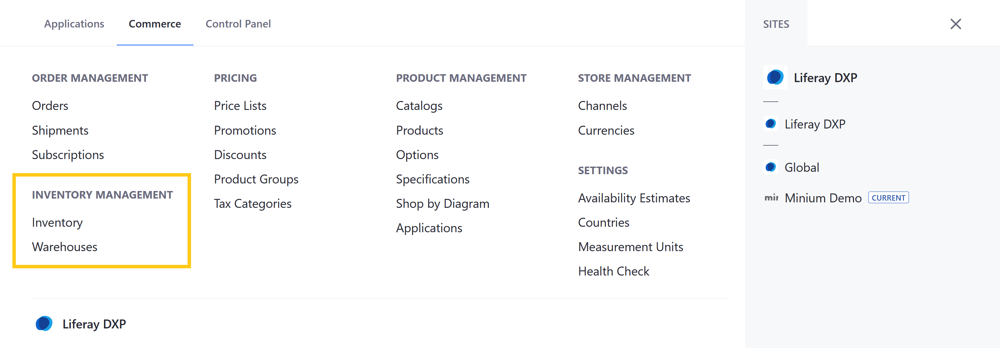
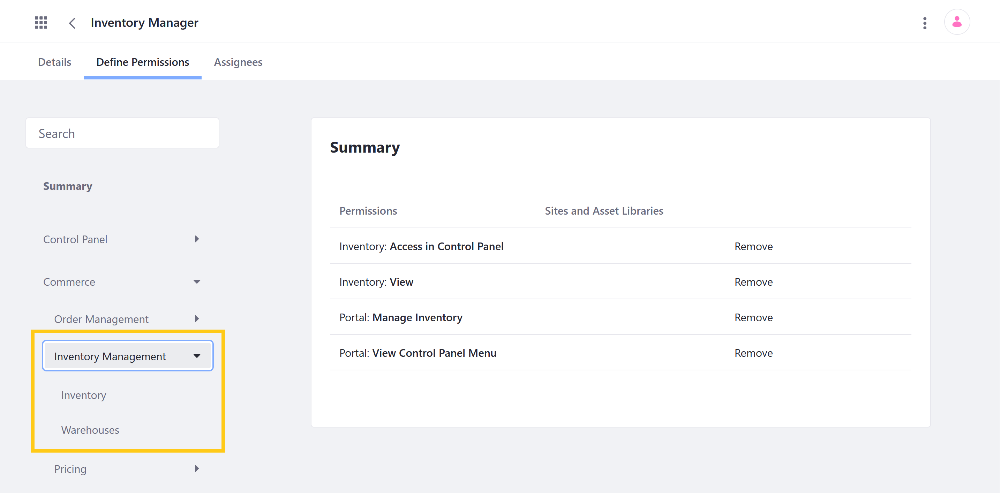

# Inventory Management Permissions

With Liferay Commerce, you can use permissions to control access to Inventory Management applications and resources in the Commerce tab of the Global Menu ().

You can manage Inventory Management permissions for user roles under *Commerce* &rarr; *Inventory Management* in the Define Permissions tab. Assign permissions individually, or check *Action* to assign all permissions for an application or resource.

## Application Permissions

Application permissions grant abilities for an application itself, but do not include [related resource permissions](#resource-permissions).

Inventory Management includes the following applications:

**Inventory**: This application is used to create and manage inventory entries for Product SKUs.

**Warehouses**: This application is used to create Warehouse entities that store Product inventory.

Both Inventory Management applications have the following permissions:

| Permission | Description |
| --- | --- |
| Access in Control Panel | Ability to access the application in the Global Menu |
| Configuration | Ability to view and set the application's configuration options |
| Permissions | Ability to view and modify the application's permissions |
| Preferences | Ability to view and set application preferences |
| View | Ability to view the application |

## Resource Permissions

Resource permissions grant specific abilities related to application resources. Some of these permissions grant the ability to perform operations on database entities (i.e., model resources). Others grant the ability to perform resource-related operations in an application context (e.g., the ability to create a new resource entity).

Inventory Management applications reference the following resources:

**Commerce Warehouse** (listed under Warehouses, [Shipments](./order-management-permissions.md), and [Products](./product-management-permissions.md)): These permissions grant the ability to perform operations on Warehouse entities. Each Warehouse stores Product inventory, is connected to Channels, and represents a physical location, with an address and geolocation.

| Permission | Description |
|---|---|
| Delete | Ability to delete Warehouse entities |
| Permissions | Ability to view and modify permissions for Warehouse entities |
| Update | Ability to edit and modify Warehouse entities |
| View | Ability to view Warehouse entities |

**Commerce Inventories** (listed under Warehouses): These permissions grant the ability to perform resource-related operations in the Warehouses and Inventory applications. Inventory entities are used to store SKU quantities in association with existing Warehouse entities. Each entity can be added, configured, and managed via the Inventory application.

| Permission | Description |
|---|---|
| Add Warehouse | Ability to create Warehouse entities |
| Manage Inventory | Ability to access and modify Inventory entities linked to a Warehouse |
| Permissions | Ability to view and modify resource permissions in the Warehouses and Inventory applications |

## Additional Information

* [Introduction to Managing Inventory](../../managing-a-catalog/managing-inventory/introduction-to-managing-inventory.md)
* [Inventory Management Reference Guide](../../managing-a-catalog/managing-inventory/inventory-management-reference-guide.md)
* [Warehouse Reference Guide](../../managing-a-catalog/managing-inventory/warehouse-reference-guide.md)
