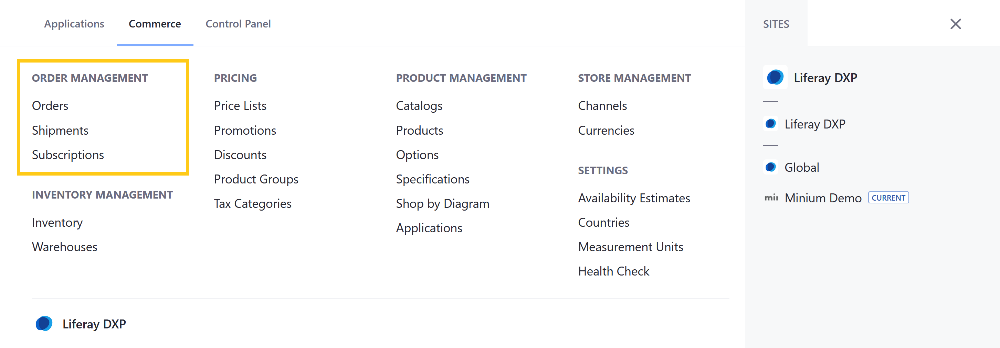
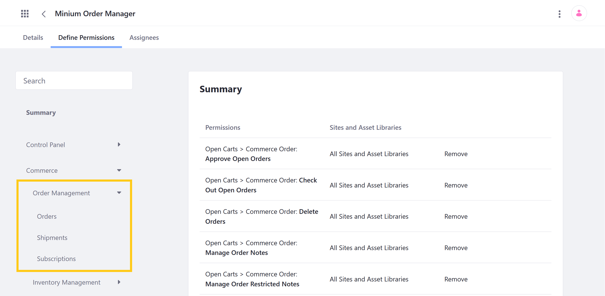

# Order Management Permissions

With Liferay Commerce, you can use permissions to control access to Order Management applications and resources in the Commerce tab of the Global Menu ().



You can manage Order Management permissions for user roles under *Commerce* &rarr; *Order Management* in the Define Permissions tab. Assign permissions individually, or check *Action* to assign all permissions for an application or resource.



## Application Permissions

Application permissions grant abilities for an application itself, but do not include [related resource permissions](#resource-permissions).

Order Management includes the following applications:

**Orders**: This application is used to view and manage orders across a Liferay instance.

**Shipments**: This application is used for viewing and managing Shipments generated for Orders across a Liferay instance.

**Subscriptions**: This application is used for viewing and managing both active and inactive customer Subscriptions across a Liferay instance.

All Order Management applications have the following permissions:

| Permission | Description |
| --- | --- |
| Access in Control Panel | Ability to access the application in the Global Menu |
| Configuration | Ability to view and set the application's configuration options |
| Permissions | Ability to view and modify the application's permissions |
| Preferences | Ability to view and set application preferences |
| View | Ability to view the application |

## Resource Permissions

Resource permissions grant specific abilities related to application resources. Some of these permissions grant the ability to perform operations on database entities (i.e., model resources). Others grant the ability to perform resource-related operations in an application context (e.g., the ability to create a new resource entity).

Order Management applications reference the following resources:

**Commerce Order** (listed under Orders): These permissions grant the ability to perform operations for Order entities.Orders are created when customers purchase Products in a Channel and are used to store and process order information. Each Order entity includes customer information (i.e., account, billing, shipping), as well as purchased items, order total, date, notes, acceptance workflow status, and more.

| Permission | Description |
|---|---|
| Add Order | Ability to add an Order |
| Approve Open Orders | Ability to approve Orders when workflow is enabled |
| Check Out Open Orders | Ability to complete the checkout process for open Orders |
| Delete Orders | Ability to delete Orders |
| Manage All Accounts | Necessary to access the portlet that manages Account Orders |
| Manage Order Notes | Ability to access and modify non-restricted Order notes |
| Manage Order Prices | Ability to edit prices for an Order entity in the Order Summary |
| Manage Order Restricted Notes | Ability to access and modify restricted notes for an Order |
| Manage Orders | Ability to change Order details (e.g., mailing and billing addresses) |
| Permissions | Ability to view and manage permissions for Order entities |
| View Open Orders | Ability to view all open Orders |
| View Orders | Ability to view all Orders, regardless of status |

```{note}
In Liferay DXP 7.3 and earlier, Manage All Accounts and Manage Order Prices were listed under Control Panel > General Permissions.
```

**Commerce Shipments** (listed under Shipments; previously listed under Control Panel > General Permissions): These permissions grant the ability to perform operations for Shipping entities used to track Product deliveries.

| Permission | Description |
| --- | --- |
| Manage All Accounts | Necessary to access the portlet that manages Shipments |
| Manage Shipments | Ability to access and modify Shipment entities |
| Permissions | Ability to view and manage permissions for Shipment entities |

**Commerce Warehouse** (listed under Warehouses, [Shipments](./inventory-management-permissions.md), and [Products](./product-management-permissions.md)): These permissions grant the ability to perform operations on Warehouse entities. Each Warehouse stores Product inventory, is connected to Channels, and represents a physical location, with an address and geolocation.

| Permission | Description |
|---|---|
| Delete | Ability to delete Warehouse entities |
| Permissions | Ability to view and modify permissions for Warehouse entities |
| Update | Ability to edit and modify Warehouse entities |
| View | Ability to view Warehouse entities |

**Commerce Subscription** (listed under Subscriptions; previously listed under Control Panel > General Permissions): These permissions grant the ability to perform operations for Subscription entities.

| Permission | Description |
| --- | --- |
| Manage Subscriptions | Ability to access and modify Subscription entities |
| Permissions | Ability to view and modify permissions for Subscription entities |

## Additional Information

* [Processing an Order](../../orders-and-fulfillment/orders/processing-an-order.md)
* [Shipments Management Reference Guide](../../orders-and-fulfillment/shipments/shipments-management-reference-guide.md)
